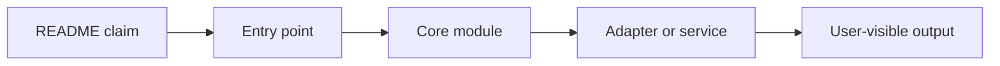
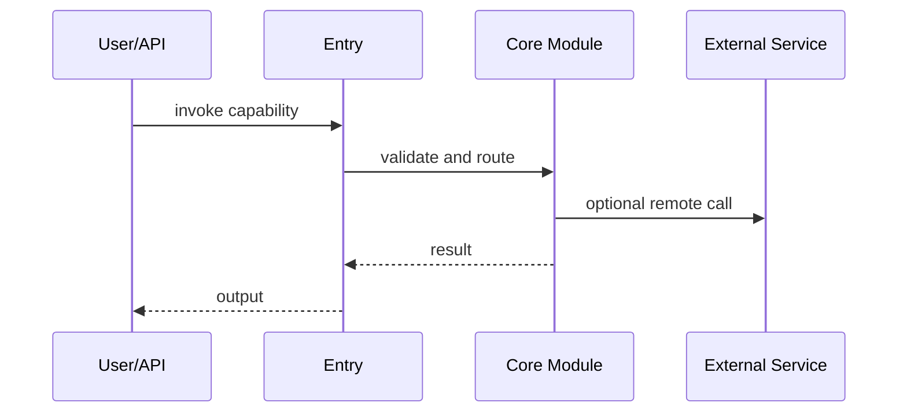
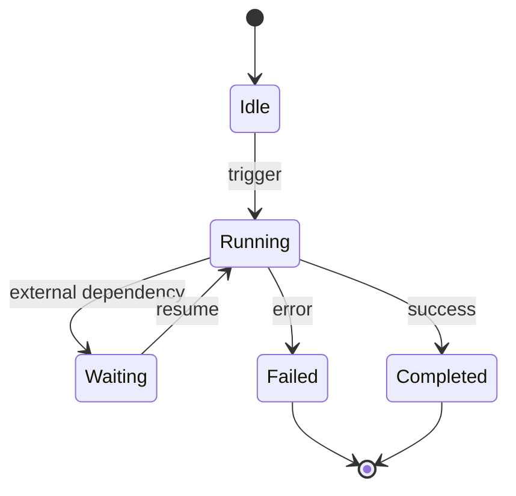
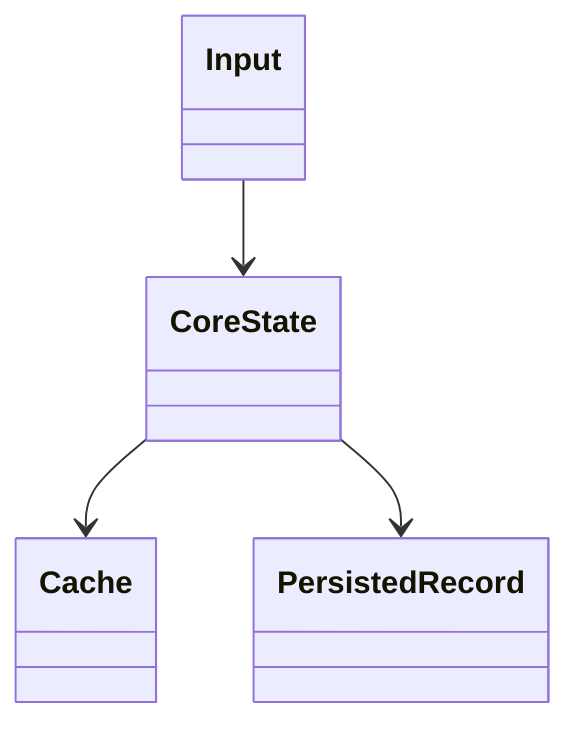

# Report Template

Use this structure for the report bundle and the final summary report.

Output location:

- Write the analysis as a multi-file report bundle under the current workspace's fixed `reports/` directory by default.
- Use the bundle directory pattern `<repo-name>-capability-audit/` in full-audit mode.
- Use the bundle directory pattern `<repo-name>-capability-audit-<scope-slug>/` in scoped-audit mode.
- Use the fixed filename pattern `<repo-name>-capability-audit.md` in full-audit mode.
- Use the fixed filename pattern `<repo-name>-capability-audit-<scope-slug>.md` in scoped-audit mode.
- Do not place the report inside the analyzed repository unless the user explicitly asks for that.

Recommended bundle layout:

- `00-task-breakdown.md`
- `01-readme-capability-extraction.md`
- `02-entrypoints-and-main-flow.md`
- `03-capability-<name>.md` and onward in full-audit mode
- `03-scope-<scope-slug>.md` and onward in scoped-audit mode
- `99-final-consistency-summary.md`

## Stage 0: Task Breakdown

Create `00-task-breakdown.md` first.

Required contents:

- repository metadata
- analysis scope
- task table
- dependencies
- status tracking
- notes on blockers and external dependencies

Use `references/task-breakdown-template.md`.

## Stage 1: README Core Capability Extraction

Output:

- `Project positioning`: one sentence.
- `Core capability list`: `3-8` items when supported.
- `Scoped audit target`: required when the user narrowed the audit.
- For each capability:
  - `README evidence`
  - `Boundary`: what it is / what it is not
  - `Initial confidence`

Suggested table:

| Capability | README evidence | Boundary | Initial confidence |
| --- | --- | --- | --- |

Prerequisite:

- Confirm the repository has been cloned locally or an equivalent local checkout already exists.
- If local clone failed, stop the analysis and report the blocker instead of producing Stage 3 verification.

Write this stage to `01-readme-capability-extraction.md`.

## Stage 1.5: Entrypoints and Main Flow

Before capability deep dives, create a shared code-reading skeleton in `02-entrypoints-and-main-flow.md`.

Required contents:

- explicit scope note
- key entrypoints
- main flow skeleton
- architecture notes
- shared evidence for later capability tasks
- open questions
- diagrams by default when evidence supports them

Use `references/entrypoints-main-flow-template.md`.

## Stage 2: Per-Capability Technical Analysis

Repeat the following block once per capability in full-audit mode, or once per scoped investigation unit in scoped-audit mode.

```markdown
# {Capability name}

## 1. Capability Definition
- Problem solved
- User or scenario
- Input
- Output

## 2. README-Side Mechanism
- How README describes it
- Key components or stages
- Process inferred from README

## 3. Solution Analysis And Alternatives
- Likely implementation paradigm
- Alternative approaches
- Advantages
- Limits and scope
- Mark inference clearly when README is thin

## 4. Implementation Mechanics
- Primary technologies, frameworks, libraries, protocols, or patterns
- Why these choices appear to be used here
- Core implementation strategy

## 5. State and Lifecycle Analysis
- Main states, phases, or lifecycle stages
- State transitions and triggers
- Failure, retry, rollback, or cleanup paths when visible
- If no meaningful state machine exists, say so explicitly
- Add a `Mermaid stateDiagram-v2` when the lifecycle is concrete enough

## 6. Data and Storage Analysis
- Main inputs and outputs
- Data transformations
- Storage, cache, registry, queue, database, index, or file boundaries
- Persistence scope and lifecycle
- Add a `Mermaid classDiagram` or equivalent data-structure diagram when it clarifies the model

## 7. Architecture Analysis
- Modules and subsystem roles
- Static relationships
- Dependency shape
- Add a `Mermaid flowchart` by default when it clarifies the structure

## 8. Core Call Path
- Entry point
- Intermediate processing
- State or data transitions
- Output node
- Add a `Mermaid sequenceDiagram` by default when the call path is non-trivial

## 9. Key Technical Points
- Frameworks, protocols, structures, patterns, algorithms
- Highest-value code-reading targets

## 10. Code Verification
- Code locations
- Key modules, classes, functions, configs
- Whether README claim is implemented
- Confirmed parts
- Unconfirmed parts
- Mismatches

## 11. Rebuildability
- Minimum modules or subsystems needed to reproduce the capability
- External dependencies that cannot be reconstructed from the repo alone
- What is clear enough to rebuild vs still unclear

## 12. Consistency Check
- README claim
- Code reality
- Gap summary
- Mismatch classification if applicable
- Possible explanation for discrepancy

## 13. Conclusion
- Exists: yes / partial / insufficient evidence
- Confidence: high / medium / low
- Validation status: Validated / Partially Validated / Insufficient Evidence / README Claim Not Supported / Implemented but Under-Documented
- Evidence grade: A / B / C / D (optional)
- Next code entrypoints
```

## Stage 3: Final Overview

Always end the bundle with `99-final-consistency-summary.md`, containing:

- `Capability summary table`
- `Verification status`
- `README vs code consistency`
- `Key risks`
- `Top 5 code entrypoints`
- `Clone status`
- `PR evidence used? yes/no`
- `Report path in current workspace`
- `Task bundle contents`
- `Scope statement`

Suggested verification table:

| Capability | README claim summary | Code verdict | Validation status | Key evidence | Confidence |
| --- | --- | --- | --- | --- | --- |

## Mermaid Suggestions

Default to including diagrams when evidence is sufficient and the diagram improves understanding.

Prefer:

- `Mermaid flowchart` for architecture
- `Mermaid sequenceDiagram` for call path
- `Mermaid stateDiagram-v2` for state and lifecycle
- `Mermaid classDiagram` for data and storage structure

If a diagram would require guessing, omit it and state why.

Examples:

Architecture:



Call path:



State and lifecycle:



Data and storage:



## Evidence Checklist

Before finalizing, check:

- Every capability came from README, not reverse-engineering from code.
- If the user requested a scoped audit, the bundle name, scope statement, and deep-dive filenames reflect that scope.
- The repository was cloned locally before code verification began.
- A task breakdown document exists and reflects the work decomposition.
- A shared entrypoints and main-flow document exists before deep capability files.
- Every conclusion cites README evidence.
- Every verification cites concrete code evidence.
- Every mismatch is explicit.
- Every capability includes a validation status.
- Any mismatch includes a mismatch classification.
- Every confidence level matches evidence quality.
- Any PR evidence is explicitly labeled as secondary to current code evidence.
- The final report was written to the current workspace `reports/` directory.
- Evidence grade is present when it materially improves rigor.
