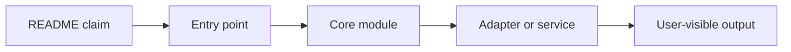
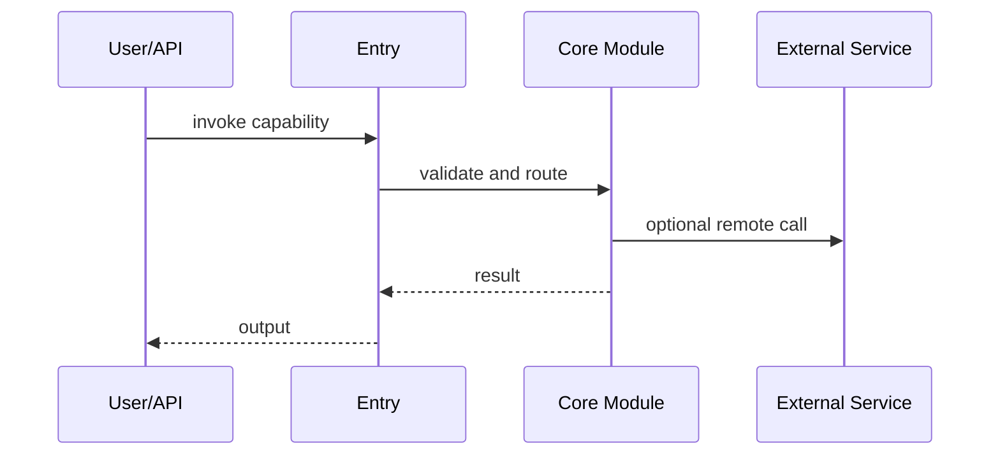

# Report Template

Use this structure for every repository analysis.

## Stage 1: README Core Capability Extraction

Output:

- `Project positioning`: one sentence.
- `Core capability list`: `3-8` items when supported.
- For each capability:
  - `README evidence`
  - `Boundary`: what it is / what it is not
  - `Initial confidence`

Suggested table:

| Capability | README evidence | Boundary | Initial confidence |
| --- | --- | --- | --- |

## Stage 2: Per-Capability Technical Analysis

Repeat the following block once per capability.

```markdown
# {Capability name}

## 1. Capability Definition
- Problem solved
- User or scenario
- Input
- Output

## 2. README-Side Mechanism
- How README describes it
- Key components or stages
- Process inferred from README

## 3. Solution Analysis And Alternatives
- Likely implementation paradigm
- Alternative approaches
- Advantages
- Limits and scope
- Mark inference clearly when README is thin

## 4. Architecture Analysis
- Modules and subsystem roles
- Static relationships
- Dependency shape
- Mermaid diagram if helpful

## 5. Core Call Path
- Entry point
- Intermediate processing
- State or data transitions
- Output node
- Sequence or flow diagram if helpful

## 6. Key Technical Points
- Frameworks, protocols, structures, patterns, algorithms
- Highest-value code-reading targets

## 7. Code Verification
- Code locations
- Key modules, classes, functions, configs
- Whether README claim is implemented
- Confirmed parts
- Unconfirmed parts
- Mismatches

## 8. Conclusion
- Exists: yes / partial / insufficient evidence
- Confidence: high / medium / low
- Next code entrypoints
```

## Stage 3: Final Overview

Always end with:

- `Capability summary table`
- `Verification status`
- `README vs code consistency`
- `Key risks`
- `Top 5 code entrypoints`

Suggested verification table:

| Capability | README claim summary | Code verdict | Key evidence | Confidence |
| --- | --- | --- | --- | --- |

## Mermaid Suggestions

Use only when they clarify structure:

Architecture:



Call path:



## Evidence Checklist

Before finalizing, check:

- Every capability came from README, not reverse-engineering from code.
- Every conclusion cites README evidence.
- Every verification cites concrete code evidence.
- Every mismatch is explicit.
- Every confidence level matches evidence quality.
