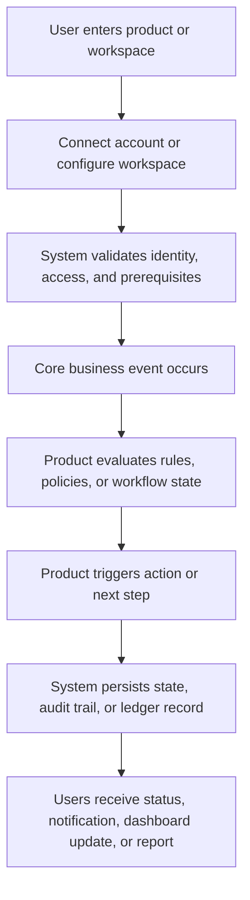
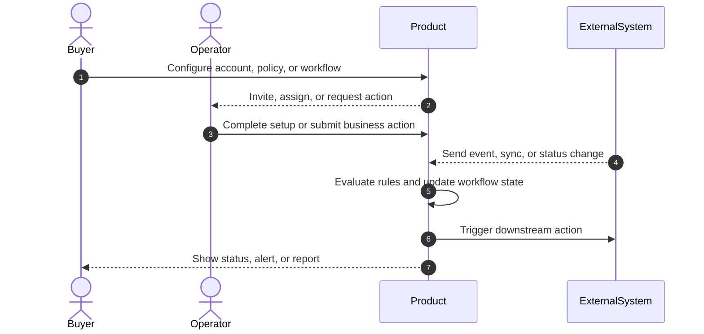
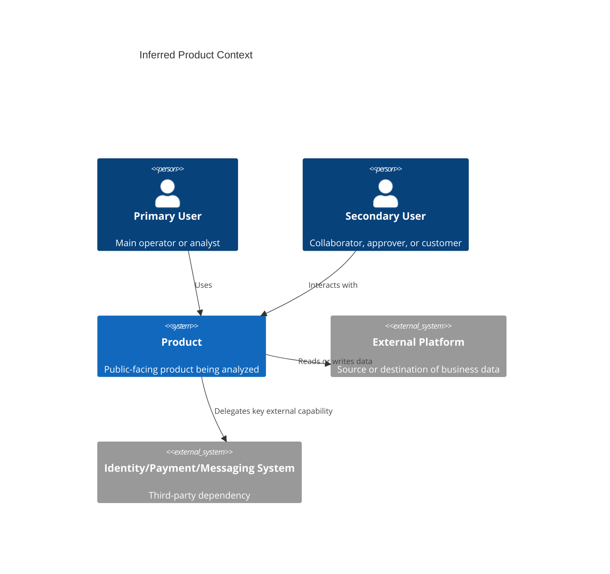
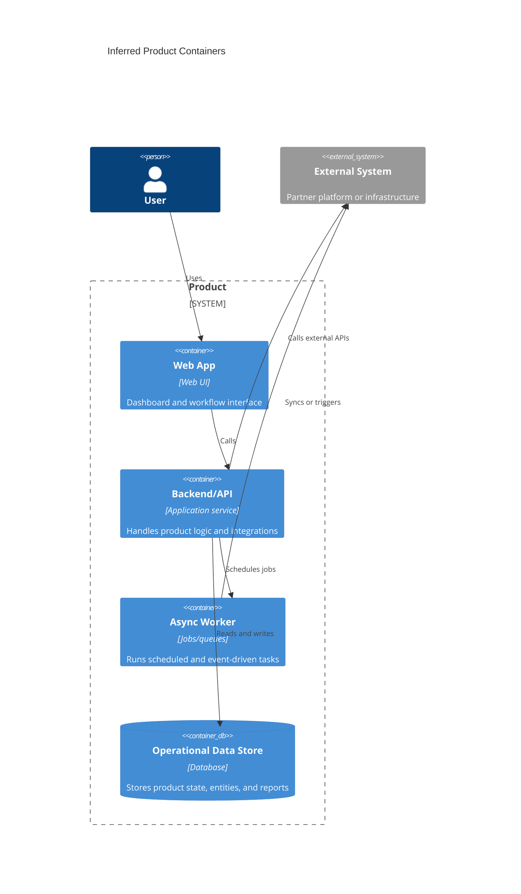
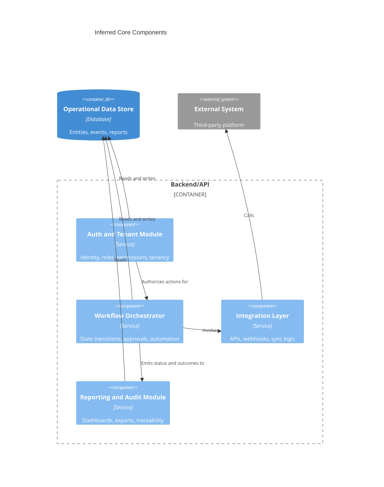

# Diagram Templates

Use Mermaid unless the user asks for another diagram format.

Mark each diagram as one of:

- `Confirmed`: mostly derived from explicit public material
- `Mixed`: combines public evidence with bounded inference
- `Inferred`: reverse-engineered from behavior and public clues

## Workflow Flowchart

## Role Interaction Sequence

## C4 Context

## C4 Container

## C4 Component

## Diagram Guidance

- Tailor actor names and system names to the actual product.
- Keep the workflow and sequence diagrams concrete and business-specific.
- Treat C4 diagrams as inferred unless official architecture documentation exists.
- Avoid naming vendors unless sources confirm them.
- If the public product is simple, a context diagram plus a compact container diagram may be enough; otherwise include all three C4 levels.
