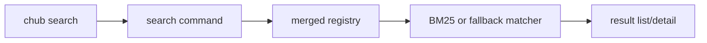
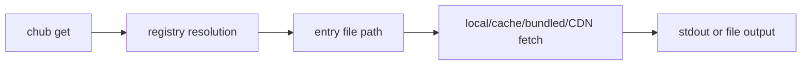
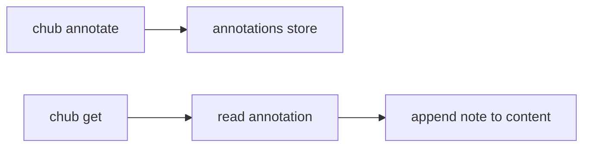
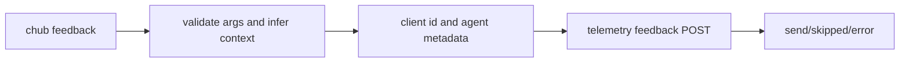
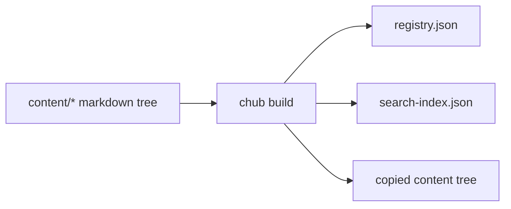

# Context Hub Capability Audit

- Repository: `https://github.com/andrewyng/context-hub`
- Local clone: `/tmp/context-hub`
- Branch: `main`
- Commit: `887a62a155d05ab565f72fdf03f33cf5c7f7b2d4`
- Clone status: success
- PR evidence used: no

## Stage 1: README-only capability extraction

### Project positioning

`Context Hub` is an agent-oriented doc and skill delivery system that replaces ad hoc web search with curated, versioned markdown plus local memory and shared feedback loops.

### Core capability list

| Capability | README evidence | Boundary | Initial confidence |
| --- | --- | --- | --- |
| Search curated docs and skills | Quick Start and Commands show `chub search`; README says “search docs and skills” | Registry search and listing, not general web search | High |
| Fetch versioned, language-specific content | `chub get openai/chat --lang py/js`; “versioned, language-specific” | Fetches curated entries by ID, not arbitrary URLs | High |
| Incremental fetch of reference files | “Incremental Fetch”, `--file`, `--full` | Entry-scoped file selection, not semantic chunking | Medium |
| Persistent local annotations | `chub annotate`; annotations “appear automatically on chub get” | Local machine memory only, not shared team memory | High |
| Feedback loop to improve shared docs | `chub feedback ... up/down`; “flows back to authors” | Client-side rating submission, not guaranteed maintainer action | Medium |
| Open markdown content and contribution model | “All content is open and maintained as markdown in this repo”; contribution section | Open content source and build flow, not an in-product editor | Medium |

## Stage 2: Per-capability technical analysis

# Search curated docs and skills

## 1. Capability Definition

- Problem solved: help an agent discover available docs and skills without browsing the web.
- User or scenario: coding agents needing an entry list or a ranked search result.
- Input: query text plus optional tag and language filters.
- Output: matching registry entries with display metadata.

## 2. README-Side Mechanism

- README describes `chub search [query]` as the main discovery interface.
- It explicitly claims docs and skills can both be searched.
- No-query mode lists all available entries.

## 3. Solution Analysis And Alternatives

- Likely implementation paradigm: local registry lookup plus ranked search.
- Alternative approach: remote search API.
- Advantage of the current approach: local, deterministic, low-latency lookup after registry load.
- Limits and scope: results are bounded by available registry content, not the public internet.

## 4. Architecture Analysis

- CLI command registration happens in the main CLI entry.
- Search delegates to registry merging, filtering, and ranking.
- BM25 is used when a search index exists; otherwise it falls back to keyword scoring.

## 5. Core Call Path

- Entry point: [`cli/src/index.js`](/tmp/context-hub/cli/src/index.js)
- Intermediate processing: [`cli/src/commands/search.js`](/tmp/context-hub/cli/src/commands/search.js)
- State or data transitions: [`cli/src/lib/registry.js`](/tmp/context-hub/cli/src/lib/registry.js) and [`cli/src/lib/bm25.js`](/tmp/context-hub/cli/src/lib/bm25.js)
- Output node: terminal or JSON output

## 6. Key Technical Points

- Supports exact ID lookup and fuzzy search in one command path.
- Merges multiple configured sources into one search surface.
- Tags entries as `doc` or `skill` for display.

## 7. Code Verification

- Code locations:
  - [`cli/src/commands/search.js`](/tmp/context-hub/cli/src/commands/search.js)
  - [`cli/src/lib/registry.js`](/tmp/context-hub/cli/src/lib/registry.js)
  - [`cli/src/lib/bm25.js`](/tmp/context-hub/cli/src/lib/bm25.js)
- Confirmed parts:
  - Search command exists.
  - Listing without a query exists.
  - Docs and skills are searched from one merged registry.
- Supporting tests:
  - [`cli/tests/lib/registry.test.js`](/tmp/context-hub/cli/tests/lib/registry.test.js)
- Mismatches:
  - None found for this capability.

## 8. Conclusion

- Exists: yes
- Confidence: high
- Next code entrypoints:
  - [`cli/src/commands/search.js`](/tmp/context-hub/cli/src/commands/search.js)
  - [`cli/src/lib/registry.js`](/tmp/context-hub/cli/src/lib/registry.js)

# Fetch versioned, language-specific content with incremental file selection

## 1. Capability Definition

- Problem solved: retrieve exactly the doc or skill content an agent needs.
- User or scenario: an agent that already knows the entry ID and wants the right variant.
- Input: entry ID plus options like `--lang`, `--version`, `--file`, `--full`.
- Output: markdown content from the selected entry file or set of files.

## 2. README-Side Mechanism

- README shows `chub get openai/chat --lang py` and `--lang js`.
- It claims content is versioned and language-specific.
- It also claims users can fetch only specific reference files with `--file` or all files with `--full`.

## 3. Solution Analysis And Alternatives

- Likely implementation paradigm: registry-based path resolution followed by file fetch from local path, cache, bundled dist, or CDN.
- Alternative approach: a server-rendered content API.
- Advantage of the current approach: portable content model and offline/cache-friendly retrieval.
- Limits and scope: content must already exist in the registry layout.

## 4. Architecture Analysis

- `get` auto-detects doc vs skill.
- Registry resolution chooses language and version for docs, or flat path for skills.
- Cache and source handling abstract local and remote retrieval.

## 5. Core Call Path

- Entry point: [`cli/src/index.js`](/tmp/context-hub/cli/src/index.js)
- Intermediate processing: [`cli/src/commands/get.js`](/tmp/context-hub/cli/src/commands/get.js)
- Path selection: [`cli/src/lib/registry.js`](/tmp/context-hub/cli/src/lib/registry.js)
- Content retrieval: [`cli/src/lib/cache.js`](/tmp/context-hub/cli/src/lib/cache.js)

## 6. Key Technical Points

- Docs require explicit language when multiple variants exist.
- Skills do not use language/version nesting.
- `--file` validates requested paths against known files in the entry.
- `--full` fetches all files in the entry directory.

## 7. Code Verification

- Code locations:
  - [`cli/src/commands/get.js`](/tmp/context-hub/cli/src/commands/get.js)
  - [`cli/src/lib/registry.js`](/tmp/context-hub/cli/src/lib/registry.js)
  - [`cli/src/lib/cache.js`](/tmp/context-hub/cli/src/lib/cache.js)
- Confirmed parts:
  - Doc vs skill auto-detection is implemented.
  - Language and version resolution are implemented.
  - `--file` and `--full` are implemented.
  - Output can go to stdout or filesystem.
- Supporting content evidence:
  - [`content/openai/docs/chat/python/DOC.md`](/tmp/context-hub/content/openai/docs/chat/python/DOC.md)
  - [`content/openai/docs/chat/javascript/DOC.md`](/tmp/context-hub/content/openai/docs/chat/javascript/DOC.md)
  - [`content/playwright-community/skills/login-flows/SKILL.md`](/tmp/context-hub/content/playwright-community/skills/login-flows/SKILL.md)
- Mismatches:
  - README `Commands` and implementation already support skills.
  - README `Content Types` says non-doc types such as skills are “on the roadmap”.

## 8. Conclusion

- Exists: yes
- Confidence: high
- Next code entrypoints:
  - [`cli/src/commands/get.js`](/tmp/context-hub/cli/src/commands/get.js)
  - [`cli/src/lib/cache.js`](/tmp/context-hub/cli/src/lib/cache.js)

# Persistent local annotations on future fetches

## 1. Capability Definition

- Problem solved: let agents preserve task-specific learning across sessions.
- User or scenario: an agent discovering environment-specific gotchas while using a doc.
- Input: entry ID and annotation text, or read/list/clear actions.
- Output: local persisted note and later automatic note replay on fetch.

## 2. README-Side Mechanism

- README shows `chub annotate`.
- It states annotations persist across sessions.
- It claims annotations appear automatically on later `chub get` calls.

## 3. Solution Analysis And Alternatives

- Likely implementation paradigm: local filesystem storage keyed by entry ID.
- Alternative approach: remote user account state.
- Advantage of the current approach: simple and private local persistence.
- Limits and scope: one-machine local state, no sync workflow in this repo.

## 4. Architecture Analysis

- Annotation writes and reads are isolated in a dedicated library.
- Fetch appends the saved note after content rendering.
- MCP exposes the same capability for tool-based agents.

## 5. Core Call Path

- CLI annotation entry: [`cli/src/commands/annotate.js`](/tmp/context-hub/cli/src/commands/annotate.js)
- Storage layer: [`cli/src/lib/annotations.js`](/tmp/context-hub/cli/src/lib/annotations.js)
- Fetch integration: [`cli/src/commands/get.js`](/tmp/context-hub/cli/src/commands/get.js)
- MCP integration: [`cli/src/mcp/tools.js`](/tmp/context-hub/cli/src/mcp/tools.js)

## 6. Key Technical Points

- Entry IDs are made filename-safe by replacing `/` with `--`.
- Storage directory is under `~/.chub/annotations/`.
- Listing, clearing, and reading are supported in both CLI and MCP paths.

## 7. Code Verification

- Code locations:
  - [`cli/src/commands/annotate.js`](/tmp/context-hub/cli/src/commands/annotate.js)
  - [`cli/src/lib/annotations.js`](/tmp/context-hub/cli/src/lib/annotations.js)
  - [`cli/src/commands/get.js`](/tmp/context-hub/cli/src/commands/get.js)
  - [`cli/src/mcp/tools.js`](/tmp/context-hub/cli/src/mcp/tools.js)
- Confirmed parts:
  - Annotation write/read/clear/list all exist.
  - Saved annotations are automatically appended to fetched content.
  - The same behavior is available over MCP.
- Supporting docs:
  - [`docs/feedback-and-annotations.md`](/tmp/context-hub/docs/feedback-and-annotations.md)
- Mismatches:
  - None found for this capability.

## 8. Conclusion

- Exists: yes
- Confidence: high
- Next code entrypoints:
  - [`cli/src/lib/annotations.js`](/tmp/context-hub/cli/src/lib/annotations.js)
  - [`cli/src/mcp/tools.js`](/tmp/context-hub/cli/src/mcp/tools.js)

# Feedback loop to improve shared docs

## 1. Capability Definition

- Problem solved: collect quality signals about docs and skills for maintainers.
- User or scenario: an agent reporting whether content was helpful, outdated, or wrong.
- Input: entry ID, rating, and optional labels/comment/context.
- Output: telemetry submission result.

## 2. README-Side Mechanism

- README exposes `chub feedback <id> <up|down>`.
- It claims feedback goes back to authors and helps improve docs over time.
- Optional labels are described in the documentation.

## 3. Solution Analysis And Alternatives

- Likely implementation paradigm: client-side API submission to a telemetry endpoint.
- Alternative approach: GitHub-native issue or PR generation.
- Advantage of the current approach: lightweight structured reporting.
- Limits and scope: this repo only shows the client side of the loop.

## 4. Architecture Analysis

- CLI validates rating and labels.
- Entry type and context can be inferred from the registry.
- Telemetry module sends structured payloads to an external endpoint.

## 5. Core Call Path

- CLI entry: [`cli/src/commands/feedback.js`](/tmp/context-hub/cli/src/commands/feedback.js)
- Telemetry transport: [`cli/src/lib/telemetry.js`](/tmp/context-hub/cli/src/lib/telemetry.js)
- Client identity: [`cli/src/lib/identity.js`](/tmp/context-hub/cli/src/lib/identity.js)
- MCP path: [`cli/src/mcp/tools.js`](/tmp/context-hub/cli/src/mcp/tools.js)

## 6. Key Technical Points

- Telemetry can be disabled in config or via environment variable.
- A stable client ID is derived from machine identity and stored locally.
- Labels, agent info, and file-level targeting are included in the payload.

## 7. Code Verification

- Code locations:
  - [`cli/src/commands/feedback.js`](/tmp/context-hub/cli/src/commands/feedback.js)
  - [`cli/src/lib/telemetry.js`](/tmp/context-hub/cli/src/lib/telemetry.js)
  - [`cli/src/lib/identity.js`](/tmp/context-hub/cli/src/lib/identity.js)
  - [`cli/src/mcp/tools.js`](/tmp/context-hub/cli/src/mcp/tools.js)
- Confirmed parts:
  - Feedback CLI exists.
  - Telemetry submission logic exists.
  - Structured labels and agent context are supported.
- Unconfirmed parts:
  - Maintainer-side ingestion, triage, and doc update workflows are not present in this repository.
- README claim / code reality / likely reason for mismatch:
  - README claim: feedback “flows back to authors”.
  - Code reality: client-side POST to an external telemetry endpoint is implemented.
  - Likely reason: server-side processing lives outside this repo.

## 8. Conclusion

- Exists: partial
- Confidence: medium
- Next code entrypoints:
  - [`cli/src/lib/telemetry.js`](/tmp/context-hub/cli/src/lib/telemetry.js)
  - [`cli/src/lib/identity.js`](/tmp/context-hub/cli/src/lib/identity.js)

# Open markdown content and contribution/build pipeline

## 1. Capability Definition

- Problem solved: keep content inspectable, editable, and buildable from the repository itself.
- User or scenario: contributors adding docs or skills, and publishers generating a registry/bundle.
- Input: markdown files with YAML frontmatter under the content tree.
- Output: built registry, search index, and packaged content tree.

## 2. README-Side Mechanism

- README states all content is open and maintained as markdown in the repo.
- It says contributors can submit docs and skills via pull requests.
- It links to content format guidance.

## 3. Solution Analysis And Alternatives

- Likely implementation paradigm: filesystem discovery with frontmatter validation.
- Alternative approach: CMS-backed authoring.
- Advantage of the current approach: transparent source of truth and easy code review.
- Limits and scope: contributor experience depends on respecting the repository structure and metadata format.

## 4. Architecture Analysis

- Content is stored under top-level provider/community directories.
- Build scans for `DOC.md` and `SKILL.md`.
- A registry plus BM25 search index are generated for distribution.

## 5. Core Call Path

- Build command: [`cli/src/commands/build.js`](/tmp/context-hub/cli/src/commands/build.js)
- Frontmatter parsing: [`cli/src/lib/frontmatter.js`](/tmp/context-hub/cli/src/lib/frontmatter.js)
- Packaged publish step: [`cli/package.json`](/tmp/context-hub/cli/package.json)

## 6. Key Technical Points

- Supports auto-discovery as well as author-provided `registry.json`.
- Builds both registry metadata and a BM25 search index.
- Copies content into `dist` for packaging and CDN use.

## 7. Code Verification

- Code locations:
  - [`cli/src/commands/build.js`](/tmp/context-hub/cli/src/commands/build.js)
  - [`cli/package.json`](/tmp/context-hub/cli/package.json)
  - [`content/`](/tmp/context-hub/content)
- Confirmed parts:
  - Markdown content tree exists with many provider folders.
  - Build command generates `registry.json` and `search-index.json`.
  - Package prepublish script builds from `../content`.
- Supporting content evidence:
  - [`content/openai/docs/chat/python/DOC.md`](/tmp/context-hub/content/openai/docs/chat/python/DOC.md)
  - [`content/landingai-ade/skills/SKILL.md`](/tmp/context-hub/content/landingai-ade/skills/SKILL.md)
- Mismatches:
  - None material for this capability.

## 8. Conclusion

- Exists: yes
- Confidence: high
- Next code entrypoints:
  - [`cli/src/commands/build.js`](/tmp/context-hub/cli/src/commands/build.js)
  - [`content/`](/tmp/context-hub/content)

## Stage 3: Final overview

### Capability summary table

| Capability | README claim summary | Code verdict | Key evidence | Confidence |
| --- | --- | --- | --- | --- |
| Search curated docs and skills | Agents can search and list docs and skills | Yes | [`cli/src/commands/search.js`](/tmp/context-hub/cli/src/commands/search.js), [`cli/src/lib/registry.js`](/tmp/context-hub/cli/src/lib/registry.js) | High |
| Fetch versioned, language-specific content | Agents can fetch docs and skills by ID, language, version, and file scope | Yes | [`cli/src/commands/get.js`](/tmp/context-hub/cli/src/commands/get.js), [`cli/src/lib/cache.js`](/tmp/context-hub/cli/src/lib/cache.js) | High |
| Persistent local annotations | Agent notes persist and appear on future fetches | Yes | [`cli/src/lib/annotations.js`](/tmp/context-hub/cli/src/lib/annotations.js), [`cli/src/commands/get.js`](/tmp/context-hub/cli/src/commands/get.js) | High |
| Feedback loop to improve shared docs | Ratings flow back to improve content over time | Partial | [`cli/src/commands/feedback.js`](/tmp/context-hub/cli/src/commands/feedback.js), [`cli/src/lib/telemetry.js`](/tmp/context-hub/cli/src/lib/telemetry.js) | Medium |
| Open markdown content and contribution/build pipeline | Content is open markdown in repo and buildable into a consumable registry | Yes | [`cli/src/commands/build.js`](/tmp/context-hub/cli/src/commands/build.js), [`content/`](/tmp/context-hub/content) | High |

### Verification status

- Most README claims are implemented in the checked-out codebase.
- The strongest evidence is around CLI search/get behavior, local annotations, and buildable markdown content.
- The weakest verified area is the maintainer-facing side of the feedback loop because only the client submission path exists in this repo.

### README vs code consistency

- Overall judgment: mostly consistent.
- Main mismatch:
  - README `Commands` and implementation already support skills.
  - README `Content Types` still says more content types such as agent skills are on the roadmap.

### Key risks

- Feedback and improvement beyond client submission depend on external services not contained in this repository.
- Registry refresh and remote content retrieval depend on CDN/network availability.
- The stable client ID in feedback telemetry is derived from machine identity and may raise privacy questions for some adopters.
- This audit was static; the test suite was not executed.

### Top 5 code entrypoints

1. [`cli/src/index.js`](/tmp/context-hub/cli/src/index.js)
2. [`cli/src/lib/registry.js`](/tmp/context-hub/cli/src/lib/registry.js)
3. [`cli/src/commands/get.js`](/tmp/context-hub/cli/src/commands/get.js)
4. [`cli/src/lib/cache.js`](/tmp/context-hub/cli/src/lib/cache.js)
5. [`cli/src/commands/build.js`](/tmp/context-hub/cli/src/commands/build.js)
