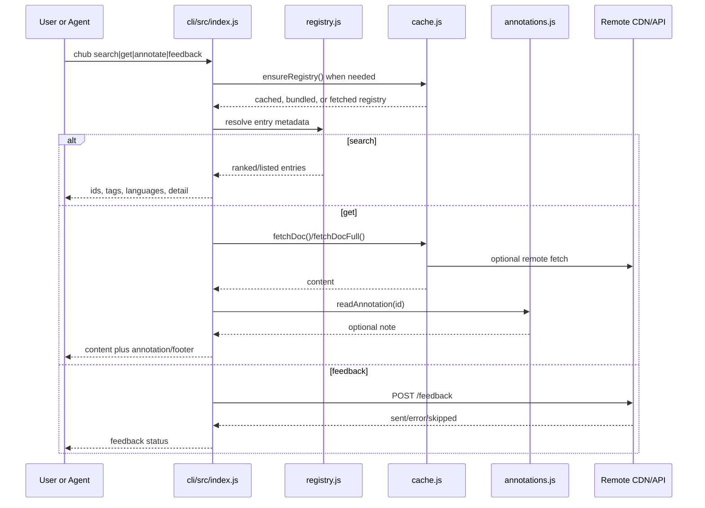
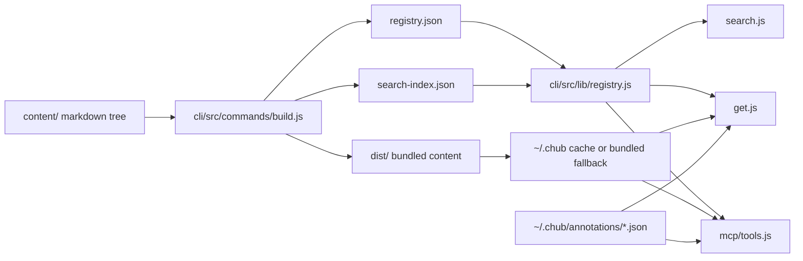
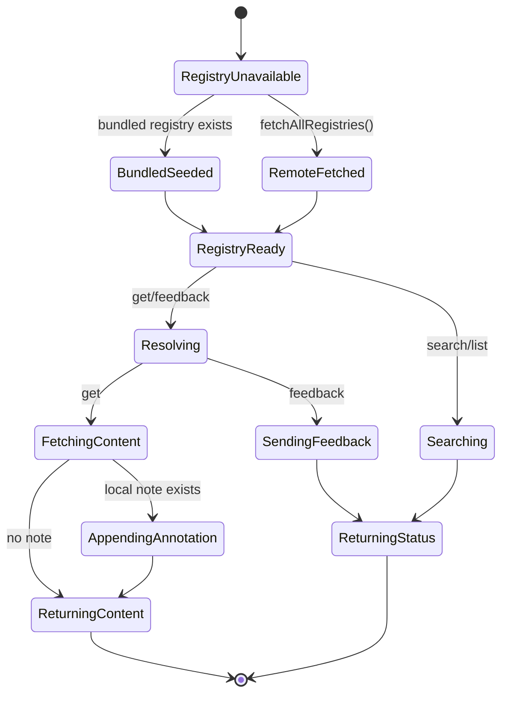

# Entrypoints and Main Flow

## 1. Scope

- Repository: `andrewyng/context-hub`
- Goal of this shared investigation: identify the common execution and data flow that all README-described capabilities reuse.
- Later capability tasks reusing this document: T03 search/discovery, T04 versioned retrieval, T05 incremental fetch, T06 annotations, T07 feedback loop.

## 2. Key Entrypoints

| Entrypoint | File | Role | Why it matters |
| --- | --- | --- | --- |
| CLI bootstrap | `cli/src/index.js` | Registers commands, global flags, help text, and pre-action registry hydration | All end-user CLI capability flows start here |
| Search command | `cli/src/commands/search.js` | Lists entries, exact-id detail, and fuzzy ranked search | Implements README search/discovery claims |
| Get command | `cli/src/commands/get.js` | Resolves IDs, language/version, file selection, output format, and annotation replay | Implements the main content-fetch flow |
| Registry resolver | `cli/src/lib/registry.js` | Merges docs and skills across sources, filters, ranks, resolves paths | Shared lookup layer behind search/get/MCP |
| Cache and transport layer | `cli/src/lib/cache.js` | Loads local or bundled registries, fetches remote docs, handles optional bundle download | Defines local-vs-remote storage boundaries |
| Build command | `cli/src/commands/build.js` | Converts markdown content trees into `registry.json` and `search-index.json` | Proves how versioned searchable content is produced |
| MCP server | `cli/src/mcp/server.js`, `cli/src/mcp/tools.js` | Exposes the same core capabilities as MCP tools | Confirms the repo supports agent-native use, not only shell CLI |

## 3. Main Flow Skeleton

- `chub` starts in `cli/src/index.js`, registers commands, and calls `ensureRegistry()` before commands that need the catalog.
- `ensureRegistry()` in `cli/src/lib/cache.js` prefers an existing cached registry, seeds from bundled `dist/registry.json` when available, and only falls back to remote download when no local registry exists.
- Search-oriented paths stay entirely metadata-driven: `search.js` calls `searchEntries()` or `listEntries()` in `registry.js`, which merge source registries, optionally apply BM25 ranking, and filter by tags/language.
- Retrieval-oriented paths resolve from catalog metadata to content paths: `get.js` calls `getEntry()`, `resolveDocPath()`, `resolveEntryFile()`, then `fetchDoc()` or `fetchDocFull()`.
- Annotation replay is a post-fetch concern: `get.js` reads local annotation JSON after fetching content and appends it to stdout or JSON output.
- Feedback is outbound-only from this repo’s perspective: `feedback.js` resolves basic entry metadata and calls `sendFeedback()` in `telemetry.js`, which POSTs to a remote API.
- The MCP layer (`cli/src/mcp/tools.js`) wraps the same registry, cache, annotation, and feedback helpers instead of reimplementing separate behavior.

## 4. Architecture Notes

- Primary technology stack: Node.js ESM CLI using `commander`, `chalk`, `yaml`, `zod`, `@modelcontextprotocol/sdk`, and `posthog-node`.
- Data model split is explicit: docs are nested by `languages[].versions[]`, while skills are flat entries without language/version (`cli/src/lib/registry.js`, `cli/src/commands/build.js`).
- Search strategy is hybrid: build-time BM25 index generation (`cli/src/commands/build.js`, `cli/src/lib/bm25.js`) plus runtime fallback keyword matching when no search index exists (`cli/src/lib/registry.js`).
- Storage boundaries:
  - bundled package content under `cli/dist/` at publish time,
  - local cache and source metadata under `~/.chub/sources/`,
  - local annotations under `~/.chub/annotations/`,
  - remote content or feedback endpoints behind configurable URLs.
- Trust and source boundaries are config-driven via `~/.chub/config.yaml`, with support for multiple remote or local sources (`cli/src/lib/config.js`).

## 5. Shared Evidence for Capability Tasks

- Command registration and registry preloading: `cli/src/index.js`
- Multi-source config and cache root resolution: `cli/src/lib/config.js`
- Registry merge, filtering, exact lookup, and doc path resolution: `cli/src/lib/registry.js`
- Remote/local fetch and bundled fallback: `cli/src/lib/cache.js`
- Local annotation persistence: `cli/src/lib/annotations.js`
- Outbound feedback transport and client identity generation: `cli/src/lib/telemetry.js`, `cli/src/lib/identity.js`
- Content schema and on-disk structure: `docs/content-guide.md`, `content/*/docs/**/DOC.md`, `content/*/skills/**/SKILL.md`
- MCP wrappers around the same core logic: `cli/src/mcp/tools.js`, `cli/src/mcp/server.js`

## 6. Open Questions

- The repo clearly implements client-side feedback submission, but the maintainer-side processing loop is external and not inspectable here.
- README and docs describe agent-centric usage, but default test/runtime behavior depends on write access to `~/.chub`; restricted environments can produce false negatives for annotation tests.
- Search quality depends on presence of `search-index.json`; runtime fallback exists, but README does not explain ranking degradation when the index is missing.

## 7. Recommended Next Reading Paths

- 1. `cli/src/lib/registry.js`
- 2. `cli/src/lib/cache.js`
- 3. `cli/src/commands/get.js`
