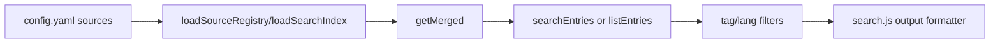
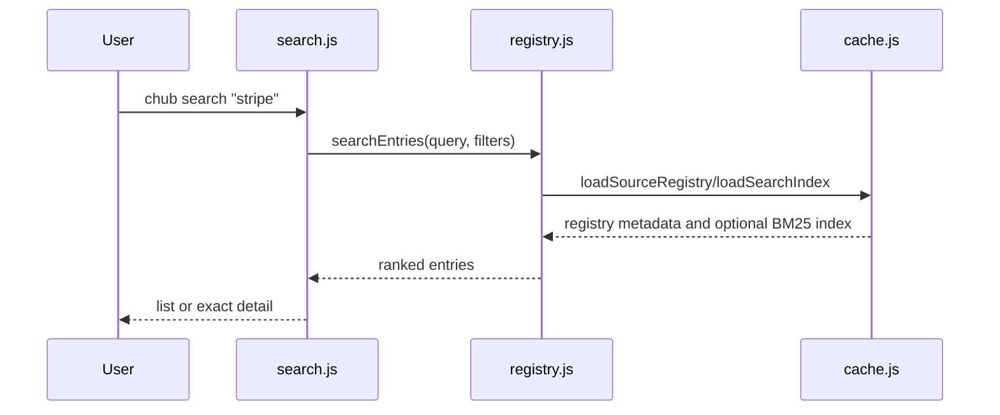

# Search and Discovery of Available Content

## 1. Capability Definition

- Problem solved: let agents find relevant docs or skills without open-web search.
- User or scenario: an agent needs a stable ID before fetching content.
- Input: free-text query, exact ID, optional tags, optional language filter.
- Output: ranked entry list or exact entry detail.

## 2. README-Side Mechanism

- README presents `chub search [query]` as the first interaction step and says it searches docs and skills.
- README examples cover fuzzy search (`"stripe payments"`) and listing what is available.

## 3. Solution Analysis And Alternatives

- Implementation paradigm: local catalog search over prebuilt registry metadata, with BM25 ranking when a search index exists and fallback keyword scoring otherwise.
- Alternative approach would be direct filesystem globbing or remote API search only; the repo instead keeps search deterministic and source-mergeable.
- This fits the README claim well because the search target is clearly the Context Hub catalog, not the web.

## 4. Implementation Mechanics

- `registerSearchCommand()` in `cli/src/commands/search.js` handles three modes: list-all, exact-id detail, and fuzzy search.
- `searchEntries()` and `listEntries()` in `cli/src/lib/registry.js` merge docs and skills from all configured sources and apply tag/language filters.
- Build-time search index generation is done in `cli/src/commands/build.js`, which writes `search-index.json`; runtime load happens in `loadSearchIndex()` in `cli/src/lib/cache.js`.

## 5. State and Lifecycle Analysis

- There is no complex state machine beyond registry availability and result formatting.
- Search lifecycle: ensure registry -> merge source metadata -> rank/filter -> emit human or JSON output.

## 6. Data and Storage Analysis

- Input data comes from one or more `registry.json` files and optional `search-index.json` files.
- No persistent mutation occurs during search.
- Result records are simplified metadata objects with IDs, descriptions, tags, and language information.

## 7. Architecture Analysis

- Search is metadata-only and does not touch doc bodies unless the user asks for exact ID detail.
- Multi-source support is native: entries are tagged with `_source` and only namespaced on collision.

## 8. Core Call Path

- Entry point: `cli/src/commands/search.js`
- Intermediate processing: `getEntry()` for exact IDs or `searchEntries()` for fuzzy matches
- Output node: human-readable list/detail or JSON via `output()`

## 9. Key Technical Points

- Hybrid BM25 and fallback keyword search.
- Exact ID lookup short-circuits fuzzy search.
- Skills and docs share the same search surface.
- Source collision handling uses `source:id` namespacing only when required.

## 10. Code Verification

- Code locations:
  - `cli/src/commands/search.js`
  - `cli/src/lib/registry.js`
  - `cli/src/lib/cache.js`
  - `cli/src/commands/build.js`
- Confirmed parts:
  - search across docs and skills
  - no-query listing
  - tag and language filters
  - exact ID detail mode
  - prebuilt search index support
- Supporting tests:
  - `cli/tests/lib/registry.test.js`
  - `cli/tests/mcp/tools.test.js`
  - `cli/test/lib/bm25.test.js`
- README claim is implemented.

## 11. Rebuildability

- Minimum modules to reproduce:
  - config/source loader
  - registry merge logic
  - optional BM25 index builder and runtime scorer
  - CLI/MCP presentation layer
- External dependencies are minimal; a rebuild could use plain JSON files and a simpler scorer.

## 12. Consistency Check

- README claim: agents can search available docs and skills.
- Code reality: implemented directly in both CLI and MCP, backed by merged registry metadata and BM25 ranking.
- Gap summary: none material.

## 13. Conclusion

- Exists: yes
- Confidence: high
- Validation status: Validated
- Evidence grade: A
- Next code entrypoints:
  - `cli/src/commands/search.js`
  - `cli/src/lib/registry.js`
  - `cli/src/lib/bm25.js`
