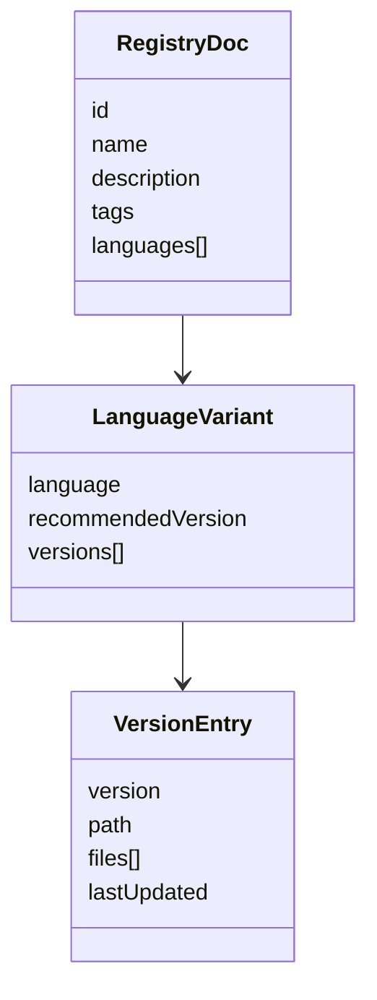
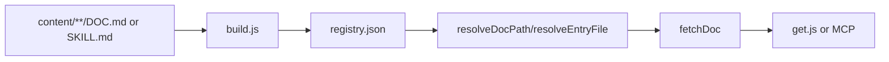
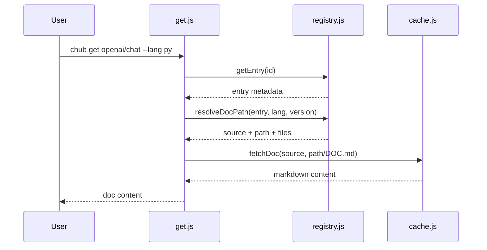

# Retrieval of Curated, Versioned, Language-Specific Content

## 1. Capability Definition

- Problem solved: fetch the right doc or skill variant by stable ID instead of relying on stale model knowledge.
- User or scenario: an agent needs a specific SDK/API doc, sometimes narrowed by language or version.
- Input: entry ID plus optional `--lang`, `--version`, and output path.
- Output: doc or skill content from local source, bundled package data, cache, or remote source.

## 2. README-Side Mechanism

- README claims "curated, versioned docs" and gives `chub get openai/chat --lang py` and `--lang js`.
- The commands table says `get <id>` fetches docs or skills by ID.

## 3. Solution Analysis And Alternatives

- Implementation paradigm: registry-guided path resolution into a content tree, with docs carrying nested language/version metadata and skills staying flat.
- This is stronger than a simple file map because it supports multiple content sources and recommended-version defaulting.

## 4. Implementation Mechanics

- `get.js` auto-detects whether the ID is a doc or skill based on presence of `languages`.
- `resolveDocPath()` in `registry.js` handles language selection, recommended version fallback, and explicit version errors.
- `resolveEntryFile()` chooses `DOC.md` or `SKILL.md`.
- `fetchDoc()` in `cache.js` reads local sources directly, then cached remote files, then bundled package content, then remote CDN paths.
- `build.js` materializes the underlying registry schema from markdown frontmatter in `content/`.

## 5. State and Lifecycle Analysis

- Main states:
  - unresolved ID
  - resolved entry
  - resolved language/version path
  - fetched content
  - emitted content
- Failure states are explicit for unknown ID, missing language, bad version, and missing content file.

## 6. Data and Storage Analysis

- Main input metadata comes from `registry.json`.
- Main payload is markdown content stored in `content/`, built into `dist/`, cached in `~/.chub/sources/<source>/data`, or served from remote URLs.
- Versioned and language-specific data is represented as `languages[].versions[]` entries in registry objects.

## 7. Architecture Analysis

- The build pipeline and runtime resolver are tightly aligned:
  - `docs/content-guide.md` defines content layout and frontmatter,
  - `cli/src/commands/build.js` converts that layout into registry records,
  - `cli/src/lib/registry.js` resolves runtime fetch paths from those records.
- Skills are a first-class parallel content type and share the same `get` path.

## 8. Core Call Path

- Entry point: `cli/src/commands/get.js`
- Intermediate processing:
  - `getEntry()`
  - `resolveDocPath()`
  - `resolveEntryFile()`
  - `fetchDoc()` or `fetchDocFull()`
- Output node: stdout, JSON, or files written via `-o`

## 9. Key Technical Points

- Recommended version defaults are computed at build time and reused at runtime.
- `ensureRegistry()` supports three retrieval modes: cached registry, bundled registry seed, or remote download.
- Content is curated markdown, not generated from API schemas at fetch time.

## 10. Code Verification

- Code locations:
  - `cli/src/commands/get.js`
  - `cli/src/lib/registry.js`
  - `cli/src/lib/cache.js`
  - `cli/src/commands/build.js`
  - `docs/content-guide.md`
  - `content/openai/docs/chat/python/DOC.md`
- Confirmed parts:
  - fetch by stable ID
  - language-specific docs
  - explicit version support and error handling
  - skill retrieval through the same command
  - local, bundled, cached, and remote fetch layers
- Supporting tests:
  - `cli/test/e2e.test.js`
  - `cli/tests/mcp/tools.test.js`
- README claim is implemented.

## 11. Rebuildability

- Minimum modules:
  - markdown content tree with frontmatter
  - registry builder
  - runtime resolver
  - fetch/cache layer
- External dependency that cannot be fully reconstructed from the repo alone:
  - remote CDN deployment used by default source URLs

## 12. Consistency Check

- README claim: curated, versioned, language-specific docs are retrievable with `get`.
- Code reality: fully supported through explicit registry schema, content layout, and resolver logic.
- Gap summary: none material. The repo is stronger than the README on implementation detail because it also supports bundled content, local sources, and MCP.
- Mismatch classification: `code implemented, README under-describes it`

## 13. Conclusion

- Exists: yes
- Confidence: high
- Validation status: Implemented but Under-Documented
- Evidence grade: A
- Next code entrypoints:
  - `cli/src/commands/get.js`
  - `cli/src/lib/cache.js`
  - `cli/src/commands/build.js`
