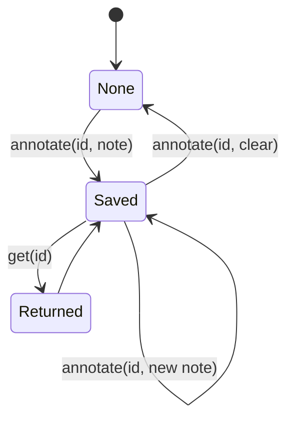
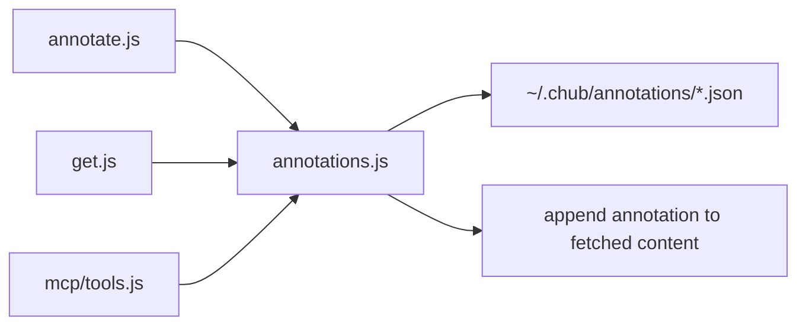

# Local Persistent Annotations That Reappear on Future Fetches

## 1. Capability Definition

- Problem solved: let agents preserve task-specific lessons locally and replay them when the same doc or skill is fetched again.
- User or scenario: an agent discovered an integration gotcha and wants it visible next session.
- Input: entry ID plus note text, or read/list/clear annotation operations.
- Output: persisted local JSON annotation and optional replay during later `get`.

## 2. README-Side Mechanism

- README explicitly says annotations are local notes, persist across sessions, and appear automatically on future `chub get`.

## 3. Solution Analysis And Alternatives

- Implementation paradigm: one local JSON file per entry ID under the user’s Chub directory.
- This is intentionally simpler than a shared database or append-only history log.
- The repo chooses overwrite semantics: one current note per entry, replaced on re-annotate.

## 4. Implementation Mechanics

- `annotations.js` maps `author/name` IDs to filesystem-safe JSON filenames by replacing `/` with `--`.
- `writeAnnotation()` stores `{ id, note, updatedAt }` under `~/.chub/annotations/`.
- `annotate.js` exposes list, read, write, and clear flows.
- `get.js` reads the annotation after fetching entry content and appends it to stdout or the JSON payload.
- MCP mirrors the same behavior through `handleAnnotate()` and `handleGet()`.

## 5. State and Lifecycle Analysis

- Main states:
  - no annotation
  - saved annotation
  - replaced annotation
  - cleared annotation
- Trigger points:
  - `annotate` writes or clears
  - `get` reads and conditionally appends
- A meaningful lifecycle exists but it is simple storage state rather than workflow orchestration.

## 6. Data and Storage Analysis

- Storage boundary: local filesystem only, under the configurable Chub directory.
- Data shape: one JSON object per entry, no multi-note history.
- Replay point: `get` appends a rendered note block to human output or includes `annotation` in JSON output.

## 7. Architecture Analysis

- Annotation persistence is deliberately decoupled from registry availability; both CLI bootstrap and docs mark `annotate` as a command that skips registry hydration.
- The same annotation store is shared by CLI and MCP.

## 8. Core Call Path

- Entry points:
  - `cli/src/commands/annotate.js`
  - `cli/src/commands/get.js`
  - `cli/src/mcp/tools.js`
- Intermediate processing:
  - `writeAnnotation()`, `readAnnotation()`, `clearAnnotation()`, `listAnnotations()`
- Output node: annotation confirmation, annotation readout, or fetch output with replayed note

## 9. Key Technical Points

- Entry IDs are sanitized before becoming filenames.
- Registry is not required for write/read/list/clear annotation operations.
- MCP annotation handler adds explicit ID validation to guard against filesystem abuse.

## 10. Code Verification

- Code locations:
  - `cli/src/lib/annotations.js`
  - `cli/src/commands/annotate.js`
  - `cli/src/commands/get.js`
  - `cli/src/mcp/tools.js`
  - `docs/feedback-and-annotations.md`
- Confirmed parts:
  - local persistence
  - replay on future fetch
  - list and clear support
  - overwrite semantics on repeated writes
- Supporting tests:
  - `cli/test/e2e.test.js`
  - `cli/tests/mcp/tools.test.js`
- Runtime caveat:
  - default-environment MCP annotation tests fail in this sandbox because writes to `/Users/ryan/.chub` are blocked (`EPERM`), but the same tests pass when `CHUB_DIR` is redirected to `/tmp/context-hub-test`.

## 11. Rebuildability

- Minimum modules:
  - filesystem-backed key-value store
  - ID-to-path normalization
  - fetch-time replay hook
- No external service is required.

## 12. Consistency Check

- README claim: local notes persist across sessions and appear automatically on future fetches.
- Code reality: implemented exactly with local JSON files and fetch-time append behavior.
- Gap summary: none in behavior. The only observed friction is environment dependence on writable home-directory storage.

## 13. Conclusion

- Exists: yes
- Confidence: high
- Validation status: Validated
- Evidence grade: A
- Next code entrypoints:
  - `cli/src/lib/annotations.js`
  - `cli/src/commands/annotate.js`
  - `cli/src/commands/get.js`
