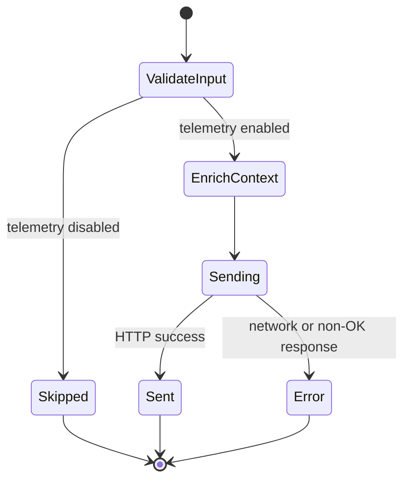
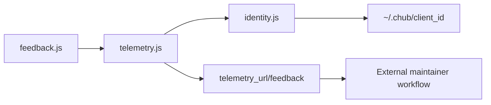

# Feedback Submission to Improve Shared Content Over Time

## 1. Capability Definition

- Problem solved: let agents send structured quality signals back to maintainers/authors.
- User or scenario: an agent found docs helpful, outdated, incomplete, or wrong.
- Input: entry ID, up/down rating, optional comment, labels, file, agent/model context.
- Output: sent/skipped/error feedback status from a remote telemetry endpoint.

## 2. README-Side Mechanism

- README says `chub feedback` votes docs up or down and that feedback flows back to authors so content improves over time.

## 3. Solution Analysis And Alternatives

- Implementation paradigm: thin client submission over HTTP to an external feedback API, sharing telemetry configuration and client identity utilities.
- The repo does not include author dashboards, moderation queues, or content update automation, so the full improvement loop is only partially visible here.

## 4. Implementation Mechanics

- `feedback.js` validates rating, labels, and telemetry status, then infers entry type and optional doc language/version context from the registry.
- `sendFeedback()` in `telemetry.js` POSTs JSON to `${telemetryUrl}/feedback` with `X-Client-ID` derived from a stable hashed machine identifier (`identity.js`).
- Valid labels are hard-coded in `feedback.js`.
- MCP exposes the same outbound capability through `handleFeedback()`.

## 5. State and Lifecycle Analysis

- Main states:
  - telemetry disabled -> skipped
  - request sent -> success
  - network/http problem -> error
- The lifecycle ends at transmission response; there is no in-repo state transition for author review or content updates.

## 6. Data and Storage Analysis

- Outbound payload includes:
  - entry ID and type
  - rating
  - optional doc language/version and target file
  - labels/comment
  - agent/model metadata
  - CLI version and source
- Local storage side effect is limited to cached client ID under `~/.chub/client_id`.
- No in-repo persistence of submitted feedback exists.

## 7. Architecture Analysis

- Feedback depends on the telemetry subsystem rather than the content build pipeline.
- Maintainer improvement is an external dependency boundary; the repo provides the client, not the closed loop.

## 8. Core Call Path

- Entry points:
  - `cli/src/commands/feedback.js`
  - `cli/src/mcp/tools.js`
- Intermediate processing:
  - `isTelemetryEnabled()`
  - `getEntry()` for type/context inference
  - `sendFeedback()`
- Output node: sent, skipped, or error result

## 9. Key Technical Points

- Feedback and anonymous analytics share the same telemetry opt-out switch.
- Client IDs are stable and machine-derived via SHA-256 hash of a platform UUID.
- The endpoint URL is configurable via config or environment variable.

## 10. Code Verification

- Code locations:
  - `cli/src/commands/feedback.js`
  - `cli/src/lib/telemetry.js`
  - `cli/src/lib/identity.js`
  - `cli/src/mcp/tools.js`
  - `docs/feedback-and-annotations.md`
- Confirmed parts:
  - command surface and label validation
  - telemetry enable/disable path
  - outbound POST to `/feedback`
  - stable client-ID creation
  - MCP parity
- Unconfirmed parts:
  - how maintainers receive, review, or act on submissions
  - whether feedback reliably improves docs over time
- Supporting tests:
  - `cli/tests/mcp/tools.test.js`
  - partial runtime evidence from local execution

## 11. Rebuildability

- Minimum modules:
  - command/API wrapper
  - telemetry config
  - stable anonymous client identity
  - remote feedback API
- External dependencies that cannot be reconstructed from the repo alone:
  - the backend service at `api.aichub.org` (or configured equivalent)
  - maintainer workflow consuming feedback

## 12. Consistency Check

- README claim: feedback flows back to authors and helps improve content for everyone.
- Code reality: the repository implements the submission client but not the maintainer-facing processing loop.
- Gap summary: the "send feedback" part is verified; the "authors improve content" loop depends on an external platform or process not present here.
- Mismatch classification: `depends on external platform or service, cannot be fully verified in repo`

## 13. Conclusion

- Exists: partial
- Confidence: medium
- Validation status: Partially Validated
- Evidence grade: C
- Next code entrypoints:
  - `cli/src/commands/feedback.js`
  - `cli/src/lib/telemetry.js`
  - `cli/src/lib/identity.js`
