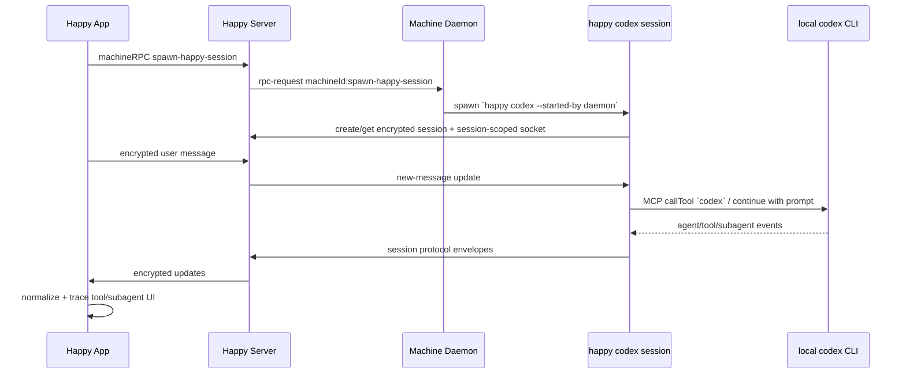
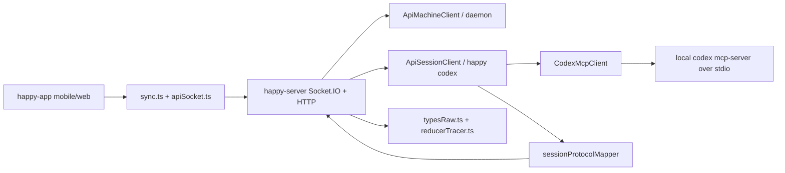

# Entrypoints and Main Flow

## 1. Scope

- Repository: `happy`
- Goal of this shared investigation: establish the concrete Codex path from mobile/web prompt to local Codex execution and back, then isolate how subagents and skills are treated
- Later capability tasks reusing this document:
  - `03-capability-mobile-web-remote-control.md`
  - `04-capability-codex-cli-wrapper.md`
  - `05-capability-encrypted-sync-backend.md`
  - `06-capability-device-handoff-and-push.md`

## 2. Key Entrypoints

| Entrypoint | File | Role | Why it matters |
| --- | --- | --- | --- |
| CLI command router | `packages/happy-cli/src/index.ts` | Parses `happy`, `happy codex`, `happy gemini`, auth/connect/daemon commands | Confirms Codex is launched as a CLI subcommand, not via SDK embedding |
| Codex runner | `packages/happy-cli/src/codex/runCodex.ts` | Creates Happy session, receives user prompts, starts/continues Codex, emits session protocol envelopes | Central evidence for the asked flow |
| Codex transport | `packages/happy-cli/src/codex/codexMcpClient.ts` | Connects to local `codex mcp-server` or `codex mcp` via stdio MCP | Proves Happy uses the Codex CLI process and MCP transport |
| Mobile/web send path | `packages/happy-app/sources/sync/sync.ts` | Builds encrypted user message records and queues them for sending | Shows how mobile commands enter the system |
| User-scoped RPC client | `packages/happy-app/sources/sync/apiSocket.ts` | Provides encrypted `sessionRPC` and `machineRPC` over Socket.IO | Explains remote control and permission/abort calls |
| Machine/session RPC operations | `packages/happy-app/sources/sync/ops.ts` | Spawns sessions, approves permissions, aborts/kills sessions | Defines phone-side control surface |
| Session socket handler | `packages/happy-server/sources/app/api/socket/sessionUpdateHandler.ts` | Persists encrypted messages and fan-outs updates | Server-side message transport proof |
| RPC forwarding | `packages/happy-server/sources/app/api/socket/rpcHandler.ts` | Routes `rpc-call` to another socket of the same user | Explains how phone talks to daemon/session processes |
| App-side session normalization | `packages/happy-app/sources/sync/typesRaw.ts` | Converts session envelopes into renderable messages | Explains how returned Codex events become mobile UI |
| Sidechain tracer | `packages/happy-app/sources/sync/reducer/reducerTracer.ts` | Links subagent/Task sidechains to parent tool messages | Core evidence for multi-agent visualization |

## 3. Main Flow Skeleton

### End-to-end Codex remote flow

### Static architecture view

## 4. Architecture Notes

- Happy separates concerns cleanly:
  - `happy-app` is a remote controller and renderer.
  - `happy-server` is a sync and routing layer, not the agent runtime.
  - `happy-cli` owns local execution, encryption, and protocol adaptation.
- Codex execution path is CLI-first:
  - `index.ts` dispatches `happy codex`.
  - `runCodex.ts` creates the Happy session and drives Codex.
  - `CodexMcpClient` shells out to `codex`.
- Message flow is encrypted before transport:
  - app encrypts raw user records;
  - server stores opaque encrypted payloads;
  - CLI decrypts incoming user messages and encrypts outgoing envelopes.
- Happy adds one local MCP server of its own:
  - `happy-mcp.mjs` exposes only `change_title`;
  - `runCodex.ts` passes this server in `config.mcp_servers`.
- Multi-agent handling is representational, not orchestration-first:
  - session protocol defines `subagent`;
  - app reducer/tracer links those sidechains back to the parent tool message.

## 5. Shared Evidence for Capability Tasks

- README proof of wrapper/product positioning:
  - `README.md`
- CLI router and Codex command:
  - `packages/happy-cli/src/index.ts`
- Codex launch and queueing:
  - `packages/happy-cli/src/codex/runCodex.ts`
- Codex stdio MCP transport:
  - `packages/happy-cli/src/codex/codexMcpClient.ts`
- Happy-owned MCP bridge:
  - `packages/happy-cli/src/codex/happyMcpStdioBridge.ts`
- Session-scoped message ingestion:
  - `packages/happy-cli/src/api/apiSession.ts`
- App send path and RPC path:
  - `packages/happy-app/sources/sync/sync.ts`
  - `packages/happy-app/sources/sync/apiSocket.ts`
  - `packages/happy-app/sources/sync/ops.ts`
- Server persistence/router:
  - `packages/happy-server/sources/app/api/socket/sessionUpdateHandler.ts`
  - `packages/happy-server/sources/app/api/socket/rpcHandler.ts`
- Subagent/session protocol handling:
  - `docs/session-protocol.md`
  - `packages/happy-cli/src/codex/utils/sessionProtocolMapper.ts`
  - `packages/happy-app/sources/sync/typesRaw.ts`
  - `packages/happy-app/sources/sync/reducer/reducerTracer.ts`

## 6. Open Questions

- Codex path does not expose the same explicit `switch` RPC handler visible in Claude path; README’s "press any key to switch back" wording may not apply uniformly.
- No code evidence was found that Happy discovers or installs Codex `skills`; this appears outside Happy’s own orchestration.
- A conditional path in daemon spawn can set a temporary `CODEX_HOME` when a token is supplied, which could affect Codex-home-scoped assets; current normal user path for this repository is not fully proven from app call sites.

## 7. Recommended Next Reading Paths

- 1. `packages/happy-cli/src/codex/runCodex.ts`
- 2. `packages/happy-app/sources/sync/sync.ts`
- 3. `packages/happy-server/sources/app/api/socket/sessionUpdateHandler.ts`
