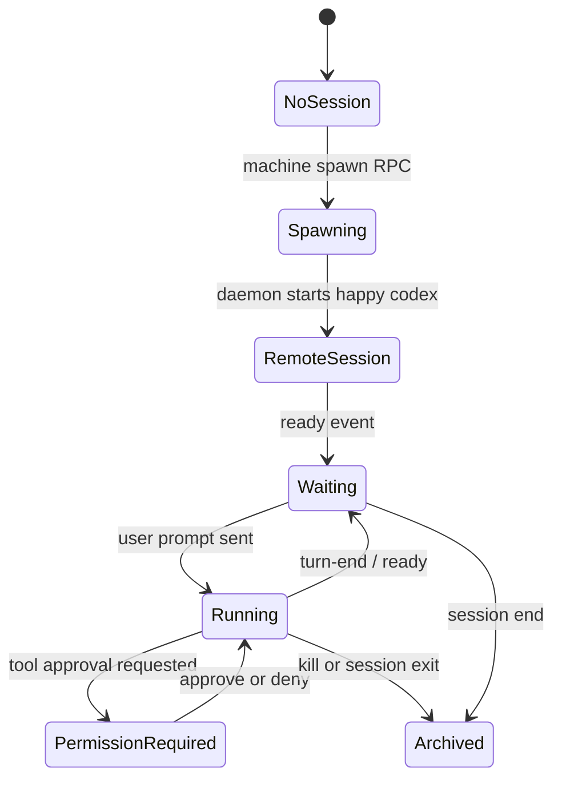
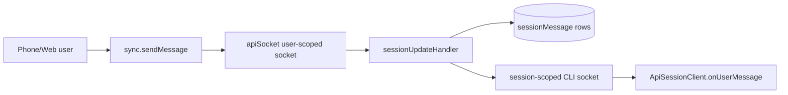

# Mobile And Web Remote Control

## 1. Capability Definition

- Problem solved: send prompts to a coding agent running on your own computer and monitor it remotely.
- User or scenario: user opens Happy app/web while away from the desk.
- Input: user prompt, permission response, abort/kill/switch requests.
- Output: persisted session messages, live updates, tool/permission state, ready notifications.

## 2. README-Side Mechanism

- README says Happy is a "Mobile and Web Client for Claude Code & Codex".
- README says when you want control from phone, Happy "restarts the session in remote mode".
- README positions the app as controller/observer, not executor.

## 3. Solution Analysis And Alternatives

- Likely implementation paradigm from README: phone/web talks to a local companion on the user’s machine through a relay service.
- Alternative would have been a fully hosted remote runner; code does not support that interpretation.
- Advantage: execution remains on the user machine.
- Limit: requires a connected local machine and Happy CLI/daemon.

## 4. Implementation Mechanics

- Technologies:
  - Expo/React Native app in `happy-app`
  - Socket.IO for realtime updates
  - Fastify + Socket.IO in `happy-server`
  - local daemon + CLI in `happy-cli`
- App-side send path:
  - `sync.sendMessage()` creates a raw `user` text record with mode metadata and encrypts it.
  - `apiSocket` sends RPCs and subscribes as `user-scoped`.
- Machine spawn path:
  - `machineSpawnNewSession()` calls `machineRPC(..., 'spawn-happy-session', ...)`.
  - server RPC layer forwards the request to the machine daemon socket.

## 5. State and Lifecycle Analysis

- Main states visible in code:
  - machine spawn
  - session creation
  - prompt send
  - agent running/thinking
  - permission pending
  - ready/idle
  - archived/end

## 6. Data and Storage Analysis

- Inputs:
  - user text
  - permission decisions
  - machine/session RPC requests
- Transformations:
  - plaintext prompt -> encrypted raw record -> session message row -> decrypted on local CLI -> Codex prompt
- Persistence boundaries:
  - app local storage for synced session state
  - server Postgres for session rows/messages
  - encrypted payloads stored opaquely on server

## 7. Architecture Analysis

## 8. Core Call Path

- Session creation:
  - app `machineSpawnNewSession()`
  - `apiSocket.machineRPC(...)`
  - server `rpcHandler`
  - daemon `ApiMachineClient.setRPCHandlers('spawn-happy-session')`
  - daemon spawns `happy codex --started-by daemon`
- Prompt delivery:
  - app `sync.sendMessage()`
  - server `sessionUpdateHandler` persists `new-message`
  - session client `ApiSessionClient.routeIncomingMessage()`
  - `runCodex()` queue receives prompt

## 9. Key Technical Points

- Remote control is session-centric, not shell-stream mirroring.
- RPC and message channels are distinct:
  - messages for prompts and agent output
  - RPC for control operations like spawn, permission, abort, kill
- The server routes within one authenticated user account; it is a mailbox/router.

## 10. Code Verification

- Code locations:
  - `packages/happy-app/sources/sync/sync.ts`
  - `packages/happy-app/sources/sync/apiSocket.ts`
  - `packages/happy-app/sources/sync/ops.ts`
  - `packages/happy-server/sources/app/api/socket/sessionUpdateHandler.ts`
  - `packages/happy-server/sources/app/api/socket/rpcHandler.ts`
  - `packages/happy-cli/src/api/apiMachine.ts`
  - `packages/happy-cli/src/daemon/run.ts`
- Confirmed parts:
  - mobile/web can spawn machine sessions
  - mobile/web can send encrypted prompts
  - local session receives those prompts
  - control RPCs exist for permission/abort/kill
- Unconfirmed parts:
  - full parity of all remote-control interactions across every agent flavor

## 11. Rebuildability

- Minimum modules to rebuild:
  - app prompt sender
  - session-scoped server transport
  - machine-scoped daemon spawn RPC
  - local session runner
- External dependencies:
  - Socket.IO
  - database-backed session storage
  - authenticated device pairing

## 12. Consistency Check

- README claim: remote control from phone/web.
- Code reality: clearly implemented.
- Gap summary: README is high-level, code shows a more explicit machine/session RPC architecture.
- Mismatch classification: none.

## 13. Conclusion

- Exists: yes
- Confidence: high
- Validation status: Validated
- Evidence grade: A
- Next code entrypoints:
  - `packages/happy-app/sources/sync/sync.ts`
  - `packages/happy-server/sources/app/api/socket/sessionUpdateHandler.ts`
  - `packages/happy-cli/src/daemon/run.ts`
