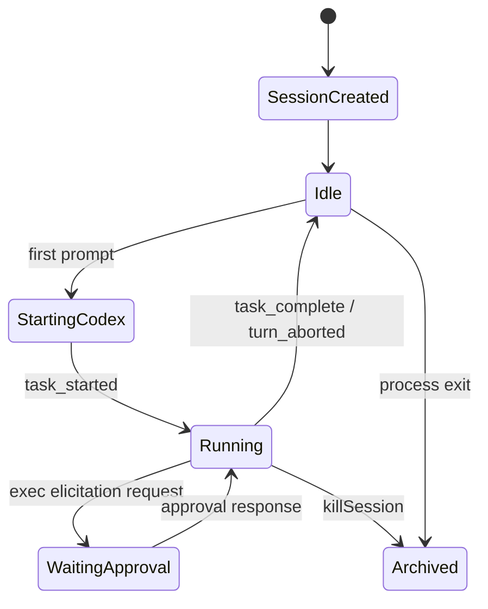
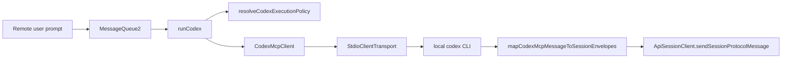
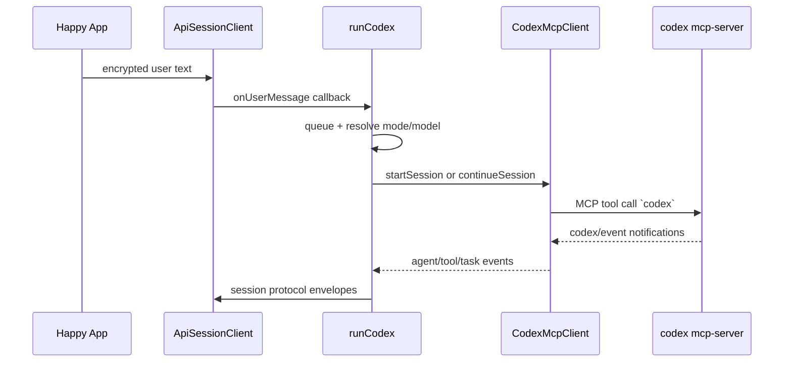

# Codex CLI Wrapper

## 1. Capability Definition

- Problem solved: let Happy wrap local Codex sessions so remote clients can drive and observe them.
- User or scenario: user runs `happy codex` locally or the daemon spawns it remotely.
- Input: user prompt plus permission/model mode metadata.
- Output: local Codex execution and a normalized session-event stream for Happy clients.

## 2. README-Side Mechanism

- README explicitly says "Use `happy codex` instead of `codex`".
- README says Happy starts the AI "through our wrapper".
- README does not claim SDK embedding.

## 3. Solution Analysis And Alternatives

- Code confirms a wrapper around the installed Codex CLI, not an OpenAI SDK integration.
- Alternative implementation would call model APIs directly and emulate Codex tools; no such path is evidenced here.
- Advantage: Happy inherits native Codex behavior.
- Limit: Happy is downstream of Codex CLI behavior and protocol changes.

## 4. Implementation Mechanics

- `packages/happy-cli/src/index.ts` dispatches the `codex` subcommand and calls `runCodex(...)`.
- `runCodex()`:
  - authenticates the Happy machine/session
  - creates a Happy session with flavor `codex`
  - listens for remote user messages via `ApiSessionClient.onUserMessage`
  - maps permission mode to Codex execution policy
  - starts or continues a Codex session
- `CodexMcpClient.connect()` shells out to:
  - `codex mcp-server` on newer versions
  - `codex mcp` on older versions
- Communication with Codex uses MCP stdio transport from `@modelcontextprotocol/sdk`.

## 5. State and Lifecycle Analysis

## 6. Data and Storage Analysis

- Main data flow:
  - remote prompt arrives in Happy session queue
  - `runCodex()` batches prompts by effective mode
  - prompt becomes `CodexSessionConfig`
  - Codex MCP events are mapped into session envelopes
  - session envelopes are sent back through Happy sync
- Important local state:
  - current turn id
  - subagent mappings
  - permission handler pending requests
  - optional resume file under `CODEX_HOME/sessions`

## 7. Architecture Analysis

## 8. Core Call Path

## 9. Key Technical Points

- This repository uses local Codex CLI plus MCP over stdio.
- It does not embed Codex in-process through an OpenAI SDK wrapper.
- Happy adds one MCP server of its own:
  - `happy-mcp.mjs`
  - exposes only `change_title`
- Therefore Happy extends Codex minimally; it does not rehost Codex tooling.

## 10. Code Verification

- Code locations:
  - `packages/happy-cli/src/index.ts`
  - `packages/happy-cli/src/codex/runCodex.ts`
  - `packages/happy-cli/src/codex/codexMcpClient.ts`
  - `packages/happy-cli/src/codex/happyMcpStdioBridge.ts`
- Confirmed parts:
  - `happy codex` is a real CLI command
  - Happy starts local Codex through `codex mcp-server` or `codex mcp`
  - prompts come from Happy session queue, not stdin only
  - output is converted into Happy session protocol
- Unconfirmed parts:
  - broader Codex internals beyond published MCP events

## 11. Rebuildability

- Minimum modules needed:
  - command router
  - Happy session client
  - Codex MCP client
  - event mapper
- External dependencies:
  - installed `codex` binary
  - MCP SDK
  - Happy server/session transport

## 12. Consistency Check

- README claim: wrapper around Codex.
- Code reality: strongly supported.
- Gap summary: README does not explain that the wrapper is specifically MCP-over-stdio to the existing `codex` executable.
- Mismatch classification: code implemented, README under-describes it.

## 13. Multi-agent And Skills In This Flow

- Multi-agent:
  - Happy does not appear to create its own planner/worker swarm for Codex.
  - Instead, `mapCodexMcpMessageToSessionEnvelopes()` watches provider events for `subagent`, `parent_call_id`, or `parentCallId`, allocates a stable Happy `subagent` id, emits `start`/`stop`, and carries subagent-linked text/tool events back to the app.
  - The app then normalizes those envelopes and uses the tracer/reducer to nest sidechain activity under the parent tool call.
- Skills:
  - No code evidence was found that Happy scans `SKILL.md`, `AGENTS.md`, or a Happy-owned skill registry for Codex.
  - Happy delegates agent behavior to the installed Codex runtime plus whatever Codex environment/config is available.
  - Happy only injects one MCP server, `change_title`; this is not a general skill system.
  - Conditional risk: daemon spawn code can set a temporary `CODEX_HOME` when an explicit token is supplied, and no code evidence was found that it copies user-global Codex-home assets into that temp directory. If a Codex skill system depends on `CODEX_HOME`, that inheritance may be incomplete on that path.

## 14. Conclusion

- Exists: yes
- Confidence: high
- Validation status: Validated
- Evidence grade: A
- Next code entrypoints:
  - `packages/happy-cli/src/codex/runCodex.ts`
  - `packages/happy-cli/src/codex/codexMcpClient.ts`
  - `packages/happy-cli/src/codex/utils/sessionProtocolMapper.ts`
