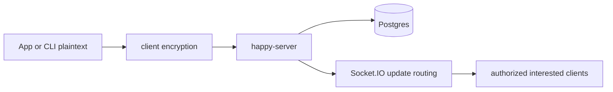

# End-To-End Encrypted Sync Backend

## 1. Capability Definition

- Problem solved: relay and persist session metadata/messages without requiring plaintext agent content on the server.
- User or scenario: mobile client and local CLI need shared session history and live updates.
- Input: encrypted metadata, encrypted agent state, encrypted message payloads.
- Output: stored rows plus routed realtime updates.

## 2. README-Side Mechanism

- README claims "end-to-end encrypted" and "Your code never leaves your devices unencrypted".
- README positions the backend as encrypted sync, not compute.

## 3. Solution Analysis And Alternatives

- Code and docs match a sync-server model:
  - clients encrypt before send;
  - server stores opaque encrypted strings/blobs;
  - session/machine sockets route updates.
- Alternative would be plaintext API payloads protected only by transport TLS; that is not what the docs and client/server code describe.

## 4. Implementation Mechanics

- Client-side:
  - CLI: `packages/happy-cli/src/api/encryption.ts`
  - App: `packages/happy-app/sources/sync/encryption/*`
- Server-side:
  - `sessionUpdateHandler.ts` stores incoming encrypted `message` strings as `{ t: 'encrypted', c: ... }`
  - metadata and agent state updates are versioned and routed to interested clients
- Protocol docs explicitly state encrypted WebSocket payloads rather than ACP REST.

## 5. State and Lifecycle Analysis

- Lifecycle is largely transport/persistence oriented rather than a complex business state machine.
- Important state:
  - per-session message sequence
  - per-user update sequence
  - metadata version
  - agent state version
  - online presence/activity cache

## 6. Data and Storage Analysis

```mermaid
classDiagram
  class Session {
    encrypted metadata
    encrypted agentState
  }
  class SessionMessage {
    seq
    content {t:'encrypted', c:string}
    localId
  }
  class Machine {
    encrypted metadata
    encrypted daemonState
  }
  Session --> SessionMessage
```

- Storage boundaries confirmed in docs:
  - Postgres for sessions/messages/machines
  - S3-compatible storage for artifacts
  - Redis initialized but not primary evidence for message bus in current code path

## 7. Architecture Analysis



## 8. Core Call Path

- app `sendMessage()` encrypts raw record
- server `sessionUpdateHandler` persists encrypted blob and emits `new-message`
- session/app clients fetch and decrypt with local keys

## 9. Key Technical Points

- Server acts as encrypted transport and storage coordinator.
- Session protocol adds renderability to agent output but still rides inside encrypted message records.
- This architecture is why Happy can support remote observation without moving execution off the user machine.

## 10. Code Verification

- Code locations:
  - `docs/backend-architecture.md`
  - `docs/session-protocol.md`
  - `packages/happy-app/sources/sync/encryption/*`
  - `packages/happy-cli/src/api/apiSession.ts`
  - `packages/happy-server/sources/app/api/socket/sessionUpdateHandler.ts`
- Confirmed parts:
  - encrypted session message storage
  - encrypted metadata/agent state update flow
  - realtime routing by user/session scope
- Unconfirmed parts:
  - full crypto correctness beyond static code reading

## 11. Rebuildability

- Minimum modules:
  - shared encryption format
  - versioned session storage
  - scoped realtime router
- External dependencies:
  - durable DB
  - auth/token layer
  - device key management

## 12. Consistency Check

- README claim: end-to-end encrypted sync.
- Code reality: strongly supported by docs, client code, and server persistence format.
- Gap summary: README is concise; backend docs expose much richer storage and routing detail.
- Mismatch classification: none.

## 13. Conclusion

- Exists: yes
- Confidence: high
- Validation status: Validated
- Evidence grade: A
- Next code entrypoints:
  - `packages/happy-server/sources/app/api/socket/sessionUpdateHandler.ts`
  - `packages/happy-cli/src/api/apiSession.ts`
  - `packages/happy-app/sources/sync/encryption/sessionEncryption.ts`
