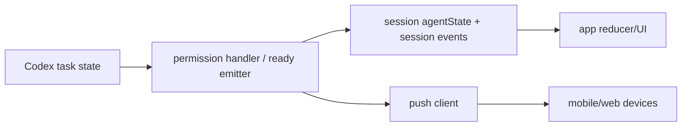

# Device Handoff And Push Notifications

## 1. Capability Definition

- Problem solved: notify users when action is needed and let control shift across devices.
- User or scenario: agent needs permission or finishes work while user is away.
- Input: permission requests, task completion, keepalive/activity signals.
- Output: push notification, session state updates, remote control actions.

## 2. README-Side Mechanism

- README claims:
  - "Push notifications"
  - "Switch devices instantly"
  - "press any key on your keyboard" to switch back

## 3. Solution Analysis And Alternatives

- Push behavior is directly evidenced in Codex runner.
- Device handoff is more uneven:
  - general infrastructure for mode/switch events exists
  - Claude path shows explicit `switch` handling
  - Codex path mainly shows remote keepalive plus prompt delivery, not the same explicit handoff RPC.

## 4. Implementation Mechanics

- Push:
  - `runCodex.ts` sends push on ready state via `api.push().sendToAllDevices(...)`
  - permission flow is backed by `CodexPermissionHandler`, which writes pending requests to session agent state for the app UI
- Handoff:
  - session event schema supports `switch`
  - app ops expose `sessionSwitch(sessionId, to)`
  - but the Codex runner in inspected code registers `abort` and `killSession`, not an explicit `switch` handler

## 5. State and Lifecycle Analysis

- Notification-oriented lifecycle:
  - running
  - permission required
  - ready
  - archived
- Device ownership lifecycle is only partially visible for Codex in this repo.

## 6. Data and Storage Analysis

- Push tokens are stored server-side according to backend docs.
- Permission state is stored in session `agentState.requests` / `completedRequests`.
- Ready is represented as a session event and normalized by the app into a non-visible `ready` message/event.

## 7. Architecture Analysis

## 8. Core Call Path

- Permission:
  - Codex emits elicitation request
  - `CodexMcpClient` forwards to `CodexPermissionHandler.handleToolCall()`
  - handler stores pending request in session agent state
  - app reads that state and can answer with `sessionAllow` or `sessionDeny`
- Ready:
  - task complete or turn aborted
  - `runCodex.ts` emits `ready` session event and push notification

## 9. Key Technical Points

- Permission response path is strongly implemented.
- Push path is implemented.
- Codex-specific instant desktop/mobile switching is less strongly evidenced than the README language suggests.

## 10. Code Verification

- Code locations:
  - `packages/happy-cli/src/codex/runCodex.ts`
  - `packages/happy-cli/src/codex/utils/permissionHandler.ts`
  - `packages/happy-app/sources/sync/ops.ts`
  - `packages/happy-app/sources/sync/storageTypes.ts`
  - `docs/backend-architecture.md`
- Confirmed parts:
  - push notification on ready
  - mobile approval/deny path for tool permission
  - event/state structures for control and readiness
- Partially confirmed parts:
  - README’s broad device-switching claim for the Codex path

## 11. Rebuildability

- Minimum modules:
  - permission-state persistence
  - app-side permission UI
  - push-token store and push sender
- External dependencies:
  - push provider
  - mobile device registration

## 12. Consistency Check

- README claim: instant device switching and push notifications.
- Code reality:
  - push notifications: implemented
  - switch semantics for Codex: insufficiently explicit in the inspected Codex path
- Gap summary: Codex path proves remote control plus push, but not the full README wording about instant back-and-forth handoff.
- Mismatch classification: README described, code partially implemented

## 13. Conclusion

- Exists: partial
- Confidence: medium
- Validation status: Partially Validated
- Evidence grade: C
- Next code entrypoints:
  - `packages/happy-cli/src/codex/runCodex.ts`
  - `packages/happy-app/sources/sync/ops.ts`
  - `packages/happy-cli/src/claude/claudeRemoteLauncher.ts`
