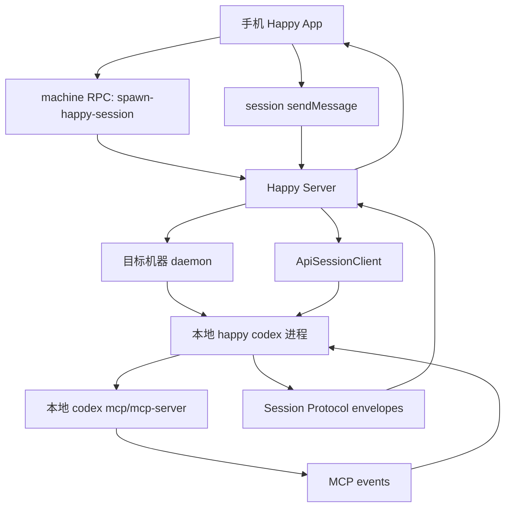
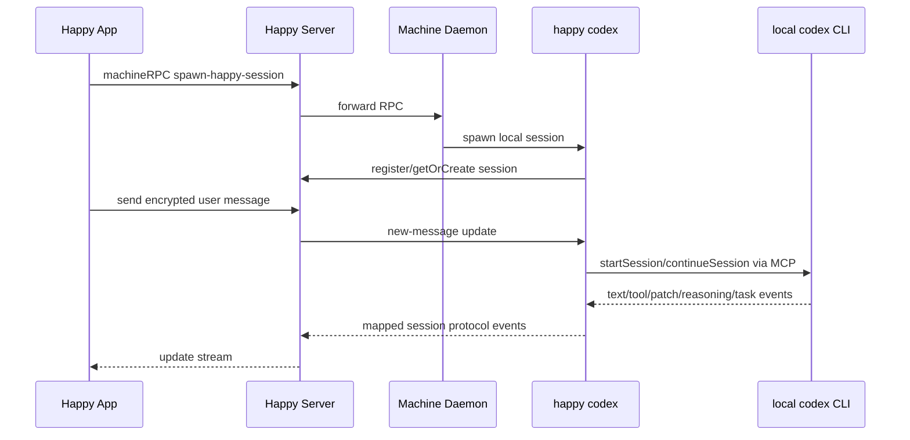

# Happy 仓库流程分析 01: Product Understanding

## 分析对象

- 仓库: `repos/happy`
- 本次只聚焦一个流程:
  1. Happy 如何操纵 Codex
  2. 移动端如何把指令发送给本机 Codex 并拿到结果
  3. 这个流程里多 agent / skills 是怎么处理的

## 术语表

- `Happy App`: 移动端/网页端客户端，负责发起会话、发消息、审批权限、展示执行过程。
- `Happy Server`: 云端同步与转发层，负责用户、机器、会话、Socket.IO 更新流，不直接执行 Codex。
- `Happy CLI`: 运行在用户电脑上的本地包装器，负责启动 `claude` / `codex` / `gemini`，并把它们接到 Happy 协议上。
- `Daemon`: Happy CLI 的后台进程，代表“这台机器在线”，可被远端请求拉起会话。
- `ApiSessionClient`: 本地 session 与 Happy Server 的加密消息/Socket 连接。
- `CodexMcpClient`: Happy 对本地 `codex mcp` 或 `codex mcp-server` 的 MCP 客户端包装。
- `Session Protocol`: Happy 自己的统一事件协议，用于把不同 provider 的输出转成统一 UI 事件流。
- `Subagent`: 底层 agent 产生的子代理/并行任务。Happy 主要做“识别并展示”，不是自己做推理编排。
- `Skill`: 底层 Codex/Claude 自己支持的技能机制。Happy 仓库里没有看到独立的 skills 调度引擎。

## 一句话定义

Happy 不是“云端替你运行 Codex 的 SaaS”，而是一个“本地 Codex/Claude 远程操控层”: 用户电脑本地运行真实 agent，Happy 的移动端和云端只负责加密同步、远程控制、权限交互和统一展示。

## 结论先说

### 结论 1

Happy 操纵 Codex 的方式是:

- 先在本机启动 `happy codex`
- `happy` CLI 再去启动本地安装的 `codex` CLI
- 双方通过 MCP stdio 通信
- Happy 再把 Codex 事件映射成自己的 session protocol 并同步给手机/网页

这不是“Happy 服务端直接调用 OpenAI SDK/Responses API 执行任务”的架构。

### 结论 2

“移动端发指令给 Codex”的真实路径是:

`Happy App -> Happy Server(Socket/RPC) -> 目标机器 daemon/session -> 本地 happy codex -> 本地 codex CLI -> 结果事件回流 -> Happy App`

### 结论 3

多 agent / subagent 的处理方式是:

- 底层 provider 产生 subagent
- Happy CLI 把 provider 的 subagent id 映射成 Happy 自己的 `cuid2`
- 再用统一协议发给 App 渲染

也就是说，Happy 的职责更像“协议适配 + UI 展示 + 远程控制”，不是“自研多 agent 编排器”。

### 结论 4

skills 的处理在这个流程里基本是“透传”:

- Happy 没有发现 `SKILL.md` 解析器、skills registry、skills scheduler
- 对 Codex 来说，skills 更可能仍由底层 `codex` CLI / `CODEX_HOME` 自己处理
- Happy 只保证这个本地 Codex 会话可以被远端控制和可视化

## 关键证据

### 已确认事实

1. `happy codex` 入口直接进入 `runCodex()`，说明 Happy 本地 CLI 是 Codex 的启动入口，而不是服务端代跑。
   - 证据: `repos/happy/packages/happy-cli/src/index.ts:100-118`

2. `CodexMcpClient` 会执行 `codex --version`，并通过 `codex mcp` 或 `codex mcp-server` 建立 `StdioClientTransport`。
   - 证据: `repos/happy/packages/happy-cli/src/codex/codexMcpClient.ts:23-49`
   - 证据: `repos/happy/packages/happy-cli/src/codex/codexMcpClient.ts:94-170`

3. `runCodex()` 会为 Happy 创建 machine/session，并监听远端 user message，把消息压入本地 `messageQueue`。
   - 证据: `repos/happy/packages/happy-cli/src/codex/runCodex.ts:98-121`
   - 证据: `repos/happy/packages/happy-cli/src/codex/runCodex.ts:169-205`

4. `runCodex()` 会启动 Happy MCP bridge，把 `happy-mcp.mjs` 注入给 Codex 作为 MCP server。
   - 证据: `repos/happy/packages/happy-cli/src/codex/runCodex.ts:526-533`
   - 证据: `repos/happy/packages/happy-cli/src/codex/runCodex.ts:616-655`

5. 移动端新建 session 时，会先调用 `machineSpawnNewSession()`，session 创建成功后再调用 `sync.sendMessage()` 发送首条 prompt。
   - 证据: `repos/happy/packages/happy-app/sources/app/(app)/new/index.tsx:1034-1057`

6. `machineSpawnNewSession()` 是 machine 级 RPC，方法名是 `spawn-happy-session`。
   - 证据: `repos/happy/packages/happy-app/sources/sync/ops.ts:160-177`

7. `sync.sendMessage()` 会把用户消息加密后写入 session outbox，并附带 `permissionMode`、`model`、`appendSystemPrompt` 等 meta。
   - 证据: `repos/happy/packages/happy-app/sources/sync/sync.ts:441-510`

8. `ApiSessionClient` 在本地 session 侧建立 `session-scoped` Socket 连接，接收 `update`，解密 `new-message`，并把消息路由给本地 agent 逻辑。
   - 证据: `repos/happy/packages/happy-cli/src/api/apiSession.ts:118-160`
   - 证据: `repos/happy/packages/happy-cli/src/api/apiSession.ts:172-210`

9. Daemon 控制面暴露 `/spawn-session`，说明远端请求最终会落到本机 daemon 再启动本地 session。
   - 证据: `repos/happy/packages/happy-cli/src/daemon/controlServer.ts:106-150`

10. Daemon 在 spawn 流程里会按 agent 类型准备环境变量；如果是 codex，还会准备 `CODEX_HOME` 一类运行环境。
   - 证据: `repos/happy/packages/happy-cli/src/daemon/run.ts:218-330`

11. Happy 的 session protocol 明确说明自己不是 ACP 本体，而是“用于加密聊天 session 渲染”的协议。
   - 证据: `repos/happy/docs/session-protocol.md:7-28`

12. session protocol 明确支持 `subagent`，并规定 subagent id 是 adapter 生成的，不是 provider 原生 id。
   - 证据: `repos/happy/docs/session-protocol.md:36-68`

13. Codex 的消息映射器会把 provider subagent id 映射成 Happy 自己的 `cuid2`，并在 turn start / turn end 时维护 subagent 生命周期。
   - 证据: `repos/happy/packages/happy-cli/src/codex/utils/sessionProtocolMapper.ts:84-110`
   - 证据: `repos/happy/packages/happy-cli/src/codex/utils/sessionProtocolMapper.ts:179-220`

14. Codex 的 MCP 事件会被转换成 Happy 的统一事件流，再发送回 session。
   - 证据: `repos/happy/packages/happy-cli/src/codex/runCodex.ts:421-523`

15. 权限审批与中断是 session RPC，而不是直接打到 Codex。
   - 证据: `repos/happy/packages/happy-app/sources/sync/ops.ts:305-337`

### 推测

- `skills` 对 Codex 的实际执行，大概率完全依赖底层 `codex` CLI 自带的 skill 机制和本地 `CODEX_HOME` 内容，Happy 只做会话承载与远程操控。
  - 置信度: High
  - 理由: 仓库里未看到技能注册、技能匹配、`SKILL.md` 解析、skill 生命周期调度代码；看到的是 CLI/MCP/session protocol 适配层。

- Happy 的设计目标是“把本地 agent 从桌面带到手机上”，而不是“替换 agent runtime”。
  - 置信度: High
  - 理由: README、CLI 架构、MCP 包装方式都指向 wrapper / remote-control 模式。

## 端到端流程还原

### 流程 A: 电脑本地如何启动 Codex

1. 用户运行 `happy codex`。
2. CLI 入口进入 `runCodex()`。
3. `runCodex()` 先确保 machine/session 在 Happy Server 上存在。
4. 然后创建 `CodexMcpClient`。
5. `CodexMcpClient` 检查本机 `codex` 版本，并以 `codex mcp` 或 `codex mcp-server` 方式连接。
6. `runCodex()` 再把 Happy MCP bridge 注入给 Codex。
7. 后续用户消息通过 Happy session 进入本地队列，再喂给 `client.startSession()` 或 `client.continueSession()`。

### 流程 B: 移动端如何把指令发给本机 Codex

1. 手机端新建 session。
2. App 调用 `machineSpawnNewSession()`，通过 machine RPC 请求目标机器 daemon 拉起会话。
3. daemon 在本机 spawn 对应 agent 进程，这里是 `happy codex`。
4. 新 session 建立后，App 调用 `sync.sendMessage()` 发送首条 prompt。
5. 这条消息会在 App 侧先被加密，然后写入服务端 session 消息流。
6. 本机 `ApiSessionClient` 通过 `session-scoped` Socket 收到 `new-message`，解密后进入 `session.onUserMessage()`。
7. `runCodex()` 取出消息，调用本地 Codex MCP session。
8. Codex 执行过程中持续发 MCP 事件，如文本、命令执行、patch、reasoning、task_started/task_complete。
9. Happy 把这些事件映射成统一 session protocol，再发回 server。
10. 手机端收到更新并渲染执行过程、工具调用、权限请求和最终结果。

## 图示

### 工作流图



### 时序图



### C4 图

```mermaid
C4Context
    title Happy 分析范围 Context
    Person(user, "用户", "在手机或电脑上控制 agent")
    System(app, "Happy App", "移动端 / Web 客户端")
    System(server, "Happy Server", "会话同步、Socket、RPC 转发")
    System(cli, "Happy CLI + Daemon", "运行在用户电脑上")
    System_Ext(codex, "Codex CLI", "本地真实执行者")
    user --> app : 发 prompt / 审批权限
    app --> server : 加密消息 / RPC
    server --> cli : 转发会话与控制
    cli --> codex : MCP stdio
```

```mermaid
C4Container
    title Happy 本地执行链路 Container
    Container(app, "Happy App Sync", "Expo/TS", "session/machine RPC, sendMessage")
    Container(server, "Happy Server Updates", "HTTP + Socket.IO", "同步 session/machine/update")
    Container(daemon, "Happy Daemon", "Node", "spawn session, machine online")
    Container(session, "runCodex", "Node", "本地 Codex 会话管理")
    Container(mcp, "CodexMcpClient", "MCP Client", "stdio 连接本地 codex")
    Container_Ext(codex, "codex mcp-server", "Codex CLI", "真实推理与工具执行")
    app -> server : encrypted messages + RPC
    server -> daemon : machine RPC
    daemon -> session : spawn
    server -> session : session updates
    session -> mcp : start/continue
    mcp -> codex : stdio MCP
```

## 关于多 agent 和 skills

### 多 agent

Happy 对多 agent 的处理重点是“协议抽象”和“UI 可视化”，不是调度决策。

- session protocol 把 provider 输出抽象成 `turn` + `subagent`。
- subagent id 由 Happy adapter 生成，避免 provider 原生 tool id 泄漏到 UI 层。
- Codex/Claude 真正什么时候创建 subagent，仍由底层 agent runtime 决定。

### skills

本仓库没有看到 Happy 自己实现的以下能力:

- 扫描本地 `SKILL.md`
- 建立 skill registry
- 在 prompt 前做 skill 匹配
- skill 生命周期调度
- 多个 skills 的冲突决策

所以对你的问题，当前最稳妥的结论是:

- Happy 不负责“skills 编排”
- Happy 负责“让底层 Codex/Claude 的 skills 执行过程可以远程触发、远程观察、远程审批”

## 最终判断

如果只回答“Happy 是怎么操纵 Codex 的”，最准确的说法是:

Happy 通过本地 CLI wrapper + MCP bridge + session/socket 同步层来操纵 Codex。手机并不直接调用 Codex SDK，也不是 Happy Server 在云端执行任务；真正的 Codex 运行时仍在用户电脑上，Happy 只是把这条本地执行链路远程化、可视化、加密同步化。
