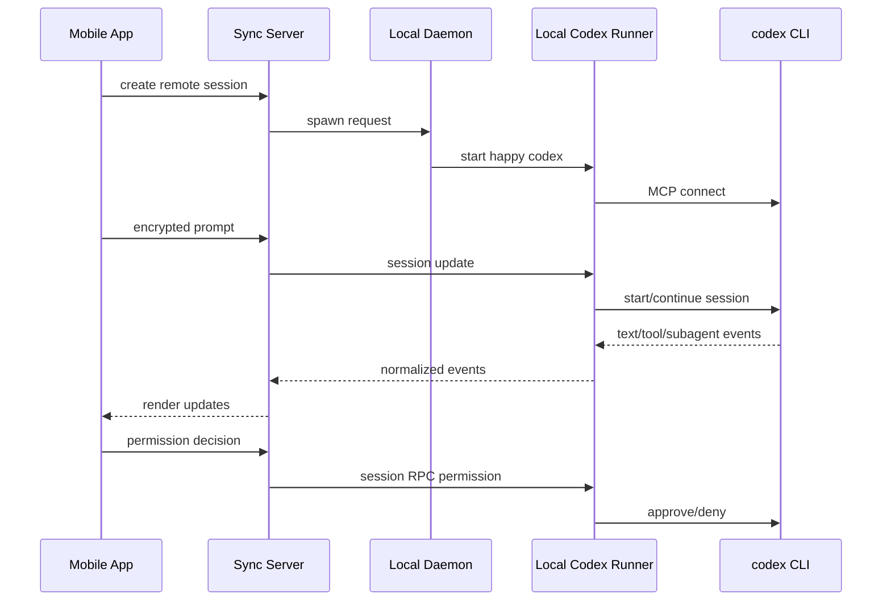

# Happy 仓库流程分析 03: Build MVP

## 1. MVP goals and boundaries

### 目标

如果只复刻你关心的这条链路，一个最小可用 MVP 要实现的是:

- 在电脑上启动本地 `codex` CLI
- 在手机端发一条 prompt
- 电脑本地执行
- 手机端看到文本输出、工具执行、权限审批和完成状态

### 边界

先不做:

- 完整社交层
- 所有 provider 全量兼容
- 复杂 artifact 系统
- 完整桌面 UI

先只做:

- `codex` 单 agent
- 新建 session
- 发消息
- 权限审批
- abort / kill
- subagent 可视化

## 2. Core challenges analysis

1. 真正难点不是“发消息”，而是“保持本地执行”。

2. 第二个难点是权限回路。
Codex 发出审批请求后，手机端要能准确响应，再把结果回注回本地进程。

3. 第三个难点是统一事件模型。
如果只传原始 stdout，移动端体验会很差；所以必须有 session protocol 这类抽象层。

4. 第四个难点是多 agent / subagent 显示。
如果不抽象 `turn/subagent/tool-call`，UI 很快会混乱。

## 3. MVP core flow

### 推荐最小流程

### 直接回答你的两个问题

#### Q1. 如何操纵 Codex

MVP 里最合理的做法不是封装 OpenAI SDK，而是直接包装本地 `codex` CLI:

- 优点: 继承 Codex 已有能力，包括 resume、subagent、skills、patch、reasoning、权限机制
- 缺点: 需要追随 CLI / MCP 事件格式变化

#### Q2. 多 agent 和 skills 怎么处理

- 多 agent: 只做事件归一化，不自己编排
- skills: 不自己调度，完全交给底层 Codex

## 4. Compliance and qualification analysis

### 已确认事实

- Happy 当前模式本质是“用户自己的设备远程控制自己的 agent”。
- 从仓库表现看，它没有把用户代码送到 Happy 云端代跑。

### 对 MVP 的含义

- 合规主风险不在模型托管，而在账号、token、设备控制和消息加密。
- 需要重点做:
  - 设备鉴权
  - 会话权限隔离
  - 本地工作目录权限边界
  - token 安全注入

### 待验证项

- 如果未来做团队共享机器，会触发更复杂的审计和访问控制要求。

## 5. Dependency research and interface inventory

### 5.1 End-to-end flow view

#### 阶段 A: 会话创建

- 客户端 -> 云端:
  - 能力: 请求目标机器拉起 session
  - Happy 证据: `spawn-happy-session`
  - 参考: `repos/happy/packages/happy-app/sources/sync/ops.ts:160-177`
  - 状态: Confirmed

- 云端 -> 机器 daemon:
  - 能力: machine RPC 转发
  - Happy 证据: daemon control / machine online 设计
  - 参考: `repos/happy/packages/happy-cli/src/daemon/controlServer.ts:106-150`
  - 状态: Confirmed

#### 阶段 B: 本地 agent 拉起

- daemon -> local runner:
  - 能力: spawn 本地 `happy codex`
  - 参考: `repos/happy/packages/happy-cli/src/daemon/run.ts:218-330`
  - 状态: Confirmed

- local runner -> codex CLI:
  - 能力: `codex mcp` / `codex mcp-server`
  - 参考: `repos/happy/packages/happy-cli/src/codex/codexMcpClient.ts:23-49`
  - 参考: `repos/happy/packages/happy-cli/src/codex/codexMcpClient.ts:94-170`
  - 状态: Confirmed

#### 阶段 C: 用户发 prompt

- mobile app -> session outbox:
  - 能力: 加密消息，附带 permission/model meta
  - 参考: `repos/happy/packages/happy-app/sources/sync/sync.ts:441-510`
  - 状态: Confirmed

- server -> local session:
  - 能力: `session-scoped` socket update
  - 参考: `repos/happy/packages/happy-cli/src/api/apiSession.ts:131-210`
  - 状态: Confirmed

#### 阶段 D: 工具执行与权限

- local session -> codex:
  - 能力: startSession / continueSession
  - 参考: `repos/happy/packages/happy-cli/src/codex/runCodex.ts:616-663`
  - 状态: Confirmed

- mobile -> local session permission RPC:
  - 能力: allow / deny / abort / kill
  - 参考: `repos/happy/packages/happy-app/sources/sync/ops.ts:305-337`
  - 状态: Confirmed

#### 阶段 E: 输出展示

- codex events -> normalized session protocol:
  - 能力: text/tool/reasoning/patch/subagent 映射
  - 参考: `repos/happy/packages/happy-cli/src/codex/runCodex.ts:421-523`
  - 参考: `repos/happy/packages/happy-cli/src/codex/utils/sessionProtocolMapper.ts:179-220`
  - 状态: Confirmed

### 5.2 Module view

#### 模块 1: Mobile/Web client

- 职责:
  - 选机器
  - 发起会话
  - 发消息
  - 审批权限
  - 展示 subagent/tool-call

#### 模块 2: Sync server

- 职责:
  - 会话与机器注册
  - Socket update
  - RPC 转发
  - 不直接运行 Codex

#### 模块 3: Machine daemon

- 职责:
  - 机器在线
  - 拉起 session
  - 管理本地进程

#### 模块 4: Local agent runner

- 职责:
  - 维护 Happy session
  - 对接本地 Codex CLI
  - 将 provider 事件转为统一协议

#### 模块 5: Provider runtime

- 职责:
  - 真正推理
  - 真正 tool calling
  - 真正 skills / subagent 执行

### 5.3 对多 agent / skills 的接口判断

- 多 agent 接口:
  - Happy 只需要 `subagent` 映射和 lifecycle 事件
  - 不需要自建 planner/scheduler

- skills 接口:
  - Happy 最好不感知技能内部机制
  - 只消费 Codex 已产出的事件

这会显著降低兼容成本。

## 6. Cost analysis

### 当前仓库可见的成本结构线索

- 需要一个云端同步服务
- 需要 Socket 长连接
- 需要移动端推送
- 真正的模型/agent 执行成本主要还是用户自己的 Codex/Claude 账户承担

### 构建类似 MVP 的成本来源

- 服务器:
  - session/machine 元数据存储
  - websocket/update 流
- 客户端:
  - iOS / Android / Web
- 本地:
  - daemon + CLI wrapper
- 模型:
  - 由用户自带 provider 成本

### 成本判断

- 这种产品的核心成本不是模型推理，而是“多端同步 + 长连接 + 事件建模 + 跨 provider 适配”。

## 7. Technical architecture recommendation

### 推荐架构

1. 本地执行优先。
   - 不要服务端代跑 Codex。

2. provider 适配层与通用协议层解耦。
   - 参考 Happy 的 `session protocol` 思路。

3. 多 agent 只做表示层抽象。
   - 统一成 `turn/subagent/tool-call` 即可。

4. skills 保持透传。
   - 不要在 Happy 这一层自己做 skill orchestration。

### 为什么这适合早期 MVP

- 复用底层 Codex 的现成能力
- 减少服务端责任
- 安全边界更清晰
- 更容易支持 Claude / Gemini / ACP 兼容 agent

## 最后的建议

如果你要复刻 Happy 里“移动端控制 Codex”这条链路，最值得抄的不是 UI，而是这三个边界:

1. 本地跑 agent，云端只同步。
2. 用统一协议表示 text/tool/subagent，而不是透传终端文本。
3. 多 agent 和 skills 都尽量留给底层 Codex，Happy 只做 remote control plane。
