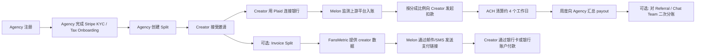
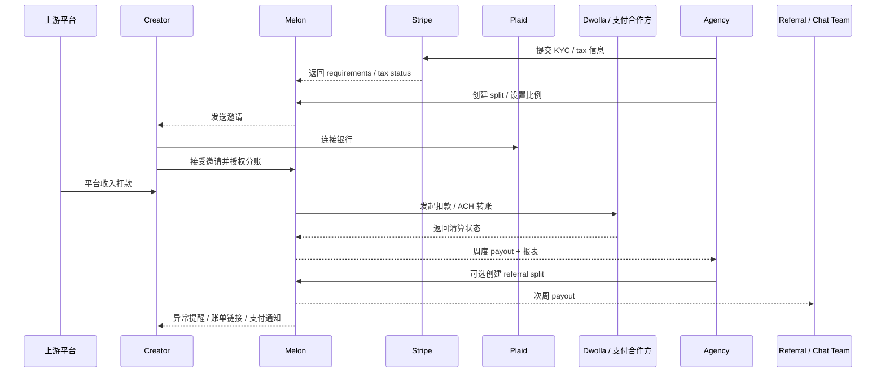
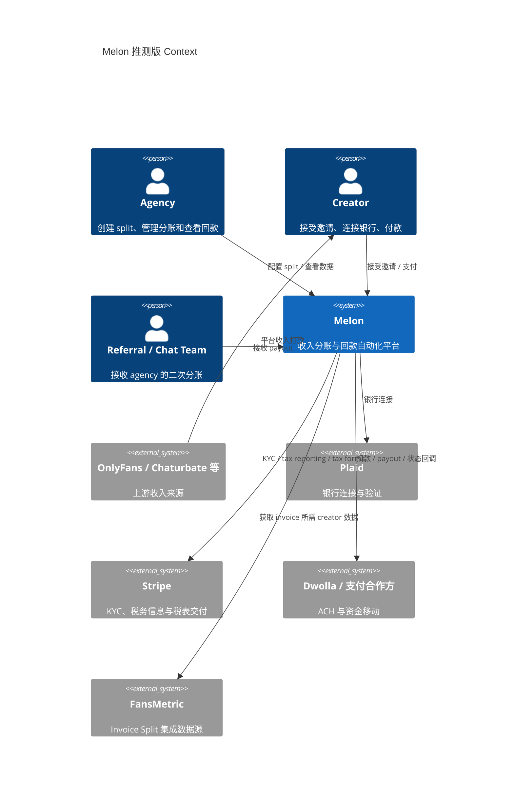
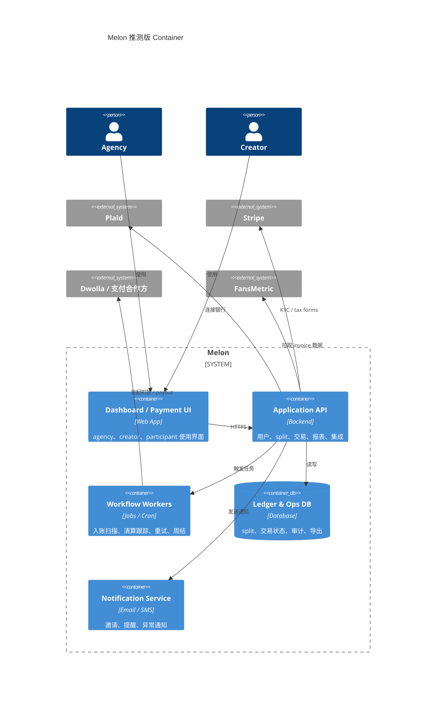

# Product Understanding: Melon (`getmelon.io`)

- 分析日期：2026-03-13
- 输出语言：中文
- 证据边界：基于官网、帮助中心、条款、隐私政策及少量官方第三方定价/合规页面；未访问其私有产品后台。

## 术语表

- `Split`：分账规则。Melon 用它表示创作者与 agency 之间的收益分配约定。
- `Creator Split`：创作者与 agency 的主分账关系。
- `Referral Split`：agency 再把自己拿到的部分分给 referral partner、chat team 等第三方。
- `Multi-participant split`：一条 split 上存在多个收款参与方。
- `Invoice Split`：不是等银行入账后自动扣款，而是按账单周期向 creator 发送支付链接催收。
- `KYC`：Know Your Customer，收款或使用金融能力前的身份/主体核验。
- `ACH`：美国银行账户间的电子清算网络，适合低成本转账，但存在清算延迟、退票、争议等问题。
- `Stripe Connect`：Stripe 面向平台场景的账户、KYC、税务与 payout 能力集合。
- `Stripe Express`：Stripe 提供给 connected account 查看税表、部分 payout 与合规信息的托管界面。
- `Plaid`：银行账户连接与验证服务商。
- `Dwolla`：银行转账/平台支付编排服务商。
- `Wise USD 账户`：用于国际 agency 或加拿大 creator 获取美国路由号/账号的替代银行方案。

## 一句话定义

Melon 是一个面向创作者经纪公司和其创作者网络的收入分账与回款自动化产品，核心价值不是内容运营，而是把“平台打款到账后如何按协议分钱、催款、对账、周结”这条金融工作流产品化。

## 确认事实

- 官网直接把自己定位为 `Automatic payouts for agencies`，并公开展示 `900+ creators / 125+ agencies / $25m+ revenue shared`。
- Melon 官方帮助中心明确写明：它允许 agency 自动分成创作者来自 `OnlyFans`、`Chaturbate` 等平台的收入。
- 标准流程是：
  - agency 创建 split；
  - creator 接受邀请；
  - creator 通过 Plaid 连接银行账户；
  - Melon 在检测到平台存款进入 creator 银行账户后发起扣款；
  - 资金通过 ACH 转给 agency；
  - agency 每周集中收款。
- 官方 FAQ 写明 Melon 会在一天内多次扫描创作者账户中的平台入账；入账被识别后，Melon 会按 split 百分比发起扣款。
- 帮助中心写明 ACH 清算通常需要约 `4` 个工作日，agency payout 按周执行。
- `How the flow of funds works on Melon` 与 `How does payout timing work on Melon?` 共同说明：agency payout 的处理截止点在美国周四，实际到 agency 账户通常体现在周五。
- `Referral Split` 支持 agency 把自己收入中的一部分分给推荐人或聊天团队，并且该分成对 creator 不可见。
- `Multi-participant split` 也支持多收款方，但这类分账对所有参与者可见，包括 creator。
- `Automated Invoicing with Melon` 说明产品已扩展到基于 `FansMetric` 集成的账单催收模式：
  - creator 可以直接通过短信或邮件中的支付链接付款；
  - 支持信用卡、借记卡、银行账户付款；
  - creator 不必注册 Melon 账号也能支付；
  - 刷卡手续费由 creator 承担，银行转账对 creator 显示为 `0 fee`。
- `Navigating the Melon dashboard` 展示了产品表面能力：
  - agency dashboard；
  - 活跃/待处理/取消/推荐分账视图；
  - cashout 与 payout 历史；
  - KYC 更新；
  - bank relink；
  - Excel 导出；
  - support 入口；
  - affiliate 页面。
- `What tax and business documentation does Melon require?` 说明 agency onboarding 涉及 EIN、地址、实体类型、部分情况下代表人出生日期与 SSN 后四位；文中还提到某些情况下 `Stripe` 会要求额外资料。
- `Update your KYC info on Melon` 明确说明：如果用户没有满足 `Stripe` 的 KYC 要求，payout 可能被延迟，直到补齐资料为止。
- `Understanding Your 1099 Tax Forms with Melon [2024 Tax Season]` 明确说明：Melon 与 `Stripe` 合作处理 tax reporting，符合条件的用户会从 Stripe 收到税表相关通知，并可通过 `Stripe Express` 查看税表。
- 服务条款明确要求使用 Dwolla 账户来启用支付能力，并要求用户接受 Dwolla 与 Plaid 的相关条款。
- 隐私政策确认运营主体为 `Creators Payment Solutions, LLC`，对外品牌名为 `Melon Pay`，联系地址为 `205 SE 20th Street, Fort Lauderdale, FL 33316, United States`。
- 隐私政策确认其会处理个人信息、财务信息、交易信息，并声明不会主动面向 `18` 岁以下用户收集数据。
- `Melon for non-US/Canada agencies` 说明其支持国际 agency，但 creator 暂时仅支持美国和加拿大；国际 agency 必须使用 `Wise USD` 账户。
- `Using Melon as a Canadian Creator – Wise US Bank Account Setup` 说明加拿大 creator 需要准备 `Wise` 的美国银行信息，以配合 OnlyFans 和 Melon 的 USD 支付路径。

## 补充证据（非官方公开来源）

- 用户提供的共享页面显示：agency 端 `KYC & Tax Information` 流程会跳转到 `https://connect.stripe.com/setup/`。这与官方帮助中心里 `Stripe` 承接 KYC / tax reporting 的说法一致，进一步支持“agency 侧很可能采用 Stripe-hosted onboarding”的判断。
- 同一份共享页面中的截图还显示了 `Business type = Individual or sole proprietorship`、`1099 tax form details = Personal tax details`、`Agree to e-delivery` 等字段。
- 这说明部分 agency 账户可能以个人或个体经营者身份完成税务归类与电子税表交付，但该点来自用户侧截图，只能作为补充观察，不能替代官方产品规则。

## 推断分析

### 推断 1：Melon 的核心楔子是“支付工作流自动化”，不是全栈 agency OS

- 置信度：`高`
- 依据：
  - 官网口径是 payouts，而不是 CRM、chatting、campaign automation。
  - 帮助中心的核心内容围绕 split、payout、KYC、bank linking、invoice、reporting。
  - 新的 `Invoice Split` 仍然是 payment collection 能力，而不是内容运营能力。
- 结论：
  - Melon 更像 creator agency 生态中的 `payment layer`。
  - 它可以和 FansMetric、OFManager、Infloww 这类 agency ops 工具并存，而不是一定要替代它们。

### 推断 2：主要服务对象高度集中在成人/订阅创作者 agency 生态

- 置信度：`高`
- 依据：
  - 公开提及 OnlyFans、Chaturbate、chat teams、referral partners。
  - 加拿大 creator 与国际 agency 的说明都围绕 USD payout 工作流设计。
- 结论：
  - 该产品虽然表述为“creator economy”，但实际最强适配场景大概率是订阅型、成人内容或高频平台打款的 agency 业务。

### 推断 3：内部一定存在“账本 + 状态机 + 异常处理 + 人工 support”组合

- 置信度：`中`
- 依据：
  - 官方文档反复提到 pending、disrupted split、micro-deposit、insufficient funds、自动邮件提醒、周度 cutoff、历史导出。
  - 这些金融工作流无法只靠简单 CRUD 支撑，必然涉及交易状态和运营兜底。
- 结论：
  - 真实系统里大概率至少有以下模块：split 规则、支付编排、清算状态跟踪、失败重试、通知、支持后台、导出报表。

### 推断 4：支付合作方栈可能经历过变更或多供应商并存

- 置信度：`中`
- 依据：
  - 条款明确提到 Dwolla。
  - 帮助中心的税务/KYC文档提到了 Stripe。
  - 官方也持续提 Plaid 和 Wise。
- 结论：
  - 从公开材料看，Melon 至少存在多支付/开户/验证供应商交叉的迹象。
  - 这是正常现象，但会增加合规、用户解释和尽调复杂度。

## 真实业务流程重建

### 主要角色

- `Agency`：创建 split、设置分成比例、查看待收与已收款、添加 referral。
- `Creator`：接受分账邀请、连接银行账户、被自动扣款或通过账单链接付款。
- `Referral / Additional Participant`：从 agency 侧收入中继续分账收款。
- `上游平台`：OnlyFans、Chaturbate 等，先把收入打到 creator 银行账户。
- `Melon`：负责规则、检测、编排、通知、报表和 payout。
- `支付合作方`：
  - `Stripe`：更接近 agency 侧 KYC、税务信息收集与 1099 交付。
  - `Plaid`：更接近 creator 侧银行连接、银行账户数据与 relink。
  - `Dwolla`：更接近 ACH、funding source 与资金移动条款。
  - `Wise`：更接近国际 agency / 加拿大 creator 的 USD 银行路径。

### 被替代的旧流程

- agency 与 creator 用合同或口头约定分成比例。
- creator 收到平台打款后，agency 靠人工催款。
- 财务用 Excel 或手工流水做对账。
- 有 referral 或 chat team 时，再做二次手工转账。
- 出现资金不足、漏转、错账、延迟时，靠消息沟通与截图核对。

### Melon 替代后的流程

- agency 在 Melon 创建 split。
- creator 通过邀请链接入驻并连接银行。
- Melon 监测平台打款进入 creator 账户。
- 检测到入账后按约定比例自动扣款。
- 清算成功后，将资金在周度周期内统一打给 agency。
- 若存在 referral split，再把 agency 部分中的约定比例打给第三方。
- 若 agency 选择 invoice 模式，则 Melon 改为根据账单规则和 FansMetric 数据发起账单与催收。

## 数据、安全与合规画像

### 数据类型

- 身份与主体信息：姓名、邮箱、电话、地址、出生日期、实体类型、EIN、SSN 后四位。
- 财务与支付信息：银行账户信息、路由号、付款记录、payout 记录。
- 行为与运营数据：split 配置、creator/agency 关系、invoice 状态、通知与支持记录。

### 安全边界

- 公开资料显示 Melon 不把自己描述为银行，而是把金融交易能力接到第三方合作方上。
- 公开资料已能较清楚地拆出合作方分工：
  - `Stripe` 负责 KYC / tax reporting / tax form delivery 相关环节；
  - `Plaid` 负责银行连接与账户数据；
  - `Dwolla` 负责支付条款与资金移动能力；
  - `Wise` 负责部分跨境 USD 账户路径。
- 隐私政策声明其有“合理的技术与组织安全措施”，但没有公开披露更细的安全认证框架。
- 待验证项：
  - 是否具备 SOC 2、ISO 27001 或等价审计。
  - 是否提供细粒度 RBAC、审计日志下载、企业级 SSO 等能力。

### 合规边界

- 条款明确将 Dwolla 和 Plaid 置于支付/数据访问链路中。
- 帮助中心进一步显示，agency 端的 KYC 与 tax reporting 环节和 Stripe 有明确关系。
- 公开文档显示 KYC 是上线分账与收款的必要前提之一。
- 未成年人被禁止使用。
- 美国与跨境支持范围存在产品边界：
  - creator 仅明确支持美国和加拿大；
  - agency 支持更广，但国际 agency 需要 Wise USD 账户。

## 主要风险与约束

- `平台依赖风险`：上游创作者平台的打款政策、提现节奏、风控策略变化会直接影响 Melon 的识别与清算链路。
- `支付合作方风险`：如果底层 ACH/支付合作方收紧对高风险行业或成人内容生态的支持，Melon 的业务会受到实质冲击。`Dwolla Account Terms of Service` 在 `2025-01-21` 更新版的 `Prohibited Activities` 中明确列出 `adult entertainment`，包括 escort services、encounter clubs、pornographic products and services，这意味着相关生态的准入与持续运营存在明确的合作方政策风险。
- `账户连接风险`：Plaid 断连、银行需要微打款验证、银行凭证变更都会导致 split 进入 pending。
- `现金流与争议风险`：ACH 不是实时且可逆，资金不足、退票、争议会直接影响对账与用户关系。
- `多供应商编排风险`：Stripe、Plaid、Dwolla、Wise 分别承担不同职责，任何一处文档、API 或审核策略变化，都会增加 support 与合规解释成本。
- `主体归类风险`：如果部分 agency 以 `individual / sole proprietorship` 方式完成税务归类，产品文案、销售承诺与税务支持就必须足够清楚，否则容易形成预期偏差。
- `文档一致性风险`：条款里的美国主体限制，与帮助中心里的国际 agency 支持存在边界不完全一致的问题，销售、法务和运营需要持续校准。

## 图示

### 1. 工作流图（Mixed）

### 2. 角色交互时序图（Mixed）

### 3. C4 图（Inferred）

## 主要来源

- 官方网站：https://www.getmelon.io/
- What is Melon?：https://help.getmelon.io/en/articles/8986654-what-is-melon
- How does Melon work?：https://help.getmelon.io/en/articles/8358228-how-does-melon-work
- How the flow of funds works on Melon：https://help.getmelon.io/en/articles/8986666-how-the-flow-of-funds-works-on-melon
- How does payout timing work on Melon?：https://help.getmelon.io/en/articles/7879269-how-does-payout-timing-work-on-melon
- Navigating the Melon dashboard：https://help.getmelon.io/en/articles/8987327-navigating-the-melon-dashboard
- What is a Referral Split?：https://help.getmelon.io/en/articles/8136980-what-is-a-referral-split
- What is a multi-participant split?：https://help.getmelon.io/en/articles/8137622-what-is-a-multi-participant-split
- Automated Invoicing with Melon：https://help.getmelon.io/en/articles/12005317-automated-invoicing-with-melon
- What tax and business documentation does Melon require?：https://help.getmelon.io/en/articles/7861465-what-tax-and-business-documentation-does-melon-require
- Update your KYC info on Melon：https://help.getmelon.io/en/articles/8987119-update-your-kyc-info-on-melon
- Understanding Your 1099 Tax Forms with Melon [2024 Tax Season]：https://help.getmelon.io/en/articles/10543097-understanding-your-1099-tax-forms-with-melon-2024-tax-season
- Melon for non-US/Canada agencies：https://help.getmelon.io/en/articles/9020125-melon-for-non-us-canada-agencies
- Using Melon as a Canadian Creator – Wise US Bank Account Setup：https://help.getmelon.io/en/articles/11994736-using-melon-as-a-canadian-creator-wise-us-bank-account-setup
- Terms of Service：https://www.getmelon.io/terms-of-service
- Privacy Policy：https://www.getmelon.io/privacy-policy
- Stripe Connect onboarding：https://docs.stripe.com/connect/custom/onboarding
- Stripe account onboarding component：https://docs.stripe.com/connect/supported-embedded-components/account-onboarding
- Stripe Pricing：https://stripe.com/pricing
- Stripe Connect: 1099：https://stripe.com/connect/1099
- Stripe tax form delivery：https://docs.stripe.com/connect/deliver-tax-forms
- Stripe Express tax forms：https://docs.stripe.com/connect/platform-express-dashboard-taxes
- Stripe identity verification：https://docs.stripe.com/connect/identity-verification
- Plaid Link introduction：https://plaid.com/docs/link/#introduction-to-link
- Dwolla Account Terms of Service：https://www.dwolla.com/legal/dwolla-account-terms-of-service
