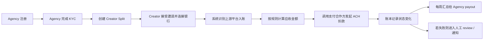
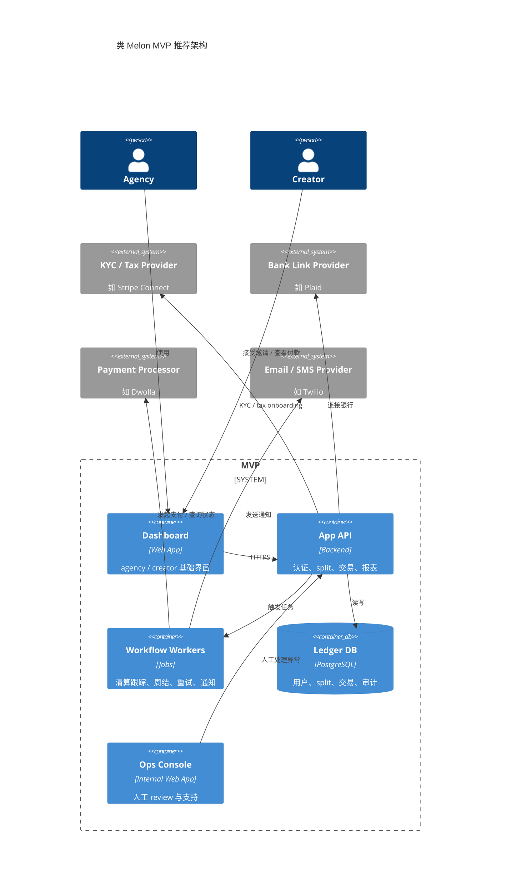

# Build MVP: 类似 Melon 的最小可行产品

- 分析日期：2026-03-13
- 输出语言：中文
- 范围说明：本文件只回答一个问题。如果要做一个“类似 Melon”的早期版本，最小可行范围该怎么切，主要难点、依赖、合规和成本在哪里。

## 术语表

- `Custody`：是否由你自己代持或控制资金。
- `MTL / MSB`：货币传输相关牌照/注册义务。
- `Ledger`：交易账本，记录每笔资金动作与状态流转。
- `Orchestration`：自己不清算资金，只负责把规则、状态、通知、重试和运营流程编排起来。
- `Return / Reversal / Dispute`：ACH 清算失败、回退或争议。
- `Ops Backstop`：自动化之外的人工运营兜底机制。

## 1. MVP 目标与边界

### 建议目标

- 先做一个只服务美国本土 agency 与美国/加拿大 creator 的 ACH 分账产品。
- 第一版只覆盖最关键场景：creator 平台收入到账后，按合同规则自动回收 agency 分成，并按周打款给 agency。

### 明确不做

- 不做全栈 agency CRM。
- 不做聊天、脚本、粉丝运营、消息群发。
- 不做全球创作者支持。
- 不做自有清算网络。
- 不做资金自持。
- 不做复杂税务自动申报系统。

### 推荐 MVP 范围

- agency 注册与基础 KYC。
- creator 邀请与银行连接。
- split 配置。
- 入账识别与应收金额计算。
- ACH 扣款与周度 payout。
- 异常状态和人工 review。
- 报表导出与基础通知。

## 2. 核心挑战分析

### 难点 1：不是“能不能扣款”，而是“何时扣、扣多少、扣错怎么办”

- 这类产品不是普通订阅扣费。
- 计费依据来自 creator 的平台入账事件，而不是固定月费。
- 一旦金额识别错误，就会直接伤害 creator 与 agency 之间的信任关系。

### 难点 2：ACH 的金融正确性

- ACH 成本低，但速度慢，而且可退回。
- 你的系统必须能处理：
  - pending；
  - cleared；
  - failed；
  - reversed；
  - disputed；
  - payout delayed。

### 难点 3：支付供应商与场景适配

- 高风险行业、成人内容相关、跨境使用、二次分账，都可能影响支付合作方接受度。
- 技术上能接 API 不代表业务上一定能获批。

### 难点 4：support 必须进入系统设计

- 从 Melon 公开文档可以看出，这类产品天然会遇到：
  - Plaid 断连；
  - micro-deposit 补验证；
  - insufficient funds；
  - KYC 缺资料；
  - payout cutoff 错过。
- 除了技术与操作异常，还要正视合作方准入风险：`Dwolla` 在 `2025-01-21` 更新的账户条款中把 `adult entertainment` 列为 `Prohibited Activities`。如果目标客群与成人内容生态高度重合，支付合作方政策本身就可能成为比产品实现更早出现的阻断项。
- 所以第一版就必须预留 support / ops 面板，而不是事后再补。

## 3. MVP 核心流程

### 核心状态建议

- `split_created`
- `creator_invited`
- `bank_connected`
- `deposit_detected`
- `charge_initiated`
- `charge_cleared`
- `charge_failed`
- `payout_scheduled`
- `payout_sent`
- `reversed_or_disputed`

## 4. 合规与资质分析

### 会触发监管关注的功能

- 银行账户连接与授权扣款。
- KYC / CIP。
- 对资金移动进行规则编排。
- 向多个参与方分配资金。
- 税务主体资料采集。
- 制裁名单筛查和高风险主体风控。

### 公开监管证据

- FinCEN 在 `2003-11-19` 发布的 `Definition of Money Transmitter (Merchant Payment Processor)` 行政裁定中，讨论了“代表商户发起 ACH、在短暂持有后将资金结算给商户”的情形，并认定在特定事实边界下不构成 money transmitter。
- 这个裁定可以作为产品边界设计的参考，但不能直接当作免牌照结论，因为你的具体业务事实、资金控制路径、合作方安排都会影响判断。
- IRS 在 `2025-10-23` 的更新中说明，1099-K 联邦申报阈值已恢复为“超过 `$20,000` 且超过 `200` 笔交易”。
- OFAC 官方仍提供 sanctions list search 工具，说明制裁筛查对这类支付产品仍是基础合规要求。

### MVP 合规建议

- 尽量不自持资金。
- 尽量不自己落到“代表任意双方传递资金”的事实模式里。
- 尽量把 KYC、tax reporting、资金移动、部分合规责任交给支付合作方承接。
- 在架构上把三类职责明确拆开：
  - `Stripe-like`：agency 侧 KYC、税务信息采集、1099 / e-delivery；
  - `Plaid-like`：creator 银行连接与账户数据；
  - `Dwolla-like`：funding source、ACH debit、payout 与状态回调。
- 在产品设计上清晰界定：
  - 谁是付款人；
  - 谁授权扣款；
  - 谁是最终收款人；
  - 你是否只是代表 agency 执行结算编排。

### 待验证项

- 支付合作方是否支持该目标客群与行业。
- 不同州对平台式资金流的额外要求。
- 加拿大 creator、国际 agency、成人内容场景下的 processor 政策边界。

## 5. 依赖调研与接口清单

### 5.1 编制原则与最新性说明

- 文档校验日期：`2026-03-13`。
- 本节按两个视角展开：
  - `流程视角`：看一条交易闭环里每一步要接什么外部接口。
  - `模块视角`：看你自己的系统边界需要暴露哪些内部接口、事件和后台操作面。
- 除非另有说明，下面出现的官方文档 URL 都在 `2026-03-13` 通过 web search 与官方站点访问校验过。
- 这里的状态标签含义：
  - `Confirmed dependency`：Melon 公开资料已明确确认该 vendor 存在。
  - `Likely via confirmed vendor`：vendor 已确认，但具体子接口是基于官方能力与产品流程的高置信推断。
  - `Candidate build option`：适合类 Melon MVP 的候选方案，但未确认 Melon 当前一定使用。
  - `待验证项`：没有公开 API 文档，或当前产品是否真的用到该接口无法从公开资料确认。

### 5.2 已确认的现产品依赖线索

- `Stripe`：Melon 官方帮助中心明确提到 `Stripe` 的 KYC 要求与 1099 tax forms；共享页面中的补充截图还显示 agency 侧会跳到 `connect.stripe.com/setup/`，可作为 `Stripe-hosted onboarding` 的辅助证据。
- `Plaid`：Melon 官方文档明确要求 creator 通过 Plaid 连接银行。
- `Dwolla`：Melon 服务条款明确要求启用 Dwolla 账户与相关条款。
- `Wise`：Melon 官方帮助中心明确用于国际 agency / 加拿大 creator 的 USD 银行路径。
- `FansMetric`：Melon 官方帮助中心明确提到 `Automated Invoicing` 依赖 FansMetric 数据。
- `Twilio / SendGrid / 其他通知供应商`：Melon 未公开确认；以下只作为类 Melon MVP 的推荐候选接口。

### 5.3 按流程展开的外部接口清单

#### A. 国内 ACH MVP 必须实现的外部接口

| 流程阶段 | 接口 / 能力 | 状态 | 何时调用 | 关键输入 / 输出 / 回调 | 官方文档 |
| --- | --- | --- | --- | --- | --- |
| Agency KYC / KYB 启动 | `Stripe Connect onboarding` | `Likely via confirmed vendor` | agency 注册后、首次启用 payout 前 | 入：主体类型、法人与业务资料；出：account onboarding flow、requirements 状态 | [Connect onboarding](https://docs.stripe.com/connect/custom/onboarding), [Account onboarding component](https://docs.stripe.com/connect/supported-embedded-components/account-onboarding) |
| Agency KYC 补件 / remediation | `Stripe identity verification / requirements remediation` | `Likely via confirmed vendor` | 资料不全、审核失败、被要求补件时 | 入：身份文件、业务补充信息；出：verification / requirements 状态 | [Identity verification](https://docs.stripe.com/connect/identity-verification), [Handle verification with the API](https://docs.stripe.com/connect/handle-verification-updates) |
| Agency 税务信息采集与交付 | `Stripe tax forms / Stripe Express` | `Likely via confirmed vendor` | 首次收款前、税季、1099 交付时 | 入：税务主体资料、e-delivery 同意；出：税表可用状态、Express 查看路径 | [Deliver tax forms](https://docs.stripe.com/connect/deliver-tax-forms), [Express dashboard taxes](https://docs.stripe.com/connect/platform-express-dashboard-taxes) |
| 资金移动层主体创建 | `Dwolla Customers` 创建业务主体 | `Likely via confirmed vendor` | agency 需要在 ACH 层持有 customer / funding source 时 | 入：legal name、EIN、address、controller；出：`customerId`、`status` | [Create a customer](https://developers.dwolla.com/docs/api-reference/customers/create-a-customer) |
| 资金移动层受益人资料补齐 | `Dwolla Beneficial Owners` | `Likely via confirmed vendor` | Dwolla 需要补充 UBO / beneficial owner 时 | 入：owner 身份资料；出：beneficial owner 记录；后续还要认证状态 | [Create beneficial owner](https://developers.dwolla.com/docs/api-reference/beneficial-owners/create-beneficial-owner), [Certify beneficial ownership](https://developers.dwolla.com/docs/api-reference/beneficial-owners/certify-beneficial-ownership-status) |
| 资金移动层文件上传 | `Dwolla Documents` | `Likely via confirmed vendor` | Dwolla 要求补件或人工审核时 | 入：法人/公司证明文件；出：document 资源与审核状态 | [Create a document for customer](https://developers.dwolla.com/docs/api-reference/documents/create-a-document-for-customer) |
| Creator 银行连接初始化 | `Plaid Link` + `link_token` | `Confirmed dependency` | creator 点击邀请链接、开始绑定银行时 | 入：`client_user_id`、产品范围、回调配置；出：`link_token`，前端启动 Link | [Plaid Link overview](https://plaid.com/docs/link/), [Link token create](https://plaid.com/docs/api/link/#linktokencreate) |
| Creator 银行连接落库 | `Plaid public_token exchange / item lifecycle` | `Likely via confirmed vendor` | creator 完成 Link 之后 | 入：`public_token`；出：`access_token`、`item_id`，后续进入 Item 管理 | [Plaid Link API](https://plaid.com/docs/api/link/), [Items API](https://plaid.com/docs/api/items/) |
| 获取账户与 ACH 细节 | `Plaid Auth` | `Likely via confirmed vendor` | Link 成功后、创建可扣款 funding source 前 | 入：`access_token`；出：账户、routing/account number、验证状态、Auth webhooks | [Auth API](https://plaid.com/docs/api/products/auth/#authget) |
| Creator 银行断连或重连 | `Plaid Update Mode` | `Likely via confirmed vendor` | Item 失效、bank relink、凭据更新时 | 入：旧 `access_token` / `link_token`；出：重新授权结果 | [Update mode](https://plaid.com/docs/link/update-mode/) |
| Item 生命周期与异常 | `Plaid Item webhooks` | `Likely via confirmed vendor` | 权限撤销、账户更新、webhook URL 更新确认等 | 出：`ITEM` 相关 webhook；驱动 relink 与异常处理队列 | [Items webhooks](https://plaid.com/docs/api/items/#webhooks) |
| Plaid 与 Dwolla 桥接 | `Plaid x Dwolla partnership guide` | `Likely via confirmed vendor` | 设计 funding source 与 exchange 流程时 | 作为官方集成设计参考，不是单一 API；若 partner 使用你的 processor token 发起 Plaid 调用，相关使用量仍会计入你的 Plaid 账单 | [Plaid + Dwolla guide](https://plaid.com/docs/auth/partnerships/dwolla/), [Plaid billing](https://plaid.com/docs/account/billing/) |
| 建立 exchange session | `Dwolla Exchange Sessions` | `Likely via confirmed vendor` | creator 银行连接后，要把银行关系映射进 Dwolla 时 | 入：customer、exchange partner 上下文；出：exchange session | [Create customer exchange session](https://developers.dwolla.com/docs/api-reference/exchange-sessions/create-customer-exchange-session) |
| 建立 exchange 资源 | `Dwolla Exchanges` | `Likely via confirmed vendor` | exchange session 完成后 | 入：exchange token / session 结果；出：exchange 资源，可继续生成 funding source | [Create an exchange for a customer](https://developers.dwolla.com/docs/api-reference/exchanges/create-an-exchange-for-a-customer) |
| 建立 funding source | `Dwolla Funding Sources` | `Likely via confirmed vendor` | customer 已通过 KYB/KYC 且 exchange 准备好后 | 入：customer、exchange 或 bank data；出：funding source URL / id | [Create customer funding source](https://developers.dwolla.com/docs/api-reference/funding-sources/create-customer-funding-source) |
| 获取 ACH debit 授权 | `Dwolla On-Demand Transfer Authorization` | `Likely via confirmed vendor` | 首次从 creator 账户发起主动扣款前 | 入：customer、授权文案、bank relationship；出：ODA 资源 | [Create on-demand transfer authorization](https://developers.dwolla.com/docs/api-reference/transfers/create-an-on-demand-transfer-authorization) |
| 向 creator 发起扣款 | `Dwolla Transfers` | `Likely via confirmed vendor` | 检测到平台入账并计算应收后 | 入：source funding source、destination、amount、correlation/idempotency；出：transfer 资源 | [Initiate a transfer](https://developers.dwolla.com/docs/api-reference/transfers/initiate-a-transfer) |
| 向 agency 发起周度 payout | `Dwolla Transfers` | `Likely via confirmed vendor` | 周度批次结算时 | 入：batch、agency funding source、净额；出：transfer 资源 | [Initiate a transfer](https://developers.dwolla.com/docs/api-reference/transfers/initiate-a-transfer) |
| 支付状态回调 | `Dwolla Webhook Subscriptions` + `Events` | `Likely via confirmed vendor` | 上线前先注册；运行中持续消费 | 出：transfer/customer/funding source 等事件；驱动账本状态机 | [Create webhook subscription](https://developers.dwolla.com/docs/api-reference/webhook-subscriptions/create-a-webhook-subscription), [List events](https://developers.dwolla.com/docs/api-reference/events/list-events) |
| 短信通知 | `Twilio Messaging` | `Candidate build option` | 邀请、提醒、失败重试、invoice link 发送时 | 入：to/from/body；出：message SID、delivery status callback | [Message Resource](https://www.twilio.com/docs/messaging/api/message-resource), [Webhook request guide](https://www.twilio.com/docs/messaging/guides/webhook-request) |
| 手机验证码 / 二次确认 | `Twilio Verify` | `Candidate build option` | creator 首次登录、敏感操作确认、手机号验证时 | 入：phone、channel；出：verification SID；校验时返回 approval / status | [Verify API](https://www.twilio.com/docs/verify/api), [Verification](https://www.twilio.com/docs/verify/api/verification), [Verification Check](https://www.twilio.com/docs/verify/api/verification-check) |
| 邮件通知 | `SendGrid Mail Send` | `Candidate build option` | 邀请函、payout 完成、failed debit、invoice reminder 时 | 入：template、recipient、dynamic data；出：accepted / message id | [Mail Send API](https://www.twilio.com/docs/sendgrid/api-reference/mail-send/mail-send) |

#### B. 第二阶段或跨境阶段接口

| 流程阶段 | 接口 / 能力 | 状态 | 何时调用 | 关键输入 / 输出 / 回调 | 官方文档 |
| --- | --- | --- | --- | --- | --- |
| 国际 agency / 加拿大 creator 主体创建 | `Wise Profiles` | `Confirmed dependency` | 进入国际 agency 或加拿大 creator 路径时 | 入：business profile / person profile；出：profile、verification state | [Business profile create](https://docs.wise.com/api-reference/profile/profilebusinesscreatev3), [Verification status](https://docs.wise.com/api-reference/profile/profileverificationstatuscheck) |
| 获取 USD 收款信息 | `Wise bank account details` | `Confirmed dependency` | 需要为 agency / creator 提供 USD route/account 时 | 出：local USD banking details / receiving account info | [Bank account details guide](https://docs.wise.com/guides/product/accounts/bank-account-details) |
| 跨境 payout 询价与收款人配置 | `Wise Quote + Recipient + Transfer` | `Confirmed dependency` | 做跨境 payout、估算手续费与到账时间时 | 入：quote、recipient、transfer payload；出：报价、recipient、transfer state | [Quote API](https://docs.wise.com/api-reference/quote), [Recipient API](https://docs.wise.com/api-reference/recipient), [Transfer API](https://docs.wise.com/api-reference/transfer) |
| 跨境事件订阅 | `Wise Webhooks` | `Confirmed dependency` | 使用 Wise transfer / receive-money 路径时 | 出：transfer state change、receive money 事件 | [Webhook API](https://docs.wise.com/api-reference/webhook), [Create subscription](https://docs.wise.com/oas/apis/generated/webhook/openapi/webhooks/createsubscription), [Versioning](https://docs.wise.com/guides/developer/versioning) |
| Invoice 上游数据源 | `FansMetric integration` | `Confirmed dependency / 待验证项` | 要自动计算 invoice 金额而不是手工导入时 | 需要 creator earnings、结算周期与 agency roster；但未找到公开 API 文档 | 截至 `2026-03-13` 未找到公开 API 文档；仅确认产品集成存在，需销售或私有集成资料补齐 |
| 制裁筛查 | `OFAC search / third-party screening` | `Candidate build option` | 新主体开户、敏感 payout、持续监控时 | 入：个人/实体标识；出：potential match / clear | [OFAC sanctions search tool](https://ofac.treasury.gov/sanctions-list-search-tool)；自动化 API 路径需第三方供应商，官方未公开 API 文档 |

### 5.4 按模块展开的内部接口与系统边界

以下不是第三方 vendor 文档，而是你自己的系统在 MVP 阶段必须清晰定义的内部接口边界。它们没有公开官方 URL，但如果这些边界不清楚，外部 API 再多也无法稳定上线。

| 模块 | 内部接口 / 事件边界 | 暴露范围 | 上游触发 | 下游依赖 | 为什么必须 |
| --- | --- | --- | --- | --- | --- |
| Identity & Tenant | `POST /orgs`, `POST /members/invite`, `POST /sessions`, `GET /me` | public | agency 注册、团队协作 | KYC、split、报表 | 没有租户边界就无法区分 agency、creator、referral 的数据权限 |
| Onboarding & KYC | `POST /kyb/applications`, `POST /kyc/documents`, `GET /kyc-status`, `event:kyc.status.changed` | public + internal | agency/creator 提交资料 | Stripe / Wise / 人工审核 | 直接决定谁能创建 funding source、谁能收 payout |
| Tax Reporting & Forms | `POST /tax-profiles`, `POST /tax-delivery-consents`, `GET /tax-forms`, `event:tax_form.available` | public + internal | agency 首次收款、税季、Stripe 回调 | Stripe、reporting、ops | 如果做 agency payout，就不能把税表采集与交付继续藏在人工流程里 |
| Bank Link Orchestrator | `POST /bank-link-sessions`, `POST /bank-links/exchange`, `POST /bank-links/relink`, `event:item.relink_required` | public + internal | creator 点击连接银行 | Plaid、Dwolla exchange | 负责把前端 Link 会话与后端 access token / item 生命周期接起来 |
| Split Rules | `POST /splits`, `PATCH /splits/{id}`, `POST /splits/{id}/participants`, `event:split.activated` | public | agency 创建或调整分成 | ledger、payments | 是计费和扣款金额计算的唯一规则源 |
| Deposit Intake / Invoice Basis | `POST /deposit-events/import`, `POST /invoice-cycles`, `POST /invoice-links` | public + internal | 平台入账检测、手工导入、FansMetric 数据同步 | payments、notifications | 不管是 bank-trigger 还是 invoice-trigger，都要先形成一个可审计的应收基准 |
| Funding Source Orchestrator | `POST /funding-sources`, `POST /debit-authorizations`, `event:funding-source.ready` | internal | bank link 完成、KYC 通过 | Dwolla / Wise | 决定是否允许后续 debit / payout 执行 |
| Payment Orchestrator | `POST /charges`, `POST /payout-batches`, `POST /payout-batches/{id}/submit`, `event:transfer.status.changed` | internal | 应收金额生成、周结批次触发 | Dwolla / Wise、ledger | 这里是“何时扣、扣多少、何时打款”的核心编排层 |
| Ledger | `POST /ledger/entries`, `GET /ledger/accounts/{id}`, `event:ledger.entry.appended` | internal | payment / payout / reversal / fee | reporting、ops | 没有独立账本就无法正确处理 reversal、refund、partial failure |
| Workflow / Retry | `job:reconcile.events`, `job:retry.failed_transfer`, `job:weekly.payout.cutoff` | internal | webhook、cron、ops manual retry | payments、notifications | ACH 与跨境清算都不是强实时，必须有队列与重试层 |
| Notifications | `POST /notifications/email`, `POST /notifications/sms`, `POST /verifications/sms`, `event:notification.delivered` | internal | 邀请、提醒、异常、invoice | Twilio / SendGrid | 沟通链条本身是资金流程的一部分，不是可有可无的“营销消息” |
| Reporting & Export | `GET /exports/payouts.csv`, `GET /statements/{batchId}`, `GET /audit-log` | public + admin | agency 对账、财务审计 | ledger、payments | 这是客户能否信任你“算对钱、发对钱”的直接证据面 |
| Ops Console | `POST /ops/retry-transfer`, `POST /ops/freeze-account`, `POST /ops/override-status`, `POST /ops/add-note` | admin-only | 支付失败、争议、人工审核 | 所有核心模块 | 这类产品一定需要人工兜底；不做 ops console 就只是把问题堆到数据库里 |

### 5.5 当前 MVP 最小闭环必须先接通的接口集合

如果只做美国本土 ACH MVP，第一阶段最小闭环建议只先打通下面这组接口：

- `Stripe Connect onboarding + tax forms / Express`
- `Plaid Link + Link Token + Auth + Items webhooks`
- `Dwolla Customer / Funding Source / ODA / Transfer / Webhook`
- `一种短信渠道`，优先 Twilio
- `一种邮件渠道`，优先 SendGrid
- `内部账本 + payout 批次 + ops console`

这组接口已经足够完成：

- agency 注册
- agency KYC / tax onboarding
- creator 接受邀请并连银行
- split 生效
- 检测应收
- 发起 debit
- 处理失败与重试
- 周度 payout
- 导出对账

### 5.6 可以交给第三方的部分

- KYC / KYB / beneficial ownership 采集与部分审核。
- 税务主体资料采集、1099 tax form 交付与 e-delivery。
- 银行账户连接与账户验证。
- funding source 托管与 ACH 资金移动。
- 短信发送、验证码与邮件发送。
- 国际 USD 收款账户与跨境 payout。
- 制裁筛查和持续监控。

### 5.7 不建议 MVP 自建的部分

- ACH 清算网络本身。
- 跨境清算与外汇路径。
- 全量税务申报系统。
- 自动化 sanctions screening 平台。
- 大而全的 agency CRM 或聊天工作台。

## 6. 成本分析

### A. Confirmed current-product cost clues

- Melon 官网公开的 agency 侧收费为“从 agency cut 的 `5%` 起”。
  - 示例 1：`$50,000/月 agency earnings -> 4.85%`
  - 示例 2：`$100,000/月 agency earnings -> 4.6%`
  - 证据等级：`High`
  - 来源：https://www.getmelon.io/
- Referral recipient 收费为转账金额的 `2%`。
  - 证据等级：`High`
  - 来源：https://help.getmelon.io/en/articles/8136980-what-is-a-referral-split
- Invoice Split 中，creator 承担刷卡手续费，银行转账显示为 `0 fee`。
  - 证据等级：`High`
  - 来源：https://help.getmelon.io/en/articles/12005317-automated-invoicing-with-melon

### B. Confirmed vendor pricing

- Twilio 美国 SMS 官方基础价从 ` $0.0083 / segment ` 起，另有运营商附加费。
  - 证据等级：`High`
  - 来源：https://www.twilio.com/en-us/sms/pricing/us
- Twilio Verify 美国短信验证价格为 ` $0.05 / successful verification + $0.0083 / SMS `。
  - 证据等级：`High`
  - 来源：https://www.twilio.com/en-us/verify/pricing
- Plaid 官方文档未公开统一标准单价，但公开了 plan 与计费触发方式：
  - pricing plans 分为 `Pay as you go`、`Growth`、`Custom`；
  - 文档中提到的 `up to $6,000/month`、`over $2,000/month` 是对 API usage volume / 月度用量规模的适用区间说明，不是公开报价，也不是固定月费；
  - `Auth`、`Identity` 等属于 `one-time fee`；
  - `Transactions`、`Recurring Transactions`、`Liabilities`、`Investments` 属于 `subscription fee`，只要 Item 未被移除就会按月持续计费；
  - partner 若使用你的 `processor token` 调用 Plaid，相关使用量仍按你的账单计费。
  - 证据等级：`Do not quantify`
  - 来源：https://plaid.com/pricing/
  - 来源：https://plaid.com/docs/account/billing/
- Stripe Connect 官方公开页显示：其平台收费模式会因“由 Stripe 向 connected accounts 定价”还是“由平台自行定价”而不同，并按地区显示不同价格；这意味着 agency KYC / tax / connected account 管理本身也是单独的供应商成本面。
  - 对 `Connect onboarding` / connected account 管理成本，仍应视为 `Do not quantify by one global number`。
  - 但对 Melon 明确会用到、且 Stripe US 官方已公开单价的模块，可单独量化：
    - `Stripe Identity - ID document and selfie verification`：`$1.50 / verification`
    - `Stripe Identity - ID number lookup`：`$0.50 / lookup`
    - `Stripe Connect 1099 - IRS e-file`：`$2.99 / 1099`
    - `Stripe Connect 1099 - state e-file`：`$1.49 / 1099`
    - `Stripe Connect 1099 - mailed form`：`$2.99 / 1099`
    - `Stripe Connect 1099 - e-delivery`：`无额外费用`
  - 证据等级：`High for Identity/1099 public list prices; Do not quantify for generic Connect onboarding`
  - 来源：https://stripe.com/pricing
  - 来源：https://stripe.com/connect/1099
  - 来源：https://stripe.com/connect/pricing
- Dwolla 官方 pricing 页面明确说明是 `custom pricing`，未公开统一标准价。
  - 证据等级：`Do not quantify`
  - 来源：https://www.dwolla.com/pricing
- FansMetric 官方定价：
  - Standard：`$39/月/linked OnlyFans account`
  - Pro：`$99/月/linked OnlyFans account`
  - 证据等级：`High`
  - 来源：https://fansmetric.com/pricing
- Infloww 官方定价：
  - OnlyFans 方案 `Starting at $40 / creator profile / 月`
  - 证据等级：`High`
  - 来源：https://infloww.com/pricing
- OFManager 官方定价：
  - 前 `5` 个 creator 免费；
  - 标准方案从 ` $15/月/账号 ` 起。
  - 证据等级：`High`
  - 来源：https://ofmanager.com/pricing
- Wise Business 官方定价：
  - 一次性开通费 ` $31 `
  - 接收 USD wire 为 ` $6.11 / 笔 `
  - 证据等级：`High`
  - 来源：https://wise.com/us/pricing/business/

### C. Scenario-based build-cost estimates

- 如果你的 MVP 只做基础 email + SMS 通知，不做重度短信营销，短信本身不是主要成本。
- 例子：若每月发送 `2,000` 条美国短信，按 Twilio 基础价估算，短信基础发送成本约 ` $16.6/月 `，但还未计入 carrier fee。
- 如果 agency onboarding 主要落在 `Stripe`，则可按公开单价做一个保守估算：
  - 每个 agency 完成一次证件+自拍 KYC，约 ` $1.50 / agency `
  - 若还需要 SSN lookup，再加 ` $0.50 / agency `
  - 到报税季，若平台为该 agency 生成并向 IRS 电子申报 `1099`，约 ` $2.99 / form `
  - 若还需要州申报，再加 ` $1.49 / form `
  - 若未取得电子交付同意而必须邮寄，再加 ` $2.99 / form `
  - `e-delivery` 本身无额外费用，因此如果用户同意电子交付，税表交付成本会显著低于纸质邮寄。
  - 证据等级：`Medium`
  - 依据：https://www.twilio.com/en-us/sms/pricing/us
- 对本文推荐的 Plaid 用法来说，最可能触发的是 `Auth` 的一次性费用，而不是 `Transactions` 这类持续订阅费用。
  - 这意味着如果你只是为了 bank link、routing/account 获取和 Dwolla exchange，就应尽量把 Plaid 范围收敛在 `Link + Auth`，避免不必要地引入会按 Item 月费持续计费的产品。
  - 证据等级：`High`
  - 依据：https://plaid.com/docs/account/billing/
- 反过来，如果你未来为了替代“银行入账扫描”而直接使用 `Transactions`，成本模型会从“一次性开户成本”切换为“按 Item 持续月费”，并且只有在 `item/remove` 或终端用户 depermission 后才会停止。
  - 证据等级：`High`
  - 依据：https://plaid.com/docs/account/billing/
- 如果你不自建 invoice 所需的 creator 账单依据，而是借现成 agency OS 数据：
  - `20` 个 creator 账号接 FansMetric Standard，大约 ` $780/月 `
  - `20` 个 creator 账号接 FansMetric Pro，大约 ` $1,980/月 `
  - 证据等级：`High`
  - 依据：https://fansmetric.com/pricing
- 真正无法公开精确估算的成本大头通常是：
  - 支付合作方商业报价；
  - KYC / 风控费用；
  - 准备金或 rolling reserve；
  - 人工 support 成本。
- 这些项目在当前公开证据下只能标记为 `Do not quantify`，不能假装给出精确数字。

## 7. 技术架构建议

### 推荐架构

- 第一版采用：
  - 单体后端；
  - 一个主数据库；
  - 一组 workflow workers；
  - 一个内部 ops/admin console。

### 为什么不建议一开始做微服务

- 真实复杂度在金融状态正确性，不在服务拆分。
- 你的团队前期更需要：
  - 账本一致性；
  - 幂等；
  - 审计；
  - 重试；
  - 人工处理。
- 微服务过早拆分只会把事务边界与排障难度放大。

### 关键设计要求

- 每笔支付动作必须有幂等键。
- 账本状态必须可追溯、不可随意覆盖。
- payout 必须按批次与 cutoff 管理。
- 所有异常都要能进入人工 review 队列。
- 重要动作都要写审计日志。

### 推测版容器图

## 主要来源

- Melon 官网：https://www.getmelon.io/
- Terms of Service：https://www.getmelon.io/terms-of-service
- What tax and business documentation does Melon require?：https://help.getmelon.io/en/articles/7861465-what-tax-and-business-documentation-does-melon-require
- Update your KYC info on Melon：https://help.getmelon.io/en/articles/8987119-update-your-kyc-info-on-melon
- Understanding Your 1099 Tax Forms with Melon [2024 Tax Season]：https://help.getmelon.io/en/articles/10543097-understanding-your-1099-tax-forms-with-melon-2024-tax-season
- What is a Referral Split?：https://help.getmelon.io/en/articles/8136980-what-is-a-referral-split
- Automated Invoicing with Melon：https://help.getmelon.io/en/articles/12005317-automated-invoicing-with-melon
- Melon for non-US/Canada agencies：https://help.getmelon.io/en/articles/9020125-melon-for-non-us-canada-agencies
- Using Melon as a Canadian Creator – Wise US Bank Account Setup：https://help.getmelon.io/en/articles/11994736-using-melon-as-a-canadian-creator-wise-us-bank-account-setup
- Stripe Connect Pricing：https://stripe.com/connect/pricing
- Stripe Pricing：https://stripe.com/pricing
- Stripe Connect: 1099：https://stripe.com/connect/1099
- Stripe Connect onboarding：https://docs.stripe.com/connect/custom/onboarding
- Stripe account onboarding component：https://docs.stripe.com/connect/supported-embedded-components/account-onboarding
- Stripe identity verification：https://docs.stripe.com/connect/identity-verification
- Stripe handle verification updates：https://docs.stripe.com/connect/handle-verification-updates
- Stripe tax form delivery：https://docs.stripe.com/connect/deliver-tax-forms
- Stripe Express tax forms：https://docs.stripe.com/connect/platform-express-dashboard-taxes
- Plaid Pricing：https://plaid.com/pricing/
- Plaid Billing Docs：https://plaid.com/docs/account/billing/
- Plaid Link introduction：https://plaid.com/docs/link/#introduction-to-link
- Plaid Link overview：https://plaid.com/docs/link/
- Plaid Link API / link token：https://plaid.com/docs/api/link/#linktokencreate
- Plaid Items API：https://plaid.com/docs/api/items/
- Plaid Auth API：https://plaid.com/docs/api/products/auth/#authget
- Plaid Update Mode：https://plaid.com/docs/link/update-mode/
- Plaid + Dwolla integration guide：https://plaid.com/docs/auth/partnerships/dwolla/
- Dwolla Pricing：https://www.dwolla.com/pricing
- Dwolla Account Terms of Service：https://www.dwolla.com/legal/dwolla-account-terms-of-service
- Dwolla Create Customer：https://developers.dwolla.com/docs/api-reference/customers/create-a-customer
- Dwolla Beneficial Owners：https://developers.dwolla.com/docs/api-reference/beneficial-owners/create-beneficial-owner
- Dwolla Certify Beneficial Ownership：https://developers.dwolla.com/docs/api-reference/beneficial-owners/certify-beneficial-ownership-status
- Dwolla Customer Documents：https://developers.dwolla.com/docs/api-reference/documents/create-a-document-for-customer
- Dwolla Exchange Session：https://developers.dwolla.com/docs/api-reference/exchange-sessions/create-customer-exchange-session
- Dwolla Exchange for Customer：https://developers.dwolla.com/docs/api-reference/exchanges/create-an-exchange-for-a-customer
- Dwolla Create Funding Source：https://developers.dwolla.com/docs/api-reference/funding-sources/create-customer-funding-source
- Dwolla On-Demand Transfer Authorization：https://developers.dwolla.com/docs/api-reference/transfers/create-an-on-demand-transfer-authorization
- Dwolla Initiate Transfer：https://developers.dwolla.com/docs/api-reference/transfers/initiate-a-transfer
- Dwolla Webhook Subscription：https://developers.dwolla.com/docs/api-reference/webhook-subscriptions/create-a-webhook-subscription
- Dwolla Events API：https://developers.dwolla.com/docs/api-reference/events/list-events
- Wise Business Pricing：https://wise.com/us/pricing/business/
- Wise Business Profile Create：https://docs.wise.com/api-reference/profile/profilebusinesscreatev3
- Wise Verification Status：https://docs.wise.com/api-reference/profile/profileverificationstatuscheck
- Wise Bank Account Details Guide：https://docs.wise.com/guides/product/accounts/bank-account-details
- Wise Quote API：https://docs.wise.com/api-reference/quote
- Wise Recipient API：https://docs.wise.com/api-reference/recipient
- Wise Transfer API：https://docs.wise.com/api-reference/transfer
- Wise Webhook API：https://docs.wise.com/api-reference/webhook
- Wise Webhook Subscription API：https://docs.wise.com/oas/apis/generated/webhook/openapi/webhooks/createsubscription
- Wise Versioning Guide：https://docs.wise.com/guides/developer/versioning
- Twilio SMS Pricing US：https://www.twilio.com/en-us/sms/pricing/us
- Twilio Verify Pricing：https://www.twilio.com/en-us/verify/pricing
- Twilio Message Resource：https://www.twilio.com/docs/messaging/api/message-resource
- Twilio Messaging Webhook Request：https://www.twilio.com/docs/messaging/guides/webhook-request
- Twilio Verify API：https://www.twilio.com/docs/verify/api
- Twilio Verification Endpoint：https://www.twilio.com/docs/verify/api/verification
- Twilio Verification Check Endpoint：https://www.twilio.com/docs/verify/api/verification-check
- SendGrid Mail Send API：https://www.twilio.com/docs/sendgrid/api-reference/mail-send/mail-send
- FinCEN Merchant Payment Processor Ruling：https://www.fincen.gov/resources/statutes-regulations/administrative-rulings/definition-money-transmitter-merchant-payment
- IRS 1099-K update on 2025-10-23：https://www.irs.gov/newsroom/irs-issues-faqs-on-form-1099-k-threshold-under-the-one-big-beautiful-bill-dollar-limit-reverts-to-20000
- OFAC Sanctions List Search Tool：https://ofac.treasury.gov/sanctions-list-search-tool
- 补充证据（非官方共享页面，仅用于辅助判断）：https://chatgpt.com/share/69b3d532-0b44-8000-8326-48a9bbcf9c8c
