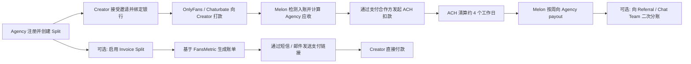
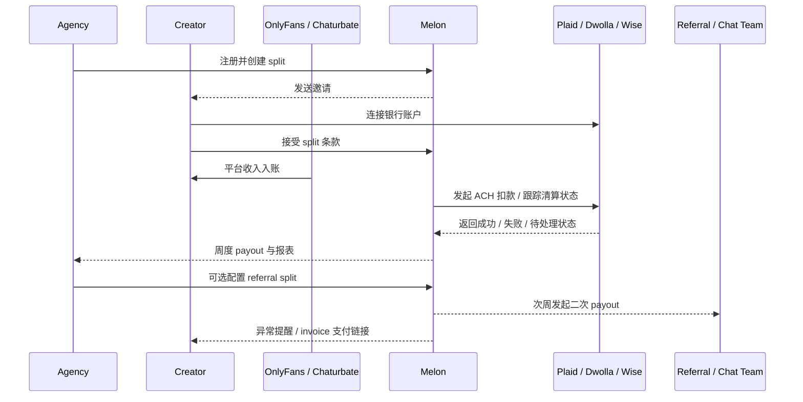

# Melon 产品概述

- Melon 是一个面向创作者经纪公司（Agency）的收入分账与回款自动化产品，核心不是内容运营，而是把“创作者收款后如何按协议分钱、催款、对账、周结”做成标准化工作流。
- 官方公开定位是 `Automatic payouts for agencies`；截至 `2026-03-13`，官网披露规模信号为 `900+ creators / 125+ agencies / $25m+ revenue shared`。
- 产品当前覆盖两类主流程：
  - `Creator Split`：创作者在 OnlyFans、Chaturbate 等平台收款后，Melon 自动向创作者扣回 agency 分成，并按周打款给 agency。
  - `Invoice Split`：基于 FansMetric 数据生成账单链接，通过短信或邮件向 creator 收款。
- 商业模式是交易抽成而不是席位费：对 agency 的收费从其 `agency cut` 的 `5%` 起；referral recipient 额外支付 `2%` 转账费。
- 本质上，Melon 是 creator agency 生态中的 `payment layer`，不是全栈 agency OS。

# 参与角色

- `Agency`：创建 split、设定分成比例、查看回款、管理 referral/chat team 分账。
- `Creator`：接受邀请、连接银行账户、接收平台收入、被自动扣款或通过账单链接付款。
- `Referral / Chat Team / Additional Participant`：接收 agency 二次分账。
- `上游平台`：OnlyFans、Chaturbate 等，为 creator 提供原始收入来源。
- `支付合作方`：Plaid 负责银行连接；Dwolla 负责账户/ACH 能力；Wise 支持部分跨境 USD 银行路径。
- `Melon`：负责规则、检测、编排、通知、账本与 payout。

# 应用场景

- Agency 管理多个 creator，需要稳定、透明地回收 agency 分成。
- Agency 需要给 referral、chat team 等第三方继续分账。
- 创作者与 agency 不希望继续依赖 Excel、截图、人工催款和手工转账。
- Agency 已有运营系统，但缺少金融工作流层，希望把“收钱、分钱、催钱、周结”独立出来。
- 国际 agency 或加拿大 creator 需要 USD 银行路径，但又不想自建跨境支付流程。

# 上下游依赖

- `上游依赖`
  - Creator 平台收入：OnlyFans、Chaturbate 等。
  - Creator 银行账户：Melon 依赖银行入账事件触发分账。
  - Invoice 数据源：Automated Invoicing 依赖 FansMetric。
- `中游关键依赖`
  - Plaid：银行连接与账户验证。
  - Dwolla：支付账户、funding source、ACH 转账。
  - Wise：国际 agency / 加拿大 creator 的 USD 银行账户路径。
- `下游依赖`
  - Agency 银行账户：周度 payout 的最终落点。
  - Referral / Chat Team 收款账户：二次分账的最终落点。
  - Email / SMS 渠道：邀请、提醒、催收与异常通知。

# 核心流程图

# 用户旅程

## Agency Onboard

- Agency 注册 Melon，提交实体资料并完成基础 KYC / KYB。
- 配置自己的收款账户与 payout 路径。
- 如果是国际 agency，则需要额外准备 Wise USD 账户。
- Onboard 完成后进入 dashboard，可创建 split、查看 cashout / payout 历史并导出数据。

## Creator Onboard

- Creator 通过 agency 邀请链接进入 Melon。
- Creator 接受 split 条款，并通过 Plaid 连接银行账户。
- 如果是加拿大 creator，则需要准备 Wise 的美国银行信息。
- Creator 完成连接后，Melon 才能在检测到平台打款后发起自动扣款。

## Agency Create Split

- Agency 创建 `Creator Split`，设定分成比例、生效关系和收款方。
- 如果存在 referral/chat team，可创建 `Referral Split` 或 `Multi-participant split`。
- Split 创建后，Melon 开始持续监听创作者账户中的平台收入变化。
- 对于账单模式，agency 可启用 `Invoice Split`，由 Melon 发送付款链接并跟踪支付状态。

## Creator Get the Money From OnlyFans

- OnlyFans 等平台先把收入打到 creator 银行账户。
- Melon 检测到入账后，按 split 规则从 creator 账户扣回 agency 应收部分。
- ACH 清算通常需要约 `4` 个工作日。

## Agency Weekly Payout

- Melon 将当周已完成清算的 agency 应收款汇总，并按周发起 payout。
- 官方公开口径显示 payout 处理通常围绕美国周四 cutoff 运行，agency 实际收款通常体现在周五。
- 如果配置了 referral/chat team，二次分账通常在 agency 收款后的下一个 payout 周期处理。
- Agency 可在 dashboard 中查看 payout / cashout 历史，并导出 Excel 用于对账。

## Exception / Retry

- 如果 creator 银行连接失效，Melon 会要求 creator 重新连接银行账户，split 可能暂时进入 pending。
- 如果账户余额不足、ACH 失败或发生退票，相关交易不会进入正常 payout，而会转入异常处理与重试流程。
- 如果 agency 或 creator 的 KYC / KYB 资料不完整，支付能力可能被暂停，需补件后恢复。
- 这说明 Melon 的真实能力不只是自动扣款，还包括异常识别、通知、人工 review 和运营兜底。

## Invoice Split

- 在 invoice 模式下，Melon 不再完全依赖平台入账后扣款，而是基于 FansMetric 数据生成应收账单。
- 系统通过邮件或短信向 creator 发送支付链接，creator 不必注册 Melon 账号也可完成付款。
- 该模式支持银行卡或银行账户支付，其中刷卡手续费由 creator 承担。

# 核心时序图

# 核心功能

- Creator Split：基于平台入账的自动分账。
- Referral Split：agency 对 referral/chat team 的二次分账。
- Multi-participant split：多参与方分账。
- Weekly payout：周度汇总结算给 agency。
- Bank linking：通过 Plaid 完成 creator 银行连接与后续 relink。
- Dashboard / Reporting：查看 active、pending、cancelled split，导出 Excel，查看 payout / cashout 历史。
- Automated Invoicing：基于 FansMetric 数据生成账单链接，并通过短信/邮件催收。
- Support / exception handling：处理资金不足、断连、补件、争议等异常。

# 护城河

- `垂直工作流理解`：不是泛支付工具，而是深度贴合 creator agency 的“关系型分账”场景。
- `金融正确性`：真正难点在账本、状态机、异常处理、周结和争议处理，不在前端界面。
- `信任与合规链路`：对 Plaid、Dwolla、Wise 等合作方的接入与运营经验会形成门槛。
- `嵌入式替代成本`：一旦 agency 把分账、报表和 payout 都迁移到 Melon，切换回 Excel 或手工流程的成本会上升。
- `运营经验沉淀`：对 relink、insufficient funds、KYC 缺资料、cutoff 等异常的处理方式会形成隐性壁垒。

# 附录

## 名词解释

- `Split`：创作者与 agency 的分账规则。
- `Referral Split`：agency 再把自己收入的一部分分给第三方的规则。
- `Invoice Split`：按账单向 creator 收款，而不是等平台入账后再扣款。
- `KYC / KYB`：个人/企业身份与主体核验。
- `ACH`：美国银行间电子清算网络，成本低但到账慢且可退回。

## 风险点

- `平台依赖风险`：OnlyFans、Chaturbate 等平台的打款政策变化会直接影响 Melon 主流程。
- `支付合作方风险`：成人/订阅内容相关生态对支付合作方的接受度变化较大。
- `账户连接风险`：Plaid 断连、银行凭证更新会导致自动分账失败。
- `争议与回退风险`：ACH 存在退票、争议、清算延迟，必须依赖人工运营兜底。
- `跨境复杂度风险`：国际 agency 与加拿大 creator 路径会显著增加 KYC、支付、support 复杂度。
- `文档一致性风险`：公开条款与帮助中心对国际支持边界存在不完全一致之处。

## 成本分析

- `显性第三方成本`
  - `银行连接与支付`：`Plaid` 未公开统一标准单价，`Dwolla` 为 `custom pricing`。这两项是核心外部成本，但当前需以商务报价为准。
  - `通知与验证`：`Twilio SMS` 美国基础价从 ` $0.0083 / segment ` 起，另有 carrier fee；`Twilio Verify` 为 ` $0.05 / successful verification + $0.0083 / SMS `。以 `2,000` 条短信/月估算，基础短信费用约 ` $16.6/月 `。
  - `跨境能力`：如覆盖国际 agency 或加拿大 creator，`Wise` 一次性开通费 ` $31 `，接收 USD wire ` $6.11 / 笔 `。
  - `账单数据来源`：若不自建 invoice 数据能力，可接 `FansMetric`。其 Standard 为 ` $39/月/账号 `，Pro 为 ` $99/月/账号 `；按 `20` 个 creator 估算，月成本约 ` $780 - $1,980 `。
- `隐性但更关键的成本`
  - 长期成本大头通常来自支付合作方商务条款、KYC / 风控、准备金要求、退票与争议处理，以及人工审核和客服 support。
  - 这些成本当前无法从公开资料精确量化，需要在支付合作方准入和商务沟通后才能形成可靠预算。

# 参考来源

- `Melon 官网`
  - URL：https://www.getmelon.io/
  - 用于支持：产品定位 `Automatic payouts for agencies`、官网规模数据 `900+ creators / 125+ agencies / $25m+ revenue shared`、周度 payout 叙述。
- `What is Melon?`
  - URL：https://help.getmelon.io/en/articles/8986654-what-is-melon
  - 用于支持：Melon 是 revenue-sharing platform；支持 OnlyFans、Chaturbate 等平台；核心是自动分账而非内容运营。
- `How does Melon work?`
  - URL：https://help.getmelon.io/en/articles/8358228-how-does-melon-work
  - 用于支持：creator 需接受邀请，并通过 Plaid 连接银行账户；agency 创建 split 后进入自动分账流程。
- `How the flow of funds works on Melon`
  - URL：https://help.getmelon.io/en/articles/8986666-how-the-flow-of-funds-works-on-melon
  - 用于支持：平台入账后同日触发 charge、ACH 约 `4` 个工作日清算、agency 每周五收款、第三方分账通常比 agency 晚一周。
- `How does payout timing work on Melon?`
  - URL：https://help.getmelon.io/en/articles/7879269-how-does-payout-timing-work-on-melon
  - 用于支持：Melon 多次扫描平台入账、charge 与 payout 的时间节奏、ACH `4` 个工作日窗口。
- `What is a Referral Split?`
  - URL：https://help.getmelon.io/en/articles/8136980-what-is-a-referral-split
  - 用于支持：Referral Split 的定义、weekly payouts、referral recipient `2%` fee。
- `Automated Invoicing with Melon`
  - URL：https://help.getmelon.io/en/articles/12005317-automated-invoicing-with-melon
  - 用于支持：Invoice Split 依赖 FansMetric、creator 可通过付款链接支付、刷卡手续费由 creator 承担、银行转账显示为 `0 fee`。
- `Melon for non-US/Canada agencies`
  - URL：https://help.getmelon.io/en/articles/9020125-melon-for-non-us-canada-agencies
  - 用于支持：Melon 支持部分国际 agency，但要求使用 Wise USD 银行账户；creator 仍主要限定在美国和加拿大。
- `Using Melon as a Canadian Creator – Wise US Bank Account Setup`
  - URL：https://help.getmelon.io/en/articles/11994736-using-melon-as-a-canadian-creator-wise-us-bank-account-setup
  - 用于支持：加拿大 creator 需要 Wise US bank account，OnlyFans 与 Melon 以 USD 路径运行。
- `Plaid Pricing`
  - URL：https://plaid.com/pricing/
  - 用于支持：Plaid 采用 one-time / subscription / per-request 三类计费模型；官方未在公开页披露统一单价。
- `Plaid Pricing and Billing`
  - URL：https://plaid.com/docs/account/billing/
  - 用于支持：Plaid 价格主要受产品形态与 plan 影响，公开文档不提供统一价目表。
- `Dwolla Pricing`
  - URL：https://www.dwolla.com/pricing/
  - 用于支持：Dwolla 为 `custom pricing`，属于需商务确认的核心支付成本。
- `Wise Business Pricing`
  - URL：https://wise.com/us/pricing/business/
  - 用于支持：Wise 一次性开通费 ` $31 `，接收 USD wire ` $6.11 / 笔 `。
- `Twilio SMS Pricing in United States`
  - URL：https://www.twilio.com/en-us/sms/pricing/us
  - 用于支持：美国短信基础价从 ` $0.0083 / segment ` 起，另有 carrier fee。
- `Twilio Verify Pricing`
  - URL：https://www.twilio.com/en-us/verify/pricing
  - 用于支持：美国短信验证价格为 ` $0.05 / successful verification + $0.0083 / SMS `。
- `FansMetric Pricing`
  - URL：https://fansmetric.com/pricing
  - 用于支持：FansMetric Standard ` $39/月/账号 `、Pro ` $99/月/账号 `，可作为 invoice 数据能力的第三方成本参考。
