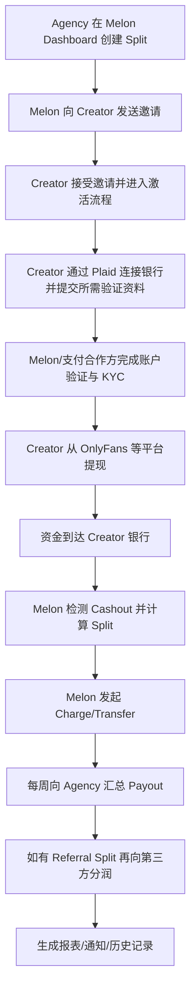
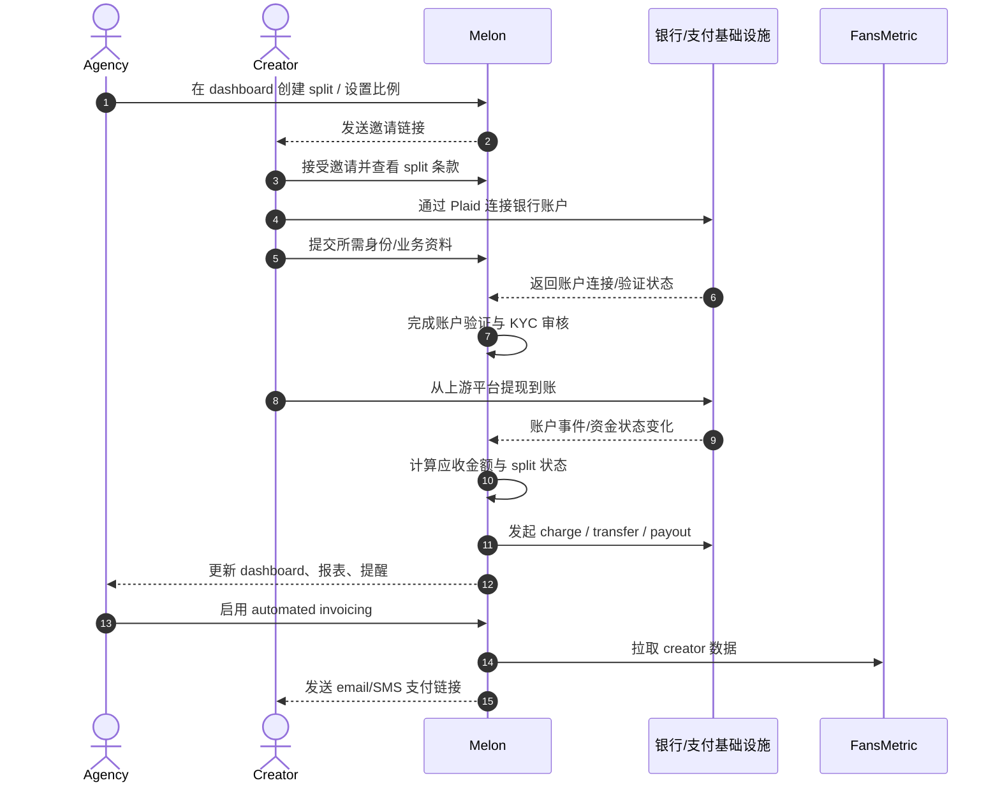
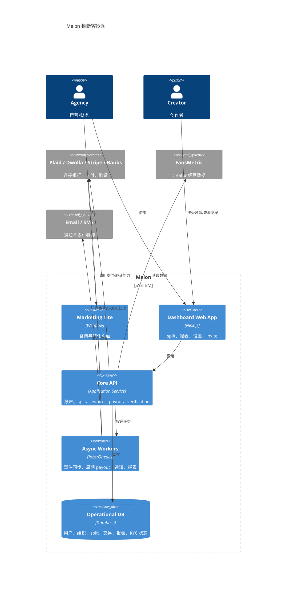

# Melon 产品分析 v3（含证据型成本调研）

- 产品名称：Melon
- 产品官网：<https://www.getmelon.io/>
- 产品类型：垂直 SaaS / Fintech workflow / 创作者经济 B2B 工具
- 分析日期：2026-03-12
- 分析目标：基于公开网页与帮助中心，重新生成一版偏“理解型 + 判断型”的产品分析报告

## 1. Product Summary

- Product name: Melon
- Product URL: <https://www.getmelon.io/>
- Category: 面向创作者经纪公司与创作者协作场景的自动分账、收款、对账平台
- Primary audience: creator agency、agency owner、agency operator、finance/ops
- Secondary audience: creator、referral partner、chat team、additional participant
- Core value proposition: 把 agency 与 creator 之间的收入分账、回款、对账、提醒与部分开票收款流程自动化
- Analysis confidence: 中高

## 2. One-Sentence Product Definition

Melon 是一个为 creator agency 服务的收入分账与回款平台，在 agency 需要按约定向创作者收取分成、向第三方分润并完成对账时，通过银行连接、自动识别入账、定期 payout 和自动 invoicing 来降低人工财务操作成本。

## 3. Key Terminology

### Creator

- 通俗含义：内容创作者。
- 在本产品中的含义：与 agency 建立分成关系、其平台收入会被纳入 split 逻辑的主体。
- 类型：行业通用概念。

### Agency

- 通俗含义：为创作者提供运营、增长、客服或商业支持的团队。
- 在本产品中的含义：Melon 的核心购买方与操作方，负责创建 split、管理 payout、查看报表。
- 类型：行业通用概念。

### Split

- 通俗含义：将一笔收入按约定比例拆给不同参与方。
- 在本产品中的含义：creator 与 agency 之间的收入分成协议，是 Melon 的核心产品对象。
- 类型：行业通用概念，在 Melon 中是核心业务实体。

### Referral Split

- 通俗含义：再从已有收入里分一部分给推荐人或合作方。
- 在本产品中的含义：agency 从自身 split 收益中，继续给 referral partner 或 chat team 做二级分润。
- 类型：业务组合术语。

### Multi-Participant Split

- 通俗含义：一笔收入同时分给多个参与方。
- 在本产品中的含义：用于公开式多方分账；帮助中心强调这和更“隐蔽”的 referral split 不同。
- 类型：业务组合术语。

### Payout

- 通俗含义：系统向某收款方实际打款。
- 在本产品中的含义：Melon 将处理完成的 split 收益按周期打给 agency 或第三方的动作。
- 类型：行业通用概念。

### Cashout

- 通俗含义：收入从上游平台提现到银行账户。
- 在本产品中的含义：creator 从 OnlyFans 等平台把收入提到银行；Melon 以此作为检测和触发后续 split 的关键事件。
- 类型：行业通用概念。

### Automated Invoicing

- 通俗含义：系统自动生成账单并发起收款。
- 在本产品中的含义：Melon 基于 FansMetric 数据对 creator 自动出账单，并用短信/邮件发送支付链接。
- 类型：行业通用概念。

### Plaid

- 通俗含义：银行账户连接与验证基础设施服务。
- 在本产品中的含义：帮助中心明确提到 creator 通过 Plaid 连接银行，说明它是 Melon 银行连接能力的关键依赖之一。
- 类型：关键外部服务商名词。

### Dwolla

- 通俗含义：美国账户间转账与资金流转基础设施服务商。
- 在本产品中的含义：条款中明确要求用户开设 Dwolla Account，说明 Melon 至少部分支付链路依赖 Dwolla 体系。
- 类型：关键外部服务商名词。

### Stripe

- 通俗含义：支付、账单与收款基础设施平台。
- 在本产品中的含义：帮助中心提到某些情况下 Stripe 可能要求额外资料，且 invoicing 支持卡支付，说明其部分收款/KYC 能力与 Stripe 相关。
- 类型：关键外部服务商名词。

### FansMetric

- 通俗含义：创作者经营数据与分析平台。
- 在本产品中的含义：Melon 的 Automated Invoicing 需要先连接 FansMetric，再据此生成 invoice split。
- 类型：关键外部平台名词。

### Wise USD Bank Account

- 通俗含义：Wise 提供的美元银行账户能力。
- 在本产品中的含义：国际 agency 使用 Melon 的前提条件之一。
- 类型：关键外部基础设施名词。

## 4. What the Product Actually Does

从公开材料看，Melon 有两条核心业务线：

1. `Revenue Share / Split`  
   agency 与 creator 约定一个收入分成比例；creator 从 OnlyFans、Chaturbate 等平台提现到银行后，Melon 检测入账并按 split 百分比发起扣款或收款，再按周期向 agency payout。

2. `Automated Invoicing`  
   agency 连接 FansMetric 后，可以创建 invoice split；Melon 根据外部经营数据和设定的时间周期自动生成账单，并通过短信/邮件给 creator 发送统一支付链接，creator 不一定需要创建 Melon 账户也能支付。

核心工作流不是“支付收单”，而是把 agency 与 creator 之间本来依赖 Excel、人工核算、催款和对账的金流流程做成一套可追踪的系统。

主要参与方：
- agency
- creator
- referral partner / chat team / additional participant
- Melon
- 银行/支付基础设施
- FansMetric

## 5. Target Users and Roles

- Buyer：agency owner、agency manager、agency finance
- Operator：运营、财务、团队负责人、分账配置者
- End beneficiary：agency、creator、referral partner、chat team
- Supporting roles：支付/KYC 服务商、支持团队、外部数据平台

## 6. Application Scenarios

### 场景 1：agency 自动向 creator 收取分成

- Who uses it：agency 与 creator
- When：creator 从平台提现到银行时
- What problem it solves：无需手工核对收入与开票催款
- Why it fits：Melon 以 creator 平台入账为事件源触发 split

### 场景 2：agency 给 referral 或第三方团队自动分润

- Who uses it：agency、referral partner、chat team
- When：agency 已从 creator 收到分成后
- What problem it solves：避免二次手工转账与账务不透明
- Why it fits：Melon 内建 referral split 与 multi-participant split

### 场景 3：agency 做周期性 invoice 收款

- Who uses it：agency、creator
- When：agency 想绕过传统手工开票与提醒流程时
- What problem it solves：自动发账单、发提醒、收款、汇总历史
- Why it fits：Melon 提供 invoice split、支付链接、短信/邮件提醒

### 场景 4：agency 做财务回顾与对账

- Who uses it：agency finance / ops
- When：周结、月结、核对收入时
- What problem it solves：缺乏统一账本、历史记录和导出明细
- Why it fits：Melon 有 cashouts、payouts、activity timeline 和可导出的 transaction report

## 7. Current Alternatives and Substitutes

- Excel / Google Sheets：便宜、灵活，但手工对账和催款成本高
- Notion / 飞书文档：适合记录协议与流程，但不负责真实资金流
- 手工 invoice + 银行转账：简单直接，但易拖欠、难追踪
- 内部脚本 + 银行数据：可控但维护成本高，合规与可靠性差
- 通用支付工具：可做收款，但未必适合 creator-agency 分账工作流
- 上游平台内建结算能力：若存在则可能成为替代，但通常无法满足 agency 自定义分润和多方 payout

判断上，Melon 真正替代的不是单一竞品，而是“人工财务工作流 + 若干通用支付工具 + 聊天提醒”。

## 8. Implemented Requirements

### Business requirements

- 支持 creator 与 agency 的收入分成关系
- 支持 referral / additional participants 的二级或多方分润
- 支持对账、历史记录、导出
- 支持国际 agency 的特定接入路径

### Functional requirements

- 银行账户连接
- split 创建、编辑、接受、取消
- payout 与 cashout 历史查看
- 自动 invoicing
- 支付链接、短信/邮件提醒
- affiliate 能力

### Operational requirements

- KYC 与账户验证
- split pending 诊断
- 断连重连银行
- 客服与帮助中心自助支持

### Risk/compliance requirements

- 收集企业/个人税务与身份信息
- 支持支付合作方补充资料要求
- 处理国际 agency 的账户限制

## 9. Pain Points Solved

- 过去 workflow：平台提现后人工算分成、发消息、开 invoice、催款、再打给合作方、再做表格对账
- friction/risk：拖欠、算错、漏记、沟通摩擦、跨系统切换、周结不透明
- Melon 改善点：自动检测入账、自动计算比例、周期 payout、统一报表、提醒自动化
- 新增价值：agency 可以把“金流管理”从不透明关系型操作改成标准化系统流程

## 10. Business Model and Monetization Clues

- Who appears to pay：主要是 agency
- What they are paying for：自动化回款、对账透明度、减少催款和财务操作负担
- Pricing clues：
  - 官网写明费用“start at 5% of your agency's cut”
  - `$50k` agency earnings/月时显示 `4.85%`
  - `$100k` agency earnings/月时显示 `4.6%`
  - `$500k` 为 `contact sales`
- Likely cost drivers if visible：
  - 银行连接与支付通道成本
  - 卡支付相关成本
  - ACH/转账处理成本
  - KYC 与合规成本
  - 客服与异常处理成本
  - 若 invoicing 扩张，短信/邮件通知成本也会增加

## 11. Competitive Positioning and Differentiation

### 直接竞品

公开页面没有直接列出竞品，但从问题类型看，Melon 所处位置接近：
- 垂直分账/收款工具
- 通用支付基础设施之上的行业化工作流产品
- 介于“支付工具”和“agency 财务操作系统”之间

### 间接替代

- Stripe/通用 billing + 人工流程
- 银行转账 + 表格
- OnlyFans 生态里的灰度脚本或人工运营流程

### 用户为什么会选 Melon

- 更贴近 creator-agency 场景，不只是收款
- 有 split、referral split、cashout/payout 历史和帮助中心流程
- 不需要用户切换银行账户或直接开放社媒平台权限
- 对“讨债式沟通”的替代价值很强

### 它真正的差异化

- 场景差异：垂直服务 creator agency
- 工作流差异：围绕 cashout -> split -> payout -> reconciliation
- 体验差异：内建 invite、bank link、status、alerts、report
- 生态差异：接入 FansMetric、affiliate、帮助中心教育

## 12. Growth and Distribution Clues

- 官网有明显的 `Get Started`、affiliate 页面与自助 onboarding 页面
- affiliate program 提供 12 个月分成，说明它依赖行业口碑与转介绍
- 帮助中心内容完备，说明 onboarding 和支持是增长的一部分
- “agency -> creator invite” 本身带一点产品内传播属性
- 从公开信号看，它不像纯 PLG，也不像纯 enterprise sales，更像带有较强社群/关系链分发的垂直 SaaS

## 13. Moat and Copyability

### 可能的护城河

- 工作流嵌入深度：不是单一支付按钮，而是长期嵌入 creator-agency 财务流程
- 生态理解：对 split、referral、multi-participant、weekly payout 等行业细节理解较深
- 信任与合规：支付/KYC 相关产品一旦跑通，复制并不只是前端功能问题
- 分发与关系网络：affiliate + invitation + 行业口碑可能带来网络式扩张

### 容易复制的部分

- 营销站
- 仪表盘基础 UI
- 通用账单、提醒、报表壳层

### 不易复制的部分

- 稳定识别上游平台入账并触发 split 的整套链路
- 银行连接、支付、KYC 与异常处理组合
- 特定垂直场景下的实施与客服经验

## 14. Dependencies

### Business dependencies

- creator 与 agency 之间有真实分成合同或默契
- 上游 creator 平台仍持续产生可识别的 cashout 行为

### External integrations / infrastructure

- Plaid
- Dwolla
- Stripe
- Wise USD account
- FansMetric
- 邮件/SMS 基础设施

### Internal technical dependencies

- 用户/组织/角色体系
- split 状态机
- 交易事件处理
- payout 任务调度
- 审计/报表/导出

## 15. Key Risks and Constraints

- Business risk：客群垂直，若强依赖 OnlyFans agency 生态，TAM 与行业周期都会影响成长上限
- Operational risk：一旦 charge 失败、bank disconnected、KYC incomplete、payout delay，人工支持压力会迅速放大
- Technical risk：核心价值建立在正确识别 cashout 并稳定触发 split 上，准确率和可追溯性要求高
- Compliance/legal risk：涉及 KYC、税务资料、支付合作方要求、跨境限制
- Platform dependency risk：上游平台提现方式、命名、时序若变化，Melon 的检测与流程可能受影响
- GTM risk：这类工具通常需要较高信任，不太像靠简单广告即可大规模转化

## 16. Data, Security, and Compliance Considerations

- likely data handled：
  - 用户身份信息
  - 企业资料
  - 银行账户连接状态
  - 交易、cashout、payout 历史
  - creator 联系方式
- permission / tenancy boundaries：
  - agency 与 creator 之间的数据边界
  - referral/additional participants 的可见范围
  - 多租户组织隔离
- security/compliance expectations：
  - KYC 信息处理
  - 税务资料收集
  - 银行连接与支付合作方要求
  - 敏感财务数据的访问控制与审计

## 17. Likely Technical Solution

- `高置信`：前台官网与后台应用分离，官网为 Webflow，dashboard 为 Next.js Web App
- `高置信`：后端至少需要管理 `User / Organization / Split / Cashout / Charge / Payout / ReferralSplit / Invoice / Report / Verification`
- `高置信`：有异步任务系统处理银行状态同步、周期 payout、提醒、report 生成
- `中置信`：存在围绕 split 的状态机，例如 pending、active、failed/disrupted、canceled
- `中置信`：invoice split 与 revenue split 是两条不同入口，但会共享用户、支付、报表和通知层
- `中置信`：需要将上游 cashout 事件、内部 charge 事件、agency payout 事件、third-party payout 事件串成审计链

## 18. Confirmed Facts vs Reasoned Inference

### Confirmed facts

- 官网定位为 `Automatic payouts for agencies`，并展示 `900+ creators`、`125+ agencies`、`$25 mil+ revenue shared`。  
  来源：<https://www.getmelon.io/>
- Melon 官方帮助中心明确说它是 revenue-sharing platform，支持 OnlyFans、Chaturbate 等平台。  
  来源：<https://help.getmelon.io/en/articles/8986654-what-is-melon>
- split 由 agency 创建，creator 通过 Plaid 连接银行后激活。  
  来源：<https://help.getmelon.io/en/articles/8358228-how-does-melon-work>
- creator 当天收到 OF deposit 后，Melon 会发起 charge；agency 每周五收到汇总 payout；third-party payout 晚一周。  
  来源：<https://help.getmelon.io/en/articles/8986666-how-the-flow-of-funds-works-on-melon>
- 自动 invoicing 需要先接 FansMetric，creator 可以不创建 Melon 账户，直接通过统一支付链接支付。  
  来源：<https://help.getmelon.io/en/articles/12005317-automated-invoicing-with-melon>
- 国际 agency 可用，但 creator 目前仅原生支持美国和加拿大；国际 agency 需 Wise USD bank account。  
  来源：<https://help.getmelon.io/en/articles/9020125-melon-for-non-us-canada-agencies>
- 帮助中心提到某些情况下 Stripe 可能要求额外资料。  
  来源：<https://help.getmelon.io/en/articles/7861465-what-tax-and-business-documentation-does-melon-require>
- 条款中明确提到 Plaid、Dwolla、Dwolla Account。  
  来源：<https://www.getmelon.io/terms-of-service>

### Reasoned inference

- `High`：Melon 更像“creator agency 金流操作系统”，而不是通用支付工具。
- `Medium`：其产品优势来自垂直工作流理解，而不是底层支付通道本身。
- `Medium`：invoice 功能是其从“收入分账自动化”向“应收自动化”扩展的重要方向。
- `Medium`：它的可扩张性很大程度上取决于对上游平台资金事件的持续稳定识别能力。

## 19. If Building a Similar Product

- Suggested MVP scope：
  - 先只服务一个垂直场景中的单一角色，比如 agency 财务负责人
  - 先只做 revenue split，不同时做 invoice、affiliate、多参与方
- Suggested modules：
  - 账户/KYC
  - bank linking
  - split management
  - transaction detection
  - payout reporting
- Main risks：
  - 资金链路准确率
  - 合规/KYC
  - 人工客服兜底成本
  - 上游平台依赖
- Cost considerations：
  - 工程实现成本：账户体系、状态机、报表、任务调度
  - 第三方基础设施成本：银行连接、支付、短信、数据平台
  - 运营成本：异常处理、人工支持、支付失败追踪
  - 合规成本：KYC、法务、税务资料收集、风控
  - 获客成本：若依赖关系链/行业社群，早期增长并不一定便宜
  - 详细证据型成本调研见 `20. Build Cost Research`
- Early validation or success criteria：
  - 是否能稳定识别 cashout 并正确生成 split
  - 是否能显著减少人工催款/对账时间
  - agency 是否愿意让真实 creator roster 进入系统

## 20. Build Cost Research

本节按新规则分为三层：

- `Confirmed current-product cost clues`
- `Confirmed vendor pricing`
- `Scenario-based build-cost estimates`

### 20.1 Confirmed current-product cost clues

| Cost item | Vendor or cost type | Confirmed or candidate | Official source | Official URL | Public pricing/billing rule | Billing unit | Evidence level | Key uncertainty or assumption |
| --- | --- | --- | --- | --- | --- | --- | --- | --- |
| Melon 平台收费 | Melon 自身定价 | Confirmed | Melon homepage pricing | <https://www.getmelon.io/> | 官网页面写明 fees start at `5%` of the agency's cut，并给出 `4.85%`、`4.6%` 的体量示例 | 占 agency cut 的百分比 | High | 这是 Melon 对客户收费，不等于其底层 vendor 成本 |
| 自动 invoicing 依赖外部数据平台 | FansMetric data dependency | Confirmed | Melon help center | <https://help.getmelon.io/en/articles/12005317-automated-invoicing-with-melon> | 启用 automated invoicing 前必须先连接 FansMetric | 功能前置依赖 | High | 依赖关系明确，但 Melon 与 FansMetric 的商务采购条款未公开 |
| 国际 agency 账户前提 | Wise USD bank account | Confirmed | Melon help center | <https://help.getmelon.io/en/articles/9020125-melon-for-non-us-canada-agencies> | 非美国/加拿大 agency 需有 Wise USD bank account | 使用前置条件 | High | 这是用户侧接入条件，不一定是 Melon 平台采购成本 |

### 20.2 Confirmed vendor pricing

| Cost item | Vendor or cost type | Confirmed or candidate | Official source | Official URL | Public pricing/billing rule | Billing unit | Evidence level | Key uncertainty or assumption |
| --- | --- | --- | --- | --- | --- | --- | --- | --- |
| 银行连接 / API 调用 | Plaid | Confirmed vendor for bank linking | Plaid pricing page | <https://plaid.com/pricing/> | 官方页写明 `Your first 200 API calls are free`，并说明后续为 pay-as-you-go 或 tailored volume pricing | API calls / custom volume pricing | Medium | 官方公开了免费额度，但公开页未稳定展示本案所需具体产品的单价，故不做精确量化 |
| 银行转账能力 | Dwolla | Confirmed vendor in Melon terms | Dwolla pricing page | <https://www.dwolla.com/pricing/> | 官方页写明 pricing is tailored to transaction volume, rails, and integration needs；无公开统一价格 | Custom / contact sales | High | 供应商确认，但官方不公开标准价，故 `Do not quantify` |
| 卡支付 | Stripe | Confirmed vendor signal | Stripe pricing | <https://stripe.com/pricing> | 标准在线卡支付 `2.9% + 30¢` | per successful card charge | High | 适用于标准在线支付；Melon 是否在所有支付场景下都按该计费未公开 |
| ACH 直接借记 | Stripe | Candidate / partially confirmed signal | Stripe pricing | <https://stripe.com/pricing> | `0.8%` for ACH Direct Debit | per ACH payment | High | Melon 帮助中心提到 Stripe 资料要求，但未公开确认所有 ACH 流程都走 Stripe |
| 平台抽佣式支付基础设施 | Stripe Connect | Candidate | Stripe pricing | <https://stripe.com/pricing> | `0.25% starting fee for platforms that deploy their own payments pricing to earn revenue on each transaction` | per transaction starting fee | High | 这是候选 build option，不可直接当作 Melon 已确认实际成本 |
| 订阅/账单软件费 | Stripe Billing | Candidate | Stripe Billing pricing | <https://stripe.com/billing/pricing> | `0.7%` of billing volume，公开页同时写明超出指定体量部分为 `0.67%` | % of billing volume | High | 可作为做类似 invoice 产品的候选方案，但 Melon 未公开确认使用 Stripe Billing |
| OnlyFans 经营数据平台 | FansMetric | Confirmed dependency / candidate paid vendor | FansMetric pricing | <https://fansmetric.com/pricing> | 定价页写明 `from $39/month per OnlyFans account`，页面可见 `Standard $39 per month per linked OnlyFans account` | monthly per linked account | High | Melon 是否按此标准零售价采购或有 B2B 协议价未公开 |
| 短信通知 | Twilio SMS US | Candidate | Twilio SMS pricing (US) | <https://www.twilio.com/en-us/sms/pricing/us> | 官方页显示分段计费；在公开表中，`150,001 - 300,000 messages` tier 为 `$0.0081`，`300,001 - 500,000` tier 为 `$0.0079`；另有 `$0.001` failed message processing fee | per message / per segment | High | Melon 未公开确认使用 Twilio；仅作为构建类似产品的候选短信基础设施价格 |
| Wise 收款账户 | Wise | Candidate / user prerequisite vendor | Wise receive pricing | <https://wise.com/us/pricing/receive> | 官方页明确这是 `Wise Account Fees for Receiving & Adding Money`，但本次稳定抓取未提取到适用于 Melon 场景的单一固定费率 | varies by currency / receive method | Low | 有官方价格页，但当前公开页面前端渲染较重，未稳定抽取到可直接引用的具体费用；`Do not quantify` |

### 20.3 Scenario-based build-cost estimates

以下不是 Melon 的已确认实际成本，而是“若做类似产品”基于官方计费规则能成立的成本模型。

| Cost item | Vendor or cost type | Confirmed or candidate | Official source | Official URL | Public pricing/billing rule | Billing unit | Evidence level | Key uncertainty or assumption |
| --- | --- | --- | --- | --- | --- | --- | --- | --- |
| 银行连接层 | Plaid | Candidate build option | Plaid pricing page | <https://plaid.com/pricing/> | 前 200 API calls free；后续 pay-as-you-go / volume pricing | API calls | Medium | 若产品早期只做小规模验证，可先落在免费额度或低量级；但正式成本需销售报价或更细产品线定价 |
| 银行转账层 | Dwolla | Candidate build option | Dwolla pricing page | <https://www.dwolla.com/pricing/> | custom pricing only | custom | Do not quantify | 适合说明“成本项存在且可能显著”，但没有公开价格不能给精确预算 |
| 卡支付/ACH 收款层 | Stripe | Candidate build option | Stripe pricing | <https://stripe.com/pricing> | card `2.9% + 30¢`；ACH Direct Debit `0.8%` | per transaction | High | 若产品用卡支付收 invoice，交易抽成会成为主要变动成本；不同付款方式成本结构差异很大 |
| 平台化分账层 | Stripe Connect | Candidate build option | Stripe pricing | <https://stripe.com/pricing> | starting fee `0.25%` for platforms earning revenue on each transaction | per transaction | High | 只有当你的产品采用 Stripe Connect 类平台化收费模型时才成立 |
| 账单与订阅层 | Stripe Billing | Candidate build option | Stripe Billing pricing | <https://stripe.com/billing/pricing> | `0.7%` of billing volume，部分区间 additional volume `0.67%` | % of billing volume | High | 如果产品的 invoice/billing 量不大，这可能是可接受软件税；若 volume 很大，则需单独核算 |
| 创作者数据层 | FansMetric | Candidate build option / confirmed dependency analog | FansMetric pricing | <https://fansmetric.com/pricing> | `Standard $39/month per linked OnlyFans account` | monthly per linked account | High | 若你的类似产品依赖第三方 creator data 平台，单账号月费会迅速累积；但是否一定要买 FansMetric 取决于产品路线 |
| 短信提醒层 | Twilio SMS US | Candidate build option | Twilio SMS pricing | <https://www.twilio.com/en-us/sms/pricing/us> | 公开页显示 15万-30万条为 `$0.0081`，30万-50万条为 `$0.0079`；failed fee `$0.001` | per message segment | High | 真正成本还受 carrier fee、A2P onboarding fee、消息分段数影响 |
| 邮件通知层 | Email provider | Candidate capability | N/A | N/A | 当前未确认 Melon 或建议方案使用哪家邮件服务商 | N/A | Do not quantify | 没有确认 vendor，不应该硬套 SendGrid/Mailgun 等价格 |
| 合规/KYC | KYC vendor or internal ops | Capability category | N/A | N/A | Melon 公开确认需要文档与验证，但未公开具体 KYC vendor 计费 | N/A | Do not quantify | 这是关键成本，但当前证据不足，不能给精确数字 |

### 20.4 成本结论

- `可以精确引用的成本` 主要来自官方公开 pricing 页面，例如 Stripe、FansMetric、Twilio 某些公开 tier。
- `可以确认存在但不能精确量化的成本` 包括 Dwolla custom pricing、Plaid 的超出免费额度部分、KYC vendor 成本、邮件 vendor 成本。
- 对“类似 Melon 的产品”而言，真正的大头通常不是单一 SaaS 订阅费，而是：
  - 交易抽成类成本
  - KYC/支付风控与异常处理
  - 外部数据依赖
  - 人工客服与失败交易兜底
- 如果要进一步做可执行预算，下一步必须先锁定：
  - 是否一定采用 Stripe / Dwolla / Plaid 这组栈
  - 预计月交易额
  - 月消息量
  - 月活 creator/account 数
  - KYC 审核量

## 21. Product Diagrams

### 21.1 Workflow Diagram

标注：Mixed

### 21.2 Sequence Diagram

标注：Mixed

### 21.3 C4 Diagrams

标注：Inferred

#### 21.3.1 C4 Container

## 22. Final Summary

Melon 是一个高度垂直的 creator-agency 金流 SaaS。它最关键的不是“能不能支付”，而是把 split、payout、referral、report、invoice 这些本来依赖人工和关系协调的财务流程做成系统化工作流。公开信息显示，它已经从“自动分账”扩展到“自动开票收款”，这说明它的长期方向更像垂直行业里的 AR automation + payout orchestration 平台，而非单点支付工具。

## Sources

- 官网：<https://www.getmelon.io/>
- 条款：<https://www.getmelon.io/terms-of-service>
- Affiliate：<https://www.getmelon.io/affiliate>
- What is Melon：<https://help.getmelon.io/en/articles/8986654-what-is-melon>
- How does Melon work：<https://help.getmelon.io/en/articles/8358228-how-does-melon-work>
- Flow of funds：<https://help.getmelon.io/en/articles/8986666-how-the-flow-of-funds-works-on-melon>
- Navigating the dashboard：<https://help.getmelon.io/en/articles/8987327-navigating-the-melon-dashboard>
- Tax and business documentation：<https://help.getmelon.io/en/articles/7861465-what-tax-and-business-documentation-does-melon-require>
- Melon for creators：<https://help.getmelon.io/en/articles/8987273-melon-for-creators>
- Create a split：<https://help.getmelon.io/en/articles/8987246-create-a-split>
- Referral split：<https://help.getmelon.io/en/articles/8136980-what-is-a-referral-split>
- Multi-participant split：<https://help.getmelon.io/en/articles/8137622-what-is-a-multi-participant-split>
- Automated invoicing：<https://help.getmelon.io/en/articles/12005317-automated-invoicing-with-melon>
- Non-US/Canada agencies：<https://help.getmelon.io/en/articles/9020125-melon-for-non-us-canada-agencies>
- Plaid pricing：<https://plaid.com/pricing/>
- Dwolla pricing：<https://www.dwolla.com/pricing/>
- Stripe pricing：<https://stripe.com/pricing>
- Stripe Billing pricing：<https://stripe.com/billing/pricing>
- FansMetric pricing：<https://fansmetric.com/pricing>
- Twilio SMS US pricing：<https://www.twilio.com/en-us/sms/pricing/us>
- Wise receive pricing：<https://wise.com/us/pricing/receive>
