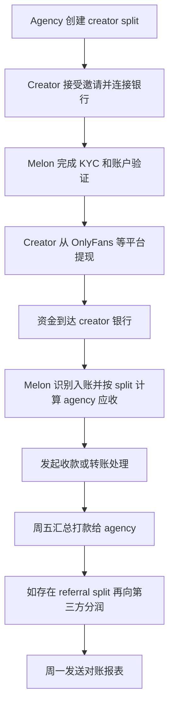
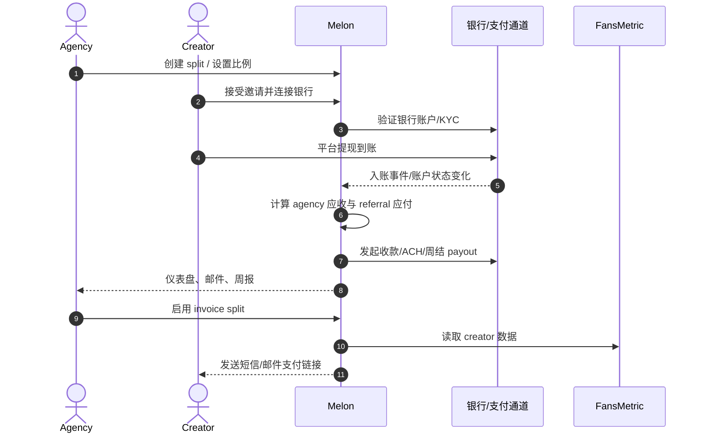
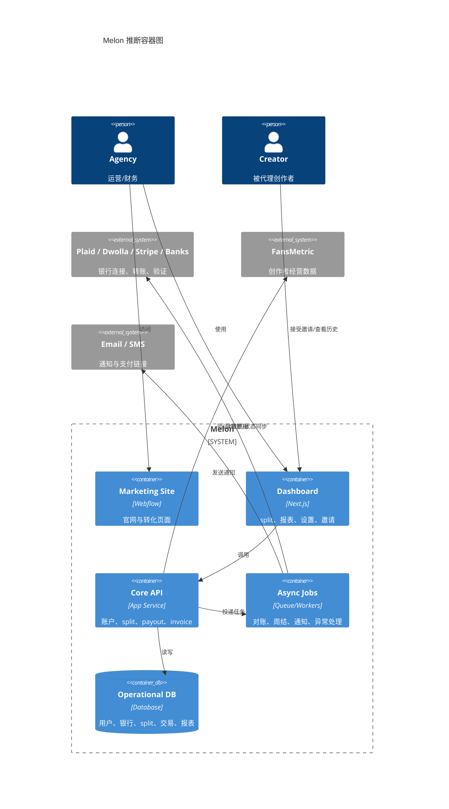

# Melon 产品分析

- 分析对象：Melon
- 产品 URL：<https://www.getmelon.io/>
- 分析日期：2026-03-12
- 分析语言：中文
- 分析深度：detailed

## 1. 产品摘要

Melon 是一个面向创作者经纪公司（agency）的自动分账与回款平台。它的核心不是单纯的支付收单，而是把创作者平台收入分成、agency 分成、第三方分成、对账和催款整条链路产品化，重点服务 OnlyFans 生态附近的 agency 财务流程。

- 产品类别：创作者经济里的 B2B 分账、回款、对账 SaaS
- 主要用户：OnlyFans 等平台的 agency、creator manager、财务、运营
- 次要用户：创作者本人、推荐人、聊天外包团队、会计
- 核心价值：把 agency 向创作者收款、再向第三方分润、再做周报对账的流程自动化
- 分析置信度：中高

## 2. 它实际上在做什么

- 对 agency 来说，Melon 的核心对象是 `Split`，即某位 creator 的收入按约定比例分给 agency。
- 当 creator 从平台提现并到账银行后，Melon 识别这笔入账并按 split 比例发起扣款或收款。
- 资金处理完成后，Melon 按周把 agency 应收汇总打款。
- 如果 agency 还要给推荐人或聊天团队分成，Melon 会再从 agency 的分成里自动打给第三方。
- Melon 还提供 `Automated Invoicing`，允许 agency 基于 FansMetric 数据给 creator 自动出账单，并通过短信或邮件发支付链接，支持银行卡和银行转账付款。

## 3. 目标用户与角色

- Buyer：agency owner、agency operator
- Operator：运营、财务、manager
- End beneficiary：creator、推荐人、聊天团队
- 配角：支付/KYC 服务商、银行、FansMetric

## 4. 应用场景

- agency 代理创作者运营，需要按约定抽成，但不想手工催款、对账、打款。
- agency 还要给 referral partner 或 chat team 二次分成。
- agency 希望每周拿到汇总 payout 和 Excel reconciliation report。
- agency 不想只依赖 creator 平台出账，也想直接给 creator 开 invoice 并收款。

## 5. 已实现需求

- 业务需求：按 creator 维度管理 split、按 agency 收入做二级 referral split、支持周结。
- 功能需求：银行账户连接、KYC、split 创建或取消、活动与 payout 历史、导出报表、通知、affiliate。
- 运营需求：异常 split 诊断、断连重连、micro-deposit 验证、支持工单和帮助中心。
- 合规需求：KYC、税务和企业资料收集、美国主体优先，国际 agency 需 Wise USD 账户。

## 6. 解决的痛点

- 替代手工查 creator 平台收入、算 agency 抽成、发 invoice、催付款、给第三方转账、做对账单。
- 降低 money conversation 的摩擦，这一点是官网反复强调的卖点。
- 把“谁欠谁多少钱”变成标准状态机，而不是 Excel 加聊天记录。

## 7. 依赖关系

- 业务依赖：OnlyFans、Chaturbate 等 creator 平台；agency 与 creator 之间已有分成协议。
- 外部依赖：Plaid、Dwolla、Stripe 相关能力至少部分存在；国际收款依赖 Wise；自动开票依赖 FansMetric。
- 技术依赖：银行账户连接、ACH 或转账网络、KYC 或身份校验、邮件或短信通知、帮助中心。

## 8. 可能的技术方案

- `高置信`：营销站和应用站分离。官网是 Webflow，dashboard 是 Next.js 应用。
- `高置信`：核心后端围绕 `User`、`Bank`、`Split`、`Cashout`、`Charge`、`Payout`、`Referral Split`、`Invoice`、`Report` 这些实体。
- `高置信`：需要异步任务系统，处理银行事件轮询、周五打款、周一报表、异常告警。
- `中置信`：通过银行流水识别 creator 平台入账，再按 split 规则计算应收并发起 ACH 或扣款。
- `中置信`：有状态机驱动的 split 生命周期，例如 `pending`、`active`、`disrupted`、`canceled`。
- `中置信`：invoice 功能是第二条收入链路，绕过 creator 平台提现识别，改为基于外部经营数据生成账单并收款。

## 9. 已确认事实 vs 推断

### 已确认事实

- 官网写明定位是 automatic payouts for agencies，并展示 `900+ creators`、`125+ agencies`、`$25 mil+ revenue shared`。
- 官方帮助中心说明 Split 是其核心模型，支持 creator split 与 referral 或 third-party split。
- 资金流公开说明为：creator 入账当天触发、agency 周五汇总 payout、第三方 payout 比 agency 晚一周。
- 自动报表每周一发 Excel reconciliation report。
- 自动 invoicing 已上线，并要求先连接 FansMetric。
- 国际 agency 可用，但 creator 目前仅原生支持美国或加拿大；国际 agency 需 Wise USD 账户。
- 条款页明确提到 `Creators Payment Solutions, LLC`、`Melon Pay`、`Plaid`、`Dwolla`。

### 推断

- `高`：Melon 本质上是创作者 agency 应收自动化平台，而不是通用支付平台。
- `中`：其最强护城河不是支付通道，而是对创作者 agency 财务工作流的深度产品化。
- `中`：支付底层可能经历过供应商演进，公开资料里同时出现 Plaid、Dwolla、Stripe，说明 KYC、银行连接、转账链路不一定由单一 vendor 完成。
- `中`：invoice 功能是从自动分账向自动开票与收款扩展，目的是扩大平台可控支付面。

## 10. 如果做一个类似产品

- MVP 应先做：账户体系、KYC、银行连接、split 模型、交易检测、周结 payout、异常告警、报表导出。
- 第二阶段再做：referral split、invoice、affiliate、国际化支持。
- 最大风险：
- 资金流与合规耦合极深，支付/KYC vendor 切换成本高。
- 平台入账识别准确率决定产品可信度。
- creator、agency、third-party 三边身份与税务资料收集复杂。
- 客诉通常集中在“为什么没扣到”“为什么没到账”“为什么 split pending”。

## 11. 工作流图

## 12. 时序图

## 13. C4 简图

## 14. 结论

Melon 不是一个广义的支付工具，而是一个高度垂直的 creator-agency 金流操作系统。它最关键的产品价值是把 agency 的抽成、二级分润、异常处理和周度对账做成了标准化 SaaS。公开信息看，它正在从自动分账扩展到自动开票与收款，这意味着它的长期方向更像创作者经济里的 AR automation 加 payout orchestration 平台。

## 15. 来源

- 官网：<https://www.getmelon.io/>
- Terms：<https://www.getmelon.io/terms-of-service>
- What is Melon：<https://help.getmelon.io/en/articles/8986654-what-is-melon>
- Flow of funds：<https://help.getmelon.io/en/articles/8986666-how-the-flow-of-funds-works-on-melon>
- Dashboard：<https://help.getmelon.io/en/articles/8987327-navigating-the-melon-dashboard>
- Weekly reports：<https://help.getmelon.io/en/articles/8986726-melon-weekly-transaction-reports>
- Referral split：<https://help.getmelon.io/en/articles/8987249-create-a-referral-third-party-split>
- Automated invoicing：<https://help.getmelon.io/en/articles/12005317-automated-invoicing-with-melon>
- International agencies：<https://help.getmelon.io/en/articles/9020125-melon-for-non-us-canada-agencies>
