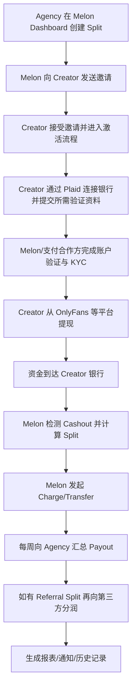
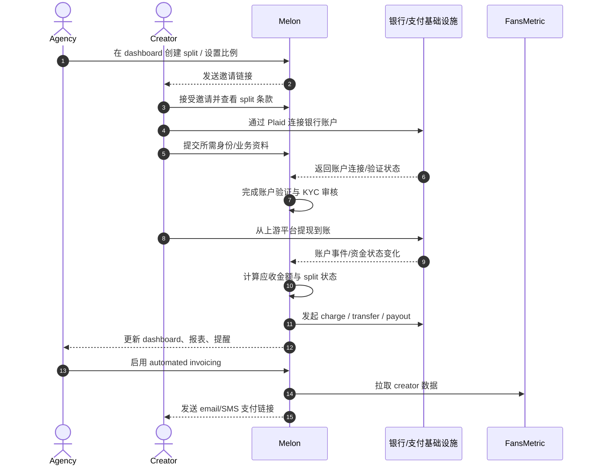
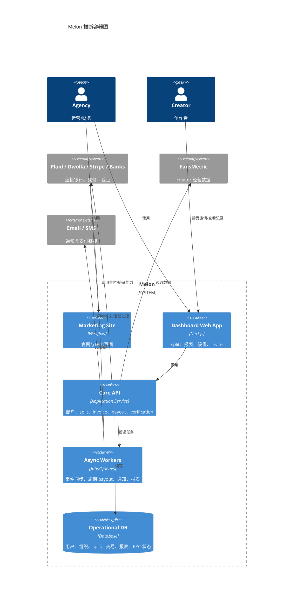

# Melon Product Understanding

- 产品名称：Melon
- 产品官网：<https://www.getmelon.io/>
- 产品类型：垂直 SaaS / Fintech workflow / 创作者经济 B2B 工具
- 分析日期：2026-03-12

## 1. Product Summary

- Product name: Melon
- Product URL: <https://www.getmelon.io/>
- Category: 面向创作者经纪公司与创作者协作场景的自动分账、收款、对账平台
- Primary audience: creator agency、agency owner、agency operator、finance/ops
- Secondary audience: creator、referral partner、chat team、additional participant
- Core value proposition: 把 agency 与 creator 之间的收入分账、回款、对账、提醒与部分开票收款流程自动化
- Analysis confidence: 中高

## 2. One-Sentence Product Definition

Melon 是一个为 creator agency 服务的收入分账与回款平台，在 agency 需要按约定向创作者收取分成、向第三方分润并完成对账时，通过银行连接、自动识别入账、定期 payout 和自动 invoicing 来降低人工财务操作成本。

## 3. Key Terminology

### Creator

- 通俗含义：内容创作者。
- 在本产品中的含义：与 agency 建立分成关系、其平台收入会被纳入 split 逻辑的主体。
- 类型：行业通用概念。

### Agency

- 通俗含义：为创作者提供运营、增长、客服或商业支持的团队。
- 在本产品中的含义：Melon 的核心购买方与操作方，负责创建 split、管理 payout、查看报表。
- 类型：行业通用概念。

### Split

- 通俗含义：将一笔收入按约定比例拆给不同参与方。
- 在本产品中的含义：creator 与 agency 之间的收入分成协议，是 Melon 的核心产品对象。
- 类型：行业通用概念，在 Melon 中是核心业务实体。

### Referral Split

- 通俗含义：再从已有收入里分一部分给推荐人或合作方。
- 在本产品中的含义：agency 从自身 split 收益中，继续给 referral partner 或 chat team 做二级分润。
- 类型：业务组合术语。

### Multi-Participant Split

- 通俗含义：一笔收入同时分给多个参与方。
- 在本产品中的含义：用于公开式多方分账；帮助中心强调这和更“隐蔽”的 referral split 不同。
- 类型：业务组合术语。

### Payout

- 通俗含义：系统向某收款方实际打款。
- 在本产品中的含义：Melon 将处理完成的 split 收益按周期打给 agency 或第三方的动作。
- 类型：行业通用概念。

### Cashout

- 通俗含义：收入从上游平台提现到银行账户。
- 在本产品中的含义：creator 从 OnlyFans 等平台把收入提到银行；Melon 以此作为检测和触发后续 split 的关键事件。
- 类型：行业通用概念。

### Automated Invoicing

- 通俗含义：系统自动生成账单并发起收款。
- 在本产品中的含义：Melon 基于 FansMetric 数据对 creator 自动出账单，并用短信/邮件发送支付链接。
- 类型：行业通用概念。

### Plaid

- 通俗含义：银行账户连接与验证基础设施服务。
- 在本产品中的含义：帮助中心明确提到 creator 通过 Plaid 连接银行，说明它是 Melon 银行连接能力的关键依赖之一。
- 类型：关键外部服务商名词。

### Dwolla

- 通俗含义：美国账户间转账与资金流转基础设施服务商。
- 在本产品中的含义：条款中明确要求用户开设 Dwolla Account，说明 Melon 至少部分支付链路依赖 Dwolla 体系。
- 类型：关键外部服务商名词。

### Stripe

- 通俗含义：支付、账单与收款基础设施平台。
- 在本产品中的含义：帮助中心提到某些情况下 Stripe 可能要求额外资料，且 invoicing 支持卡支付，说明其部分收款/KYC 能力与 Stripe 相关。
- 类型：关键外部服务商名词。

### FansMetric

- 通俗含义：创作者经营数据与分析平台。
- 在本产品中的含义：Melon 的 Automated Invoicing 需要先连接 FansMetric，再据此生成 invoice split。
- 类型：关键外部平台名词。

### Wise USD Bank Account

- 通俗含义：Wise 提供的美元银行账户能力。
- 在本产品中的含义：国际 agency 使用 Melon 的前提条件之一。
- 类型：关键外部基础设施名词。

## 4. What the Product Actually Does

从公开材料看，Melon 有两条核心业务线：

1. `Revenue Share / Split`
   agency 与 creator 约定一个收入分成比例；creator 从 OnlyFans、Chaturbate 等平台提现到银行后，Melon 检测入账并按 split 百分比发起扣款或收款，再按周期向 agency payout。

2. `Automated Invoicing`
   agency 连接 FansMetric 后，可以创建 invoice split；Melon 根据外部经营数据和设定的时间周期自动生成账单，并通过短信/邮件给 creator 发送统一支付链接，creator 不一定需要创建 Melon 账户也能支付。

核心工作流不是“支付收单”，而是把 agency 与 creator 之间本来依赖 Excel、人工核算、催款和对账的金流流程做成一套可追踪的系统。

主要参与方：
- agency
- creator
- referral partner / chat team / additional participant
- Melon
- 银行/支付基础设施
- FansMetric

## 5. Target Users and Roles

- Buyer：agency owner、agency manager、agency finance
- Operator：运营、财务、团队负责人、分账配置者
- End beneficiary：agency、creator、referral partner、chat team
- Supporting roles：支付/KYC 服务商、支持团队、外部数据平台

## 6. Application Scenarios

### 场景 1：agency 自动向 creator 收取分成

- Who uses it：agency 与 creator
- When：creator 从平台提现到银行时
- What problem it solves：无需手工核对收入与开票催款
- Why it fits：Melon 以 creator 平台入账为事件源触发 split

### 场景 2：agency 给 referral 或第三方团队自动分润

- Who uses it：agency、referral partner、chat team
- When：agency 已从 creator 收到分成后
- What problem it solves：避免二次手工转账与账务不透明
- Why it fits：Melon 内建 referral split 与 multi-participant split

### 场景 3：agency 做周期性 invoice 收款

- Who uses it：agency、creator
- When：agency 想绕过传统手工开票与提醒流程时
- What problem it solves：自动发账单、发提醒、收款、汇总历史
- Why it fits：Melon 提供 invoice split、支付链接、短信/邮件提醒

### 场景 4：agency 做财务回顾与对账

- Who uses it：agency finance / ops
- When：周结、月结、核对收入时
- What problem it solves：缺乏统一账本、历史记录和导出明细
- Why it fits：Melon 有 cashouts、payouts、activity timeline 和可导出的 transaction report

## 7. Implemented Requirements

### Business requirements

- 支持 creator 与 agency 的收入分成关系
- 支持 referral / additional participants 的二级或多方分润
- 支持对账、历史记录、导出
- 支持国际 agency 的特定接入路径

### Functional requirements

- 银行账户连接
- split 创建、编辑、接受、取消
- payout 与 cashout 历史查看
- 自动 invoicing
- 支付链接、短信/邮件提醒
- affiliate 能力

### Operational requirements

- KYC 与账户验证
- split pending 诊断
- 断连重连银行
- 客服与帮助中心自助支持

### Risk/compliance requirements

- 收集企业/个人税务与身份信息
- 支持支付合作方补充资料要求
- 处理国际 agency 的账户限制

## 8. Pain Points Solved

- 过去 workflow：平台提现后人工算分成、发消息、开 invoice、催款、再打给合作方、再做表格对账
- friction/risk：拖欠、算错、漏记、沟通摩擦、跨系统切换、周结不透明
- Melon 改善点：自动检测入账、自动计算比例、周期 payout、统一报表、提醒自动化
- 新增价值：agency 可以把“金流管理”从不透明关系型操作改成标准化系统流程

## 9. Dependencies

### Business dependencies

- creator 与 agency 之间有真实分成合同或默契
- 上游 creator 平台仍持续产生可识别的 cashout 行为

### External integrations / infrastructure

- Plaid
- Dwolla
- Stripe
- Wise USD account
- FansMetric
- 邮件/SMS 基础设施

### Internal technical dependencies

- 用户/组织/角色体系
- split 状态机
- 交易事件处理
- payout 任务调度
- 审计/报表/导出

## 10. Data, Security, and Compliance Considerations

- likely data handled：
  - 用户身份信息
  - 企业资料
  - 银行账户连接状态
  - 交易、cashout、payout 历史
  - creator 联系方式
- permission / tenancy boundaries：
  - agency 与 creator 之间的数据边界
  - referral/additional participants 的可见范围
  - 多租户组织隔离
- security/compliance expectations：
  - KYC 信息处理
  - 税务资料收集
  - 银行连接与支付合作方要求
  - 敏感财务数据的访问控制与审计

## 11. Likely Technical Solution

- `高置信`：前台官网与后台应用分离，官网为 Webflow，dashboard 为 Next.js Web App
- `高置信`：后端至少需要管理 `User / Organization / Split / Cashout / Charge / Payout / ReferralSplit / Invoice / Report / Verification`
- `高置信`：有异步任务系统处理银行状态同步、周期 payout、提醒、report 生成
- `中置信`：存在围绕 split 的状态机，例如 pending、active、failed/disrupted、canceled
- `中置信`：invoice split 与 revenue split 是两条不同入口，但会共享用户、支付、报表和通知层
- `中置信`：需要将上游 cashout 事件、内部 charge 事件、agency payout 事件、third-party payout 事件串成审计链

## 12. Confirmed Facts vs Reasoned Inference

### Confirmed facts

- 官网定位为 `Automatic payouts for agencies`，并展示 `900+ creators`、`125+ agencies`、`$25 mil+ revenue shared`。  
  来源：<https://www.getmelon.io/>
- Melon 官方帮助中心明确说它是 revenue-sharing platform，支持 OnlyFans、Chaturbate 等平台。  
  来源：<https://help.getmelon.io/en/articles/8986654-what-is-melon>
- split 由 agency 创建，creator 通过 Plaid 连接银行后激活。  
  来源：<https://help.getmelon.io/en/articles/8358228-how-does-melon-work>
- creator 当天收到 OF deposit 后，Melon 会发起 charge；agency 每周五收到汇总 payout；third-party payout 晚一周。  
  来源：<https://help.getmelon.io/en/articles/8986666-how-the-flow-of-funds-works-on-melon>
- 自动 invoicing 需要先接 FansMetric，creator 可以不创建 Melon 账户，直接通过统一支付链接支付。  
  来源：<https://help.getmelon.io/en/articles/12005317-automated-invoicing-with-melon>
- 国际 agency 可用，但 creator 目前仅原生支持美国和加拿大；国际 agency 需 Wise USD bank account。  
  来源：<https://help.getmelon.io/en/articles/9020125-melon-for-non-us-canada-agencies>
- 帮助中心提到某些情况下 Stripe 可能要求额外资料。  
  来源：<https://help.getmelon.io/en/articles/7861465-what-tax-and-business-documentation-does-melon-require>
- 条款中明确提到 Plaid、Dwolla、Dwolla Account。  
  来源：<https://www.getmelon.io/terms-of-service>

### Reasoned inference

- `High`：Melon 更像“creator agency 金流操作系统”，而不是通用支付工具。
- `Medium`：其产品优势来自垂直工作流理解，而不是底层支付通道本身。
- `Medium`：invoice 功能是其从“收入分账自动化”向“应收自动化”扩展的重要方向。
- `Medium`：它的可扩张性很大程度上取决于对上游平台资金事件的持续稳定识别能力。

## 13. Product Diagrams

### 13.1 Workflow Diagram

标注：Mixed

### 13.2 Sequence Diagram

标注：Mixed

### 13.3 C4 Diagrams

标注：Inferred

#### 13.3.1 C4 Container

## 14. Final Summary

Melon 是一个高度垂直的 creator-agency 金流 SaaS。它最关键的不是“能不能支付”，而是把 split、payout、referral、report、invoice 这些本来依赖人工和关系协调的财务流程做成系统化工作流。公开信息显示，它已经从“自动分账”扩展到“自动开票收款”，这说明它的长期方向更像垂直行业里的 AR automation + payout orchestration 平台，而非单点支付工具。

## Sources

- 官网：<https://www.getmelon.io/>
- 条款：<https://www.getmelon.io/terms-of-service>
- What is Melon：<https://help.getmelon.io/en/articles/8986654-what-is-melon>
- How does Melon work：<https://help.getmelon.io/en/articles/8358228-how-does-melon-work>
- Flow of funds：<https://help.getmelon.io/en/articles/8986666-how-the-flow-of-funds-works-on-melon>
- Tax and business documentation：<https://help.getmelon.io/en/articles/7861465-what-tax-and-business-documentation-does-melon-require>
- Automated invoicing：<https://help.getmelon.io/en/articles/12005317-automated-invoicing-with-melon>
- Non-US/Canada agencies：<https://help.getmelon.io/en/articles/9020125-melon-for-non-us-canada-agencies>
- Create a split：<https://help.getmelon.io/en/articles/8987246-create-a-split>
