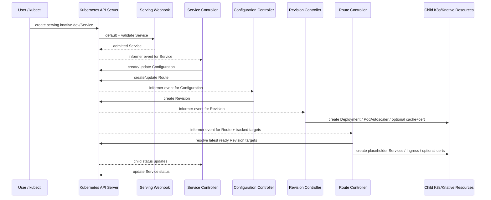
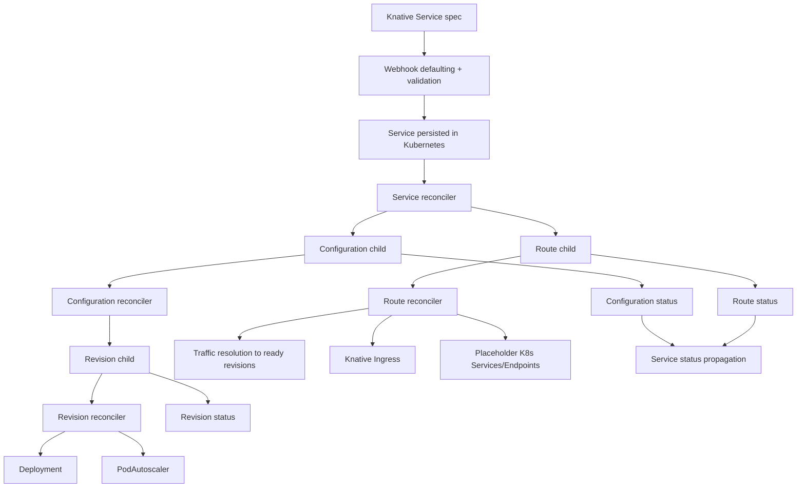
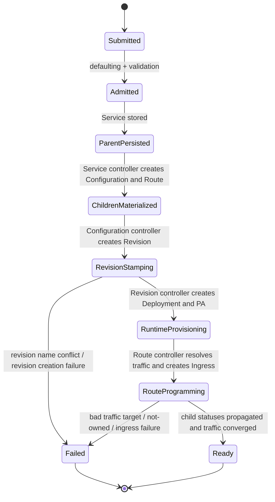

# Entrypoints and Main Flow

## 1. Scope

- Repository: `knative/serving`
- Requested audit scope: `Service create` control-plane chain only
- Goal of this shared investigation: establish the control-plane skeleton for how a newly created Knative `Service` is admitted, reconciled, expanded into child resources, and reflected back into top-level status.
- Which later capability tasks will reuse this document: `03-scope-service-create.md`

## 2. Key Entrypoints

| Entrypoint | File | Role | Why it matters |
| --- | --- | --- | --- |
| Mutating admission webhook registration | `config/core/webhooks/defaulting.yaml` | Registers CREATE/UPDATE defaulting for Serving CRDs including `services` | A `Service create` first passes through this webhook before it is persisted. |
| Validating admission webhook registration | `config/core/webhooks/resource-validation.yaml` | Registers CREATE/UPDATE/DELETE validation for Serving CRDs including `services` | This enforces schema and semantic checks before controllers see the object. |
| Webhook binary | `cmd/webhook/main.go` | Maps `Service`, `Configuration`, `Route`, `Revision` into defaulting/validation controllers | This is the executable implementation behind the webhook manifests. |
| Controller binary | `cmd/controller/main.go` | Starts the multi-controller process | This is where `service`, `configuration`, `revision`, and `route` reconcilers are wired into one controller deployment. |
| Service controller | `pkg/reconciler/service/controller.go` | Watches `Service` and owned `Configuration`/`Route` | This is the top-level orchestrator for create. |
| Service business reconcile | `pkg/reconciler/service/service.go` | Creates or updates delegated `Configuration` and `Route`; rolls child status into `Service` | This is the first controller-side fan-out after persistence. |
| Configuration controller | `pkg/reconciler/configuration/configuration.go` | Stamps out the `Revision` snapshot for the current generation | This realizes the README snapshot claim. |
| Revision controller | `pkg/reconciler/revision/revision.go` and `pkg/reconciler/revision/reconcile_resources.go` | Materializes runnable infrastructure for a revision | This turns a logical snapshot into Deployment + PodAutoscaler and related infra. |
| Route controller | `pkg/reconciler/route/route.go` and `pkg/reconciler/route/reconcile_resources.go` | Resolves traffic to concrete revisions and creates networking resources | This realizes the routing claim and produces service URL/status traffic. |

## 3. Main Flow Skeleton

### Top-level execution flow

1. A user submits a Knative `Service` custom resource to the Kubernetes API.
2. The mutating webhook defaults the resource, especially the combined `ConfigurationSpec` and `RouteSpec`.
3. The validating webhook enforces object metadata rules, traffic semantics, revision-name rules, and template validity.
4. The `Service` controller observes the new object and treats it as an orchestration spec, not as a directly runnable workload.
5. The `Service` controller creates or reconciles exactly one child `Configuration` and one child `Route`, both named after the parent `Service`.
6. The `Configuration` controller creates the current-generation `Revision`, which is the immutable deployment snapshot.
7. The `Revision` controller creates runtime-facing infrastructure such as a Kubernetes `Deployment` and a Knative `PodAutoscaler`.
8. The `Route` controller resolves traffic targets to ready revisions, then creates placeholder Kubernetes Services and a Knative networking `Ingress`.
9. Child controllers update their own statuses; the `Service` controller is re-enqueued by child changes and rolls child readiness, traffic, URL, and snapshot names back into `Service.Status`.

### Mermaid sequenceDiagram

### Mermaid flowchart

### High-level state or lifecycle transitions

- `Service` create is eventually consistent and multi-stage. The parent object becomes ready only after at least two subordinate readiness domains converge:
  - configuration snapshotting succeeds and a latest ready revision exists;
  - route programming succeeds and traffic is fully assigned to concrete ready revisions.
- A `BYO Revision name` path is explicitly serialized: when `config.Spec.Template.Name` is set and the `Configuration` has not yet reconciled the latest generation, the `Service` reconciler delays route progression to avoid steering traffic to a conflicting or stale revision.
- Route readiness is also gated on traffic migration: even when a `Route` is nominally ready, `Service.checkRoutesNotReady` compares desired traffic against flattened status traffic and marks the service not yet ready if migration has not converged.

### Where key data is created, transformed, stored, or emitted

- Input data enters as a single `Service.Spec` that inlines both `ConfigurationSpec` and `RouteSpec`.
- Defaulting mutates the in-memory admission object so that empty service traffic becomes `100% latest revision`.
- The `Service` reconciler splits one parent spec into two persisted CRs:
  - `Configuration.Spec = Service.Spec.ConfigurationSpec`
  - `Route.Spec = Service.Spec.RouteSpec`, with missing `ConfigurationName` backfilled to the service-owned configuration.
- The `Configuration` reconciler turns mutable configuration intent into an immutable `Revision`.
- The `Route` reconciler flattens traffic from configuration references into concrete revision references for status and ingress programming.
- Persistent state lives in Kubernetes API resources only; there is no repository-local database, queue, or cache that is required for this create path.

## 4. Architecture Notes

### Main modules and responsibilities

- `pkg/apis/serving/v1`: API shape, defaulting, validation, lifecycle helpers, and status propagation semantics.
- `pkg/reconciler/service`: top-level parent orchestration of `Configuration` and `Route`.
- `pkg/reconciler/configuration`: immutable revision stamping and latest-created/latest-ready tracking.
- `pkg/reconciler/revision`: conversion of a revision snapshot into runtime infrastructure.
- `pkg/reconciler/route`: traffic resolution, placeholder Services, ingress, and URL/status computation.
- `pkg/client/injection/reconciler/serving/v1/*`: generated typed reconcilers that wrap business logic with informer fetch, config injection, event recording, status update, and leader-awareness behavior.

### Important boundaries between layers

- Admission layer:
  - defaulting and validation run in the webhook process before persistence.
- Control-plane orchestration layer:
  - the `Service` controller does not create Deployments or Ingress directly; it creates delegated CRs.
- Snapshot layer:
  - the `Configuration` controller owns revision immutability and generation-to-revision mapping.
- Runtime/resource layer:
  - the `Revision` controller owns Deployment and PodAutoscaler realization.
- Networking layer:
  - the `Route` controller owns traffic flattening, URL computation, placeholder Services, ingress, and optional certificates.

### Cross-cutting concerns

- ConfigMap-driven behavior:
  - both webhook and controllers inject config via `ConfigStore`, so defaulting and reconciliation depend on live Serving configuration.
- Ownership and safety:
  - all major child resources are checked with `metav1.IsControlledBy` before reuse.
- Status rollup:
  - `ServiceStatus` embeds both `ConfigurationStatusFields` and `RouteStatusFields`, making the top-level object a status aggregator.
- Tracking:
  - the `Route` controller tracks referenced `Configuration` and `Revision` resources so later readiness changes re-enqueue the route automatically.
- Optional external integrations:
  - certificate provisioning and external ingress implementation depend on other Knative networking components and, optionally, cert-manager.

### Core technology choices that shape implementation

- Kubernetes CRDs and reconcilers instead of an imperative deploy API.
- Go-based generated typed reconcilers instead of hand-written queue and status boilerplate.
- Immutable `Revision` snapshots instead of mutating an already-running revision in place.
- Eventual consistency across controllers instead of one monolithic synchronous orchestrator.

### Mermaid stateDiagram-v2

## 5. Shared Evidence For Capability Tasks

- Admission registration:
  - `config/core/webhooks/defaulting.yaml`
  - `config/core/webhooks/resource-validation.yaml`
- Webhook implementation:
  - `cmd/webhook/main.go`
  - `pkg/apis/serving/v1/service_defaults.go`
  - `pkg/apis/serving/v1/service_validation.go`
  - `pkg/webhook/validate_unstructured.go`
- Top-level orchestration:
  - `cmd/controller/main.go`
  - `pkg/reconciler/service/controller.go`
  - `pkg/reconciler/service/service.go`
  - `pkg/reconciler/service/resources/configuration.go`
  - `pkg/reconciler/service/resources/route.go`
- Snapshot creation:
  - `pkg/reconciler/configuration/configuration.go`
  - `pkg/reconciler/configuration/resources/revision.go`
  - `pkg/apis/serving/v1/configuration_lifecycle.go`
- Runtime realization:
  - `pkg/reconciler/revision/revision.go`
  - `pkg/reconciler/revision/reconcile_resources.go`
  - `pkg/reconciler/revision/resources/deploy.go`
  - `pkg/reconciler/revision/resources/pa.go`
- Route programming:
  - `pkg/reconciler/route/route.go`
  - `pkg/reconciler/route/reconcile_resources.go`
  - `pkg/reconciler/route/traffic/traffic.go`
  - `pkg/reconciler/route/resources/ingress.go`
  - `pkg/reconciler/route/resources/service.go`

## 6. Open Questions

- The scoped audit validates static control-plane logic only; it does not verify a live cluster's ingress-class-specific behavior.
- The actual networking dataplane implementation behind Knative `Ingress` is outside the narrow `Service create` chain and depends on the installed networking provider.
- Autoscaling to zero is downstream of creation. The create path proves that a `PodAutoscaler` is created, but not the later runtime transitions of KPA/HPA.

## 7. Recommended Next Reading Paths

1. `pkg/reconciler/service/service.go`
2. `pkg/reconciler/configuration/configuration.go`
3. `pkg/reconciler/route/traffic/traffic.go`
