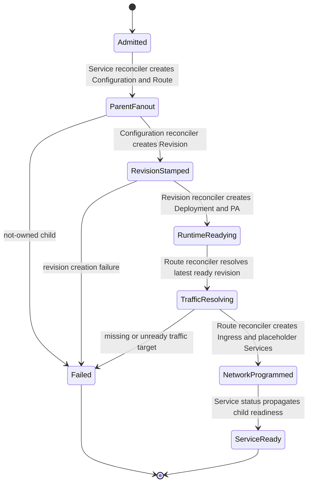
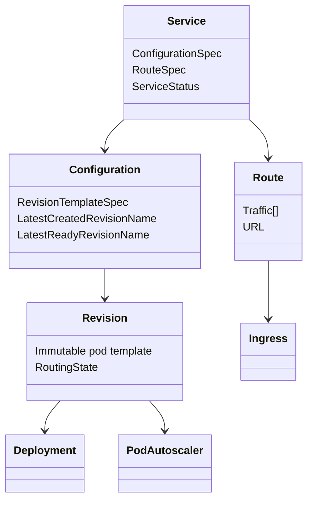
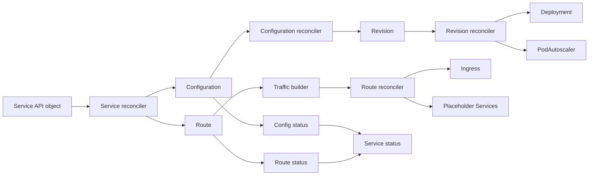
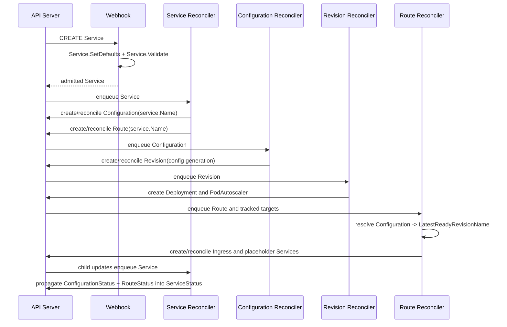

# Service Create Chain

## Scope Statement

This document is a scoped deep dive for the user-requested `Service create` control-plane chain. It does not claim to validate the full repository or every README capability end to end.

## 1. Capability Definition

- Problem solved:
  - Turn one declarative Knative `Service` creation request into a runnable serverless endpoint with immutable rollout state and routable traffic.
- User or scenario:
  - A user wants to deploy a containerized application or function without manually creating separate `Configuration`, `Revision`, and `Route` objects.
- Input:
  - `serving.knative.dev/v1.Service` with `spec.template` and optional traffic settings.
- Output:
  - Persisted child `Configuration`, `Revision`, and `Route` resources.
  - Runtime infrastructure such as `Deployment` and `PodAutoscaler`.
  - Networking resources such as placeholder Services and Knative `Ingress`.
  - Aggregated `Service.Status` containing revision snapshot names, URL, and traffic status.

## 2. README-Side Mechanism

- How README describes it:
  - Rapid deployment of serverless containers.
  - Routing and network programming.
  - Point-in-time snapshots of deployed code and configurations.
- Key components or stages:
  - README does not name them explicitly.
- Process inferred from README:
  - A top-level serving abstraction likely accepts deployment intent, stores an immutable snapshot of that intent, and then exposes traffic through routing primitives.
- Inference note:
  - The concrete `Service -> Configuration -> Revision + Route` graph is `based on README inference` until verified by code.

## 3. Solution Analysis And Alternatives

- Likely implementation paradigm:
  - Composite Kubernetes CRD orchestration. A single high-level resource delegates to several narrower child resources managed by separate controllers.
- Alternative approaches:
  - Expose only `Configuration` and `Route` to users and require them to create both explicitly.
  - Use a single monolithic controller that directly creates `Deployment` and ingress objects from `Service`.
  - Reuse plain Kubernetes `Deployment + Service + Ingress` without revision snapshots.
- Advantages of the implemented approach:
  - Friendly top-level API.
  - Clear ownership boundaries.
  - Immutable deployment snapshots.
  - Traffic management separated from rollout snapshotting.
  - Status can be rolled up from children without collapsing the internal model.
- Limits and scope:
  - Multi-controller eventual consistency makes the create path asynchronous.
  - The full user-visible readiness depends on controllers outside the parent `Service` reconciler.
  - The ingress dataplane is partly external to this repository.

## 4. Implementation Mechanics

- Primary technologies, frameworks, libraries, protocols, or patterns:
  - Kubernetes CRDs and admission webhooks.
  - Knative `pkg/controller` and generated typed reconcilers.
  - OwnerReference-based child orchestration.
  - ConfigMap-backed runtime configuration injection.
- Why these choices appear to be used here:
  - Knative wants a Kubernetes-native control plane with declarative APIs and reconciliation-based convergence.
- Core implementation strategy:
  - `Service` is intentionally an orchestrator, not the final runtime object.
  - The API type in `pkg/apis/serving/v1/service_types.go` inlines `ConfigurationSpec` and `RouteSpec`, which lets one object capture both deployment intent and traffic intent.
  - Defaulting and validation run first in the webhook process.
  - The `Service` controller fans the parent object out into child `Configuration` and `Route`.
  - Child controllers then continue the graph:
    - `Configuration` stamps a `Revision`.
    - `Revision` builds runtime infrastructure.
    - `Route` resolves ready revision traffic and builds networking resources.

## 5. State and Lifecycle Analysis

- Main states, phases, or lifecycle stages:
  - `Admitted`
  - `Service children materialized`
  - `Configuration observed`
  - `Revision created`
  - `Revision resources provisioning`
  - `Route traffic resolved`
  - `Ingress programmed`
  - `Service ready`
- State transitions and triggers:
  - Webhook admission moves the object from request form into a normalized stored form.
  - The `Service` controller creates child CRs when they do not exist.
  - The `Configuration` controller creates a generation-specific revision when the latest one is absent.
  - The `Revision` controller marks readiness only after digest resolution and runtime resources are in place.
  - The `Route` controller waits for routable ready revisions before programming ingress and traffic status.
  - The `Service` controller re-runs when child objects change and only then aggregates final status.
- Failure, retry, rollback, or cleanup paths when visible:
  - If a child `Configuration` or `Route` already exists but is not owned by the `Service`, readiness is marked false and reconciliation errors.
  - If a BYO revision name conflicts, route progression is blocked and `RevisionNameTaken` is surfaced.
  - If route traffic points to missing or unready targets, route programming stops before ingress reconciliation.
  - Generated reconcilers and informer-driven controllers provide retry behavior by re-enqueueing on errors or dependency changes.

### Mermaid stateDiagram-v2

## 6. Data and Storage Analysis

- Main inputs and outputs:
  - Input:
    - `Service.Spec.ConfigurationSpec`
    - `Service.Spec.RouteSpec`
  - Outputs:
    - `Configuration.Spec`
    - `Revision.Spec`
    - `Route.Spec`
    - `Deployment.Spec`
    - `PodAutoscaler.Spec`
    - `Ingress.Spec`
    - `Service.Status`
- Data transformations:
  - Defaulting injects implicit route traffic:
    - empty service traffic becomes `100%` to latest revision.
  - `Service` to `Configuration`:
    - the configuration child receives the parent's deployment template and service ownership labels.
  - `Service` to `Route`:
    - route traffic targets missing `ConfigurationName` are rewritten to the service-owned configuration name.
  - `Configuration` to `Revision`:
    - the revision copies the template object meta and pod spec, then receives immutable naming, generation labels, and route/routing-state annotations.
  - `Route` traffic flattening:
    - configuration references become concrete revision references using `LatestReadyRevisionName`.
- Storage, cache, registry, queue, database, index, or file boundaries:
  - Persistent state is stored in Kubernetes resources only.
  - No dedicated SQL/NoSQL store exists for this path.
  - Optional caching resources for container images are represented as Kubernetes CRs.
  - ConfigMap-backed settings affect behavior but are not a separate business-data store.
- Persistence scope and lifecycle:
  - `Service`, `Configuration`, `Revision`, `Route`, `Deployment`, `PodAutoscaler`, `Ingress`, placeholder `Service`, and `Endpoints` persist in the cluster API until deleted or replaced by later reconciliation.

### Mermaid classDiagram

## 7. Architecture Analysis

- Modules and subsystem roles:
  - `pkg/apis/serving/v1/service_types.go` defines `Service` as a top-level container that manages a `Route` and `Configuration`.
  - `pkg/reconciler/service` handles the parent orchestration boundary.
  - `pkg/reconciler/configuration` owns revision stamping and readiness bookkeeping.
  - `pkg/reconciler/revision` owns runtime realization.
  - `pkg/reconciler/route` owns traffic resolution and networking realization.
- Static relationships:
  - `Service` owns `Configuration` and `Route`.
  - `Configuration` owns `Revision`.
  - `Revision` owns `Deployment` and `PodAutoscaler`.
  - `Route` owns placeholder Services, Endpoints, Ingress, and optional Certificates.
- Dependency shape:
  - The path is acyclic in resource creation but cyclic in reconcile triggering:
    - child status updates re-enqueue parents, especially `Service` and `Route`.

### Mermaid flowchart

## 8. Core Call Path

- Entry point:
  - Kubernetes CREATE of `serving.knative.dev/v1.Service`
- Intermediate processing:
  - Webhook defaulting and validation
  - Service reconciliation
  - Configuration reconciliation
  - Revision reconciliation
  - Route reconciliation
  - Parent status rollup
- State or data transitions:
  - Parent spec is normalized.
  - Parent spec is split into child configuration and route intent.
  - Configuration template becomes immutable revision state.
  - Revision becomes deployment and autoscaling primitives.
  - Route resolves latest-ready revision targets and becomes ingress rules.
  - Service status becomes the rolled-up user-facing summary.
- Output node:
  - Ready `Service` with URL, traffic status, and latest revision references.

### Mermaid sequenceDiagram

## 9. Key Technical Points

- `Service` is intentionally an orchestrator, not the only reconciliation target in the chain.
- Defaulting uses context to tell `RouteSpec` that a default configuration name exists, so empty traffic can be interpreted safely.
- The service-owned route is constrained to revisions belonging to the same service.
- `Configuration` readiness is not just "revision created"; it depends on latest created versus latest ready bookkeeping.
- `Route` status traffic is revision-flattened, not configuration-based, which is what makes migration visibility explicit.
- `Revision` creation is immutable by generation or by BYO name, and runtime infrastructure is then attached to that revision rather than to the parent service.
- Highest-value code-reading targets:
  - `pkg/reconciler/service/service.go`
  - `pkg/reconciler/configuration/configuration.go`
  - `pkg/reconciler/revision/reconcile_resources.go`
  - `pkg/reconciler/route/traffic/traffic.go`
  - `pkg/reconciler/route/reconcile_resources.go`

## 10. Code Verification

### Code locations

- Admission and API normalization:
  - `config/core/webhooks/defaulting.yaml`
  - `config/core/webhooks/resource-validation.yaml`
  - `cmd/webhook/main.go`
  - `pkg/apis/serving/v1/service_defaults.go`
  - `pkg/apis/serving/v1/service_validation.go`
  - `pkg/apis/serving/v1/route_defaults.go`
  - `pkg/apis/serving/v1/route_validation.go`
  - `pkg/webhook/validate_unstructured.go`
- Parent orchestration:
  - `pkg/apis/serving/v1/service_types.go`
  - `pkg/apis/serving/v1/service_lifecycle.go`
  - `pkg/reconciler/service/controller.go`
  - `pkg/reconciler/service/service.go`
  - `pkg/reconciler/service/resources/configuration.go`
  - `pkg/reconciler/service/resources/route.go`
- Snapshot stamping:
  - `pkg/apis/serving/v1/configuration_types.go`
  - `pkg/apis/serving/v1/configuration_lifecycle.go`
  - `pkg/reconciler/configuration/controller.go`
  - `pkg/reconciler/configuration/configuration.go`
  - `pkg/reconciler/configuration/resources/revision.go`
- Runtime realization:
  - `pkg/reconciler/revision/controller.go`
  - `pkg/reconciler/revision/revision.go`
  - `pkg/reconciler/revision/reconcile_resources.go`
  - `pkg/reconciler/revision/resources/deploy.go`
  - `pkg/reconciler/revision/resources/pa.go`
- Route realization:
  - `pkg/apis/serving/v1/route_types.go`
  - `pkg/reconciler/route/controller.go`
  - `pkg/reconciler/route/route.go`
  - `pkg/reconciler/route/reconcile_resources.go`
  - `pkg/reconciler/route/traffic/traffic.go`
  - `pkg/reconciler/route/resources/ingress.go`
  - `pkg/reconciler/route/resources/service.go`

### Whether README claim is implemented

- `Rapid deployment of serverless containers`:
  - Confirmed.
  - Evidence:
    - `Service` fans out into `Configuration` and `Route`.
    - `Configuration` stamps `Revision`.
    - `Revision` creates `Deployment` and `PodAutoscaler`.
- `Routing and network programming`:
  - Confirmed.
  - Evidence:
    - `Route` resolves traffic and creates `Ingress` plus placeholder Services.
- `Point-in-time snapshots of deployed code and configurations`:
  - Confirmed.
  - Evidence:
    - `Configuration` tracks `LatestCreatedRevisionName` and `LatestReadyRevisionName`.
    - `MakeRevision` copies the template into a named immutable revision per generation.

### Confirmed parts

- `Service` is the user-facing composite API:
  - `ServiceSpec` literally inlines `ConfigurationSpec` and `RouteSpec`.
- Service create defaults:
  - empty traffic becomes `100%` latest revision.
- Parent-child graph:
  - child `Configuration` and `Route` both use the parent service name and owner reference.
- Snapshot semantics:
  - revision generation labels and naming prove immutable snapshot materialization.
- Readiness rollup:
  - service readiness is derived from child configuration and route readiness, not from direct deployment checks.
- Traffic concretization:
  - `Route` status always uses concrete revision references, even when spec uses configuration references.

### Unconfirmed parts

- The scoped audit does not statically prove the behavior of a specific ingress implementation once a Knative `Ingress` leaves this repository and is picked up by a networking provider.
- The create-path audit does not prove runtime scale-to-zero behavior, only the creation of the `PodAutoscaler` resource.

### Mismatches

- README claim granularity versus code reality:
  - README is much higher-level than the actual multi-controller `Service -> Configuration -> Revision + Route` pipeline.
  - This is not a contradiction, but it means the create chain is materially under-documented at README level.

## 11. Rebuildability

- Minimum modules or subsystems needed to reproduce the capability:
  - Serving CRD API types for `Service`, `Configuration`, `Revision`, and `Route`.
  - Admission webhook layer for defaulting and validation.
  - `Service` controller with child creation and status propagation.
  - `Configuration` controller with revision stamping.
  - `Revision` controller with deployment and PodAutoscaler creation.
  - `Route` controller with traffic flattening, placeholder Services, and ingress generation.
  - Generated typed reconciler wrappers or an equivalent status/update scaffold.
- External dependencies that cannot be reconstructed from the repo alone:
  - A Kubernetes cluster and API server.
  - Knative networking CRDs and an installed networking implementation to realize `Ingress`.
  - Optional cert-manager for certificate paths.
- What is clear enough to rebuild vs still unclear:
  - Clear enough:
    - control-plane object model
    - defaulting/validation logic
    - child resource graph
    - revision snapshotting
    - route traffic flattening
  - Still environment-dependent:
    - actual dataplane implementation behind Knative `Ingress`
    - cert provisioning runtime

## 12. Consistency Check

- README claim:
  - Knative Serving rapidly deploys serverless containers, programs routing, and preserves point-in-time snapshots.
- Code reality:
  - The code implements these claims through a layered control plane centered on `Service`, `Configuration`, `Revision`, and `Route`.
- Gap summary:
  - The behavior exists and is strongly implemented.
  - The README under-describes the fact that `Service create` is a multi-controller orchestration pipeline rather than a single controller or direct deployment action.
- Mismatch classification:
  - `code implemented, README under-describes it`
- Possible explanation for discrepancy:
  - The README is positioned as a concise project-level value statement, not a control-plane design document.

## 13. Conclusion

- Exists:
  - yes
- Confidence:
  - high
- Validation status:
  - Implemented but Under-Documented
- Evidence grade:
  - A
- Next code entrypoints:
  - `pkg/reconciler/service/service.go`
  - `pkg/reconciler/configuration/resources/revision.go`
  - `pkg/reconciler/route/traffic/traffic.go`
